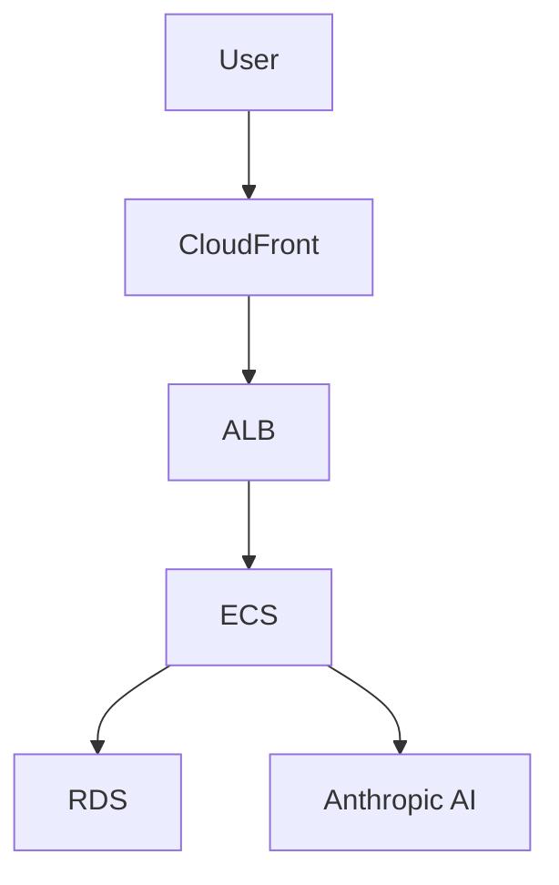

# Patterns Discovered

Recurring code, testing, and debugging patterns that improve reliability and speed.
This is an accumulated knowledge base and should grow over time. Written in English.

## Pattern Template

### Pattern Name
- <short, descriptive name>

### Context
- <where this appears: backend/frontend/tests/build/debug>

### Problem
- <what issue repeatedly occurs>

### Solution
- <recommended approach>

### Example
```
// minimal code snippet or pseudocode
```

### Related Files
- <path 1>
- <path 2>

---\n\n### Swappable Payment Provider (Go Interface Pattern)\n\n### Context\n- Backend \u2014 `internal/subscription/payment/`\n\n### Problem\n- MVP needs a mock payment stub, but post-MVP must plug in a real provider (Stripe, etc.) without rewriting subscription domain logic.\n\n### Solution\n- Define a `PaymentProvider` interface in `provider.go` with `CreateSubscription`, `CancelSubscription`, and `GetSubscription` methods. Implement `StubProvider` in `stub.go` (always returns `succeeded`, logs `[STUB]`). Inject via constructor; swap by changing the concrete type passed at startup.\n\n### Example\n```go\ntype PaymentProvider interface {\n    CreateSubscription(ctx context.Context, req CreateSubscriptionRequest) (*SubscriptionResult, error)\n    CancelSubscription(ctx context.Context, subscriptionID string) error\n    GetSubscription(ctx context.Context, subscriptionID string) (*SubscriptionStatus, error)\n}\n```\n\n### Related Files\n- `specs/001-product-vision-scope/research.md` (Decision 6)\n- `backend/internal/subscription/payment/provider.go`\n- `backend/internal/subscription/payment/stub.go`\n\n---\n\n### Suggest-Then-Approve Collaboration Workflow\n\n### Context\n- Backend \u2014 `internal/suggestion/`; Frontend \u2014 `features/suggestions/`\n\n### Problem\n- Multi-user collaboration needs write-access control: partners should be able to contribute without directly modifying the authoritative itinerary.\n\n### Solution\n- Partners submit `Suggestion` records (status: `pending`). The admin is the sole actor who can `approve` (applying the change) or `reject` (no itinerary change). All suggestions are retained permanently \u2014 never hard-deleted \u2014 for audit history.\n\n### Example\n```\nPOST /trips/:id/suggestions        \u2192 partner creates (pending)\nPATCH .../suggestions/:id/approve  \u2192 admin applies + status: approved\nPATCH .../suggestions/:id/reject   \u2192 admin rejects + status: rejected\n```\n\n### Related Files\n- `specs/001-product-vision-scope/spec.md` (FR-009, FR-011)\n- `specs/001-product-vision-scope/data-model.md` (Suggestion entity)\n- `specs/001-product-vision-scope/contracts/api.md` (Suggestions section)

## Example Pattern

### Pattern Name
- Prefer Empty Collection Over Null

### Context
- Service/module state initialization for list-like data.

### Problem
- Initializing collection state with null requires repetitive null guards.

### Solution
- Initialize list-like state as an empty collection and treat it as the default
  no-data state; enables direct iteration without guards.

### Related Files
- <add real paths as they emerge>

---

### Server-Side Prompt Validation Deny-List (AI Security Pattern)

### Context
- Backend — `internal/ai/validator/`; any endpoint that forwards user input to an LLM

### Problem
- Users can submit adversarial prompts that attempt to override the system prompt, extract secrets, switch roles, or drive the AI outside the application's purpose (travel planning). Relying solely on the LLM's own refusal behaviour is not sufficient.

### Solution
- Implement a server-side `PromptValidator` that loads a versioned deny-list from `backend/config/prompt-rules.yml` at startup. Each rule has an `id`, `description`, `pattern`, `match_type` (`substring` | `regex`), and `enabled` flag. Call `Validate(prompt)` before forwarding to the AI provider. On match: return `400 Bad Request` with `{"error":"invalid_prompt","message":"<user-safe text>","request_id":"..."}` and emit a `WARN` slog entry with the matched rule ID (never revealed to the client). The system prompt is kept server-side and treated as a secret (env var, never logged).

### Example
```go
// prompt_validator.go
type PromptValidator struct{ rules []Rule }

func (v *PromptValidator) Validate(prompt string) (ruleID string, matched bool) {
    for _, r := range v.rules {
        if !r.Enabled { continue }
        if r.matches(prompt) { return r.ID, true }
    }
    return "", false
}
```

### Related Files
- `specs/002-nfr-system-constraints/spec.md` (NFR-SEC-007, NFR-SEC-008)
- `backend/internal/ai/validator/prompt_validator.go`
- `backend/config/prompt-rules.yml`

---

### Task Grouping for Issue Management (Roadmap Pattern)

### Context
- Project planning — `docs/roadmap.md`; applies before running `/sync-issues` to create GitHub issues

### Problem
- Large projects generate hundreds of granular tasks. Creating one GitHub issue per task fragments the backlog, increases PR/review overhead, and obscures the big picture. Reviewers see 10 separate PRs for what should be one coherent work item.

### Solution
- Before running `/sync-issues`, identify tasks that share context and can be bundled into a single work item:
  - Tasks in the same file or closely related files (e.g. middleware + tests, component + tests)
  - Tasks in the same domain with no dependency gaps between them
  - Small setup/config tasks that belong together (e.g. linter configs, CI workflow files)
- Assign a shared `Group` value (e.g. `G-SETUP-INIT`, `G-US1-COMPONENTS`) to those rows in the roadmap.
- When `/sync-issues` runs, grouped tasks form ONE issue with a checklist of member tasks. The issue title references the group; the body lists all stable IDs.
- Result: fewer issues (one per group + standalone tasks), cleaner backlog, one PR per logical unit of work.

### Example
```markdown
| ID | Task | Group | Sprint | Priority | Status | ... |
|----|------|-------|--------|----------|--------|-----|
| 001-T002 | Initialize Go module | G-SETUP-INIT | 1 | P1 | Backlog | ... |
| 001-T003 | Initialize React project | G-SETUP-INIT | 1 | P1 | Backlog | ... |

→ When `/sync-issues` runs, these 2 tasks become ONE issue with a 2-item checklist.
```

### Related Files
- `docs/roadmap.md`
- `.github/prompts/build-roadmap.prompt.md`
- `.github/memory/session-notes.md` (2026-07-02 session)

---

### Documentation-Centric SpecKit Workflow

### Context
- SpecKit workflows — applies to features that produce documentation/standards rather than code implementation

### Problem
- Documentation features (standards docs, runbooks, style guides) might seem too simple for full SpecKit workflow. Temptation to skip planning and jump straight to writing the doc. However, this risks ambiguity, missing edge cases, and unclear acceptance criteria.

### Solution
- Documentation features follow the SAME SpecKit workflow as code features: specify → plan → clarify → tasks. Even pure documentation benefits from:
  - **Specification**: User stories defining who needs the doc, what questions it must answer, acceptance criteria (e.g. "backend dev designs compliant endpoint in < 15 min")
  - **Planning**: Research decisions documented (e.g. why offset pagination vs. cursor, why snake_case vs. camelCase), technical context, constitution check
  - **Clarification**: Validate spec completeness across all categories (even docs have edge cases, error handling, user stories)
  - **Tasks**: Dependency-ordered implementation (e.g. standards doc promotion BLOCKS all user story work)
- Result: High-quality documentation with zero ambiguity, clear MVP scope, testable outcomes, and proper dependency ordering.

### Example
```
Spec 007 (API Design Standards) — documentation feature:
- Spec: 4 user stories (backend dev, frontend dev, code reviewer, API consumer)
- Plan: 9 research decisions (resource naming, error format, pagination strategy)
- Clarify: 0 ambiguities found (spec quality validated)
- Tasks: 70 tasks in 7 phases, 38 parallelizable (54%)
- MVP: Phase 1-3 (22 tasks) = standards doc promoted and backend devs can use it
```

### Related Files
- `specs/007-api-design-standards/spec.md`
- `specs/007-api-design-standards/tasks.md`
- `.github/memory/session-notes.md` (2026-07-06 session)

---

### Idempotent Roadmap Reconciliation

### Context
- Project planning — `docs/roadmap.md` maintenance; triggered by `/build-roadmap` workflow

### Problem
- As specs evolve (new specs added, existing specs refined, tasks added/removed), the roadmap must stay in sync with source `tasks.md` files. Naive regeneration would destroy human-curated metadata (sprint assignments, priority overrides, issue links, notes). Manual sync is error-prone and doesn't scale.

### Solution
- Implement **reconciliation, not regeneration**: `/build-roadmap` diffs source specs against existing roadmap and applies minimal add/update/remove operations:
  - **ADD**: Task present in source, absent from roadmap → insert new row with source-derived fields, default human-owned fields (Priority=TBD, Status=Backlog, Issue=empty)
  - **UPDATE**: Task present in both, source changed → refresh ONLY source-derived fields (title, dependencies), preserve ALL human-owned fields (Group, Sprint, Priority, Status, Issue, Notes)
  - **UNCHANGED**: Task present in both, source identical → leave row untouched
  - **REMOVE**: Task present in roadmap, absent from source → archive if has Issue link OR Status > Backlog; hard-delete if Backlog + no Issue (refined away)
- Use **stable global IDs** (`<spec-number>-<task-id>`) as anchor for matching across runs.
- Result: Running `/build-roadmap` repeatedly converges to correct state, never duplicates, preserves human work, supports iterative spec refinement.

### Example
```
Run 1: Spec 007 added → 70 tasks inserted
Run 2: Spec 007 refined (task title changed) → 1 task updated (title only), 69 unchanged
Run 3: Spec 007 task T042 removed from source → archived to "Removed" section (preserves history)
```

### Related Files
- `docs/roadmap.md`
- `.github/prompts/build-roadmap.prompt.md`
- `.github/memory/session-notes.md` (2026-07-06 session)

---
```markdown
| ID | Task | Group | Issue |
|----|------|-------|-------|
| 001-T002 | Initialize Go module | G-SETUP-INIT | |
| 001-T003 | Initialize React project | G-SETUP-INIT | |
| 001-T004 | Configure golangci-lint | G-SETUP-INIT | |
| 001-T005 | Configure ESLint | G-SETUP-INIT | |

→ Creates 1 issue "G-SETUP-INIT — Module & Linter Setup" with 4-item checklist.
```

### Related Files
- `docs/roadmap.md`
- `.github/prompts/build-roadmap.prompt.md`
- `.github/prompts/sync-issues.prompt.md`

---

### NFR Observability Primitives Must Precede Feature Work (Ordering Pattern)

### Context
- Cross-cutting infrastructure; especially when NFR specs are authored after feature specs

### Problem
- An NFR spec defines observability, security, and performance requirements that *validate* application features — but these primitives (request-ID middleware, structured logging, `/healthz`) are foundational to the feature code that gets tested. If they are deprioritised alongside their P2 user story (US4 Observability), they block everything else.

### Solution
- In `tasks.md`, extract the **implementation** of observability primitives into the Foundational phase (Phase 2), regardless of the spec's user-story priority order. The P2 user story then only contains **validation tests** (integration tests asserting log structure, header correlation) that can safely run after the P1 stories. Document this ordering mismatch in the tasks.md cross-spec notes.

### Example
```
Phase 2 (Foundational): T006 RequestID middleware, T008 Logger middleware, T010 /healthz handler
Phase 6 (US4 P2):       T037 integration test for Logger, T038 integration test for RequestID
```

### Related Files
- `specs/002-nfr-system-constraints/tasks.md` (Phase 2 vs Phase 6 split)
- `specs/002-nfr-system-constraints/spec.md` (US4 — Observability, Priority P2)

---

### Foundation Promotion Workflow (Context Propagation Pattern)

### Context
- Project planning — executed after foundation specs stabilize; re-run whenever a foundation spec is refined

### Problem
- SpecKit reads the constitution and the current spec, but NOT other specs. If architectural decisions, NFRs, security rules, or cloud strategy live only in `specs/NNN-*/spec.md`, future feature planning is blind to them. This causes downstream implementations to violate foundational constraints or duplicate decision-making.

### Solution
- Run `/promote-foundations` to extract durable decisions from foundation specs and route them to the two places the entire project reads:
  1. **Constitution** (`.specify/memory/constitution.md`) — non-negotiable principles and mandated technology choices that all specs must honor
  2. **Documentation** (`docs/*.md`) — reference material (architecture, NFRs, security model, data model) wired into `.github/copilot-instructions.md` so every agent invocation inherits it
- Promoted docs use `<!-- PROMOTED:name START -->` markers for idempotent updates and include source attribution
- After promotion, every `/speckit.plan`, `/speckit.tasks`, and implementation inherits foundational context automatically

### Example
```markdown
Constitution gets:
- Mandated stack (AWS/Terraform/ECS)
- Non-negotiable security rules (prompt injection validation, output sanitization)

docs/ gets:
- product-vision.md (personas, MVP scope, roles)
- nfrs.md (measurable targets, validation methods)
- architecture.md (components, integration rules)
- security.md (auth model, secrets management)
- cloud-and-environments.md (infrastructure strategy)
```

### Related Files
- `.github/prompts/promote-foundations.prompt.md`
- `.specify/memory/constitution.md`
- `docs/product-vision.md`, `docs/nfrs.md`, `docs/security.md`, `docs/architecture.md`, `docs/cloud-and-environments.md`
- `.github/copilot-instructions.md` (Documentation References section)

---

### ECS Fargate for AI Workloads (Compute Platform Selection Pattern)

### Context
- Backend infrastructure — AWS compute platform choice for services that integrate with AI providers (Anthropic, OpenAI, etc.)

### Problem
- Lambda is commonly used for serverless APIs, but AI workloads have characteristics that violate Lambda's constraints: multi-turn conversations can exceed the 15-minute timeout, large itinerary responses can exceed the 10MB payload limit, and repeated AI calls benefit from persistent HTTP connection pooling.

### Solution
- Use **ECS Fargate** (not Lambda) for AI-integrated services:
  - **Unlimited execution time** — multi-turn AI conversations can run as long as needed without artificial timeouts
  - **No payload size limits** — large AI-generated responses (detailed itineraries) can be returned without chunking
  - **Persistent HTTP connections** — connection pooling to AI provider APIs improves latency and reliability
  - **ARM64 Graviton2** — 20% cost savings vs x86 without code changes
- Trade-off: lose Lambda's automatic scaling-to-zero, but gain predictable performance for AI workloads

### Example
```hcl
# terraform/modules/ecs/main.tf
resource "aws_ecs_task_definition" "backend" {
  cpu                      = "512"   # 0.5 vCPU
  memory                   = "1024"  # 1 GB
  runtime_platform {
    cpu_architecture = "ARM64"  # Graviton2
  }
}
```

### Related Files
- `specs/003-cloud-env-strategy/spec.md` (US1.2 — Compute Platform)
- `specs/003-cloud-env-strategy/research.md` (Fargate vs Lambda decision)
- `docs/cloud-and-environments.md` (Compute Platform section)

---

### Mermaid Diagrams for Documentation (Visual Documentation Pattern)

### Context
- Documentation — `docs/*.md` files where diagrams can improve clarity

### Problem
- ASCII art diagrams (box-drawing characters) don't render well in all Markdown viewers and are hard to maintain. Simple arrow notation (→) is clean for linear command flows but insufficient for multi-component architectures with bidirectional or parallel relationships.

### Solution
- **Use Mermaid** for true architecture/flow diagrams with multiple connected components:
  - System architecture (CloudFront → ALB → ECS → RDS)
  - Multi-phase workflows with branches (foundations → propagation → delivery → scaling)
  - State machines or decision trees
  - Component hierarchies with multiple levels
- **Keep inline arrow notation** (→) for simple command sequences that read left-to-right:
  - SpecKit pipeline: `/speckit.specify → /speckit.clarify → /speckit.plan → /speckit.tasks`
  - Quick reference flows: `specify → clarify → plan → tasks`
- **Always validate syntax** before committing — Mermaid errors break rendering; test locally or use Mermaid Live Editor
- Use color-coding for semantic grouping (e.g., green for active, purple for optional, dashed lines for dormant)

### Example
```markdown
<!-- Good: Mermaid for multi-component architecture -->


<!-- Good: Arrow notation for linear command flow -->
```
/speckit.specify → /speckit.clarify → /speckit.plan → /speckit.tasks
```

<!-- Bad: Mermaid for simple linear flow (overkill) -->

```

### Related Files
- `docs/architecture.md` (component diagram)
- `docs/security.md` (authorization roles, validation pipeline)
- `docs/cloud-and-environments.md` (environment topology, CI/CD pipeline)
- `docs/testing-guidelines.md` (testing strategy pyramid)
- `docs/ui-guidelines.md` (component hierarchy)
- `docs/project-workflow.md` (kept arrow notation after Mermaid syntax errors)

---

### README Documentation Consistency (Multi-Area Pattern)

### Context
- Project documentation — area READMEs at `backend/`, `frontend/`, `e2e/`, `infra/`

### Problem
- In multi-area projects (backend, frontend, E2E, infrastructure), inconsistent README structures make it hard for new contributors to navigate. Some READMEs focus on architecture, others on commands, some have env vars, others don't — no uniform entry point.

### Solution
- Establish a standard README template for all project areas with these sections in order:
  1. **Title + tagline** — area name, tech stack, one-line purpose
  2. **Breadcrumb links** — `[← Back to root README] | [Spec X] | [Doc Y]`
  3. **Responsibility** — 3-7 bullet points: what this area does, key workflows
  4. **Tech Stack** — table format: `| Concern | Library / Tool |`
  5. **Project Structure** — annotated tree with comments explaining each directory
  6. **Prerequisites** — table format: `| Tool | Version | Check |`
  7. **Environment Variables** — table: `| Variable | Required | Description |`
  8. **Setup** — bash commands to initialize from scratch
  9. **Development** — commands to run, test, lint, build
  10. **Related Documentation** — table linking to specs and docs
- Apply consistently across all areas; when adding a new area, copy the template structure
- Root README should have a "Project Areas" section linking to all area READMEs

### Example
```markdown
# backend

> Go 1.24 REST API for TrAIveler — AI-powered travel itinerary generation.

[← Back to root README](../README.md) | [Spec 001](../specs/001-product-vision-scope/spec.md)

## Responsibility
1. Authentication and subscription
2. AI itinerary generation
...

## Tech Stack
| Concern | Library / Tool |
|---------|----------------|
| Language | Go 1.24 |
...
```

### Related Files
- `README.md` (root — Project Areas section)
- `backend/README.md`
- `frontend/README.md`
- `e2e/README.md`
- `infra/README.md`

---

### Simplified GitHub Issue Workflow (One Task = One Issue)

### Context
- Project management — GitHub issue creation from roadmap tasks; applies to all sprints

### Problem
- Creating parent issues + sub-issues for task groups adds overhead (e.g., 23 tasks → 29 issues with 6 parents). Duplicate tracking occurs: parent completion % vs. individual task status. Parent-child hierarchies require specific creation order (sub-issues first to get numbers, then parent with tasklist references). Scales poorly (Sprint 2: 62 tasks → ~82 issues with parents).

### Solution
- **One task = one issue** (1:1 mapping with roadmap). No parent issues, no sub-issues.
- Use GitHub Projects for organization:
  - **Epic labels** (`epic:architecture-foundation`) for high-level grouping
  - **Group custom field** in Projects (set to `G-ARCH-SETUP-DIRS`, etc.) for work package visualization
  - **Project views** (Sprint Board, Epic Board, Group Board) to see related work together
- Create issues in any order (no parent-first or sub-issue-first constraint)
- Track progress through issue status only (no parent completion % to maintain)
- Result: Cleaner backlog, simpler workflow, scales linearly (N tasks = N issues)

### Example
```bash
# Sprint 1: 23 tasks → 23 issues (not 29)
for task_id in 005-T001 005-T002 ...; do
  gh issue create \
    --title "$task_id — <title>" \
    --label "epic:architecture-foundation,sprint:1,priority:P1"
done

# Set Group in Projects UI for visualization
# No parent issues needed — Projects handles grouping
```

### Related Files
- `.github/ISSUE-CREATION-GUIDELINES.md` (simplified workflow section)
- `.github/prompts/create-sprint-issues.prompt.md`
- `docs/roadmap.md` (Group column for Projects grouping)

---

### Dependency Tracking via Cross-Reference Comments

### Context
- GitHub issue management — making "Blocked by" / "Blocks" relationships visible in UI

### Problem
- GitHub's native relationship dropdown requires manual linking in UI (click issue → Development → Add link → search for blocker). For sprints with 20+ issues and complex dependency chains, manual linking is time-consuming and error-prone. Roadmap has dependency data ("Depends on" column), but GitHub doesn't auto-import it.

### Solution
- **Automated cross-reference comments** create visible relationships:
  - For dependent issues: Add comment `**Dependency Tracking**: Blocked by #<blocker>`
  - For blocker issues: Add comment `**Blocks the following issues**: #A, #B, #C`
  - GitHub auto-links issue numbers in comments → creates clickable cross-references
  - Relationships appear in issue timelines and linked issues sections
  - Visible in GitHub Projects dependency views
- Create script (`.github/scripts/setup-issue-relationships.sh`) that:
  1. Reads roadmap dependencies
  2. Maps stable IDs to issue numbers
  3. Calls `gh issue comment` to create cross-references
  4. Idempotent (checks for existing comments before adding)
- Run after all sprint issues are created

### Example
```bash
# Add relationship tracking
gh issue comment 16 --body "**Dependency Tracking**: Blocked by #13

This task (005-T020) requires completion of the blocking issue before work can begin."

gh issue comment 13 --body "**Blocks the following issues**:
- #14 - #15 - #16 - #25 - #27 - #30 - #31 - #32 - #33

These issues depend on completion of this task."
```

### Related Files
- `.github/scripts/setup-issue-relationships.sh` (template script)
- `.github/ISSUE-CREATION-GUIDELINES.md` (dependency tracking section)
- `docs/roadmap.md` (source of "Depends on" relationships)

---

### GitHub Documentation URL Formatting (Issue Creation Pattern)

### Context
- GitHub issue creation — documentation and spec references in issue descriptions; product-manager mode

### Problem
- When creating GitHub issues with documentation references, URLs were malformed:
  - ❌ Wrong: `https://github.com/OWNER/REPO/docs/architecture.md`
  - ❌ Wrong: `https://github.com/OWNER/REPO/specs/005-system-architecture/spec.md`
- These URLs return 404 because they're missing the `/blob/main/` path segment that GitHub requires for file viewing.

### Solution
- **ALWAYS use full GitHub blob URLs** when referencing documentation or specs in issues:
  - ✅ Correct: `https://github.com/OWNER/REPO/blob/main/docs/architecture.md`
  - ✅ Correct: `https://github.com/OWNER/REPO/blob/main/specs/005-system-architecture/spec.md`
- Pattern for issue generation: `https://github.com/{owner}/{repo}/blob/main/{path}`
- Apply to ALL documentation references: specs, docs/, README files, any project file referenced in issues
- Verify URLs are clickable in issue preview before creating

### Example
```markdown
## Related Specifications

**Specs**: [specs/005-system-architecture/spec.md](https://github.com/JosemaPereira/capstone-project-ai-bootcamp/blob/main/specs/005-system-architecture/spec.md)  
**Documentation**: [docs/architecture.md](https://github.com/JosemaPereira/capstone-project-ai-bootcamp/blob/main/docs/architecture.md)

NOT:
**Specs**: [specs/005-system-architecture/spec.md](https://github.com/JosemaPereira/capstone-project-ai-bootcamp/specs/005-system-architecture/spec.md) ❌
```

### Related Files
- All GitHub issues created by product-manager mode
- Issue enhancement templates in `/tmp/sprint2-enhancements/`
- `.github/memory/session-notes.md` (2026-07-08 Sprint 2 session — issue creation and enhancement)

---

### Template-Based Script Customization for Sprint-Specific Needs

### Context
- Automation scripts — sprint-specific dependency tracking, data transformation, batch operations

### Problem
- Hard-coded scripts become obsolete after one use (e.g., Sprint 1 dependency script can't be used for Sprint 2). Copy-paste leads to errors (wrong issue numbers, missed dependencies). Need reusable pattern that forces correct customization.

### Solution
- **Template scripts with placeholder logic**:
  1. Create script with reusable functions (e.g., `add_relationship()`, `add_blocks_comment()`)
  2. Replace sprint-specific data with comments and examples
  3. Add prominent warning: "⚠️ TEMPLATE SCRIPT — Customize for Your Sprint"
  4. Provide clear instructions and example pattern in script header
  5. Script won't work as-is (forces user to read and customize)
- Pattern: Functions at top, sprint-specific calls at bottom (commented out)
- User must: (1) Analyze their data, (2) Uncomment/adapt example, (3) Run script
- Prevents blind copy-paste; ensures sprint-specific correctness

### Example
```bash
#!/bin/bash
# TEMPLATE SCRIPT — Customize for your sprint

add_relationship() {
  local issue=$1
  local blocker=$2
  # ... function logic
}

# CUSTOMIZE BELOW with your sprint's dependencies:
# Example (Sprint 1 pattern):
# add_blocks_comment 13 "14 15 16"
# add_relationship 14 13 "005-T005"
# add_relationship 15 13 "005-T013"

# ADD YOUR SPRINT'S CALLS HERE:
# (Analyze docs/roadmap.md first)
```

### Related Files
- `.github/scripts/setup-issue-relationships.sh` (template example)
- `.github/scripts/README.md` (template usage instructions)

---

### Multi-Layer Enforcement for Mandatory Steps

### Context
- Process compliance — ensuring critical steps aren't skipped in complex workflows

### Problem
- Single-point documentation is easy to miss. Developers skip steps if they're only mentioned in one place. Example: Dependency tracking was initially documented only in guidelines, but wasn't enforced in workflow prompt or checked in script.

### Solution
- **Enforce mandatory steps through 4+ layers**:
  1. **Workflow prompt** — Add mandatory step in agent workflow (e.g., "Step 11: SET UP DEPENDENCY TRACKING")
  2. **Guidelines** — Add rule with ⚠️ warning (e.g., "Rule #5: Dependency Tracking is MANDATORY")
  3. **Checklist** — Mark item with **MANDATORY** in post-work checklist
  4. **Tool design** — Template script forces customization (won't work as-is)
  5. **README** — Repeat requirement with rationale ("Why it's required")
- Each layer reinforces others; no single failure point
- Add "Why" explanation in at least 2 layers (motivation prevents shortcuts)

### Example
Enforcement layers for dependency tracking:
- Prompt: "Step 11: SET UP DEPENDENCY TRACKING (mandatory)"
- Guidelines: "Rule #5: Dependency Tracking is MANDATORY ⚠️"
- Checklist: "[ ] **MANDATORY: Customize and run dependency tracking script**"
- Script: Template won't work until customized
- README: "Why it's required: Makes dependencies visible..."

### Related Files
- `.github/prompts/create-sprint-issues.prompt.md` (workflow layer)
- `.github/ISSUE-CREATION-GUIDELINES.md` (guidelines + checklist layer)
- `.github/scripts/setup-issue-relationships.sh` (tool design layer)
- `.github/scripts/README.md` (documentation layer)

---

### Consolidation-First Issue Creation (Backlog Optimization Pattern)

### Context
- Sprint planning and issue creation — applies BEFORE creating GitHub issues from roadmap tasks

### Problem
- Creating one GitHub issue per atomic task fragments the backlog and wastes tickets. Small related tasks (middleware files, config pairs, primitive components) should be developed together in one PR but create 3-5 separate issues, increasing review overhead and context switching. Post-creation consolidation requires manual GitHub issue closing and roadmap updates.

### Solution
- **Consolidate BEFORE creating issues, not after**:
  1. Group related tasks during sprint planning by shared context (same area/module + same tech stack + similar size)
  2. Assign Group values (e.g., `G-SPRINT2-BACKEND-MIDDLEWARE`) to roadmap rows
  3. Create ONE issue per group with member tasks as a checklist
  4. Each group becomes one reviewable PR (~150-200 LOC)
- **Consolidation Rules (apply automatically)**:
  - ✅ DO consolidate: Same spec + same area/module + same tech stack + shared context + size 2-4 tasks + no blocking deps + independent tracking not required
  - ❌ DON'T consolidate: Different tech stacks (Go + TypeScript) + critical blocker + different dependency chains + cross-spec + already large (>200 LOC)
- **Optimal group size**: 2-4 tasks per group
- **Target**: 10-25% ticket reduction (Sprint 2 achieved -49%)
- **Permanent integration**: Consolidation analysis is now a MANDATORY step in PM agent's sprint planning workflow

### Example
```markdown
Before Consolidation:
- 005-T024: request_id.go → Issue #X
- 005-T025: logger.go → Issue #Y
- 005-T026: recovery.go → Issue #Z
- 005-T027: cors.go → Issue #A
- 005-T028: body_size.go → Issue #B
Result: 5 issues, 5 PRs

After Consolidation:
- G-SPRINT2-BACKEND-MIDDLEWARE → Issue #N with 5-task checklist
Result: 1 issue, 1 PR (~150 LOC, reviewable in 30-60 min)
```

### Related Files
- `.github/agents/product-manager.agent.md` (Task Consolidation section)
- `.github/prompts/plan-sprints.prompt.md` (mandatory consolidation step)
- `.github/ISSUE-CREATION-GUIDELINES.md` (Consolidation-First Workflow)
- `.github/copilot-instructions.md` (Task Consolidation Policy)
- `.github/PM-WORKFLOW-CONSOLIDATION.md` (detailed workflow reference)

---

### Existing Sprints as Refinement Evidence (Idempotency Pattern)

### Context
- Sprint replanning, roadmap updates — when running `/plan-sprints` or modifying sprint assignments

### Problem
- A sprint with issues already created represents completed planning work. Re-planning or recreating those issues causes duplication, GitHub issue URL conflicts in roadmap, and wasted effort. Manual cleanup is required to reconcile.

### Solution
- **Detect existing sprints by Issue URL presence**: If roadmap tasks in a sprint already have values in the Issue column, treat that sprint as refinement evidence and SKIP all modification:
  - Do NOT propose consolidation (already decided)
  - Do NOT recreate issues (already exist)
  - Do NOT modify Sprint/Priority/Group values (human-curated)
  - Use sprint as historical data to inform future sprint patterns
- **Apply consolidation ONLY to new sprints**: Check if tasks in target sprint have Issue URLs; if empty, proceed with consolidation analysis
- **Idempotent workflow**: Running `/plan-sprints` multiple times converges correctly — completed sprints remain untouched, new sprints receive fresh analysis

### Example
```
Sprint 1: 23 tasks with Issue URLs (#13-35)
Action: SKIP — treat as evidence of 1-task-per-issue approach

Sprint 2: 37 tasks with NO Issue URLs
Action: APPLY — mandatory consolidation analysis, propose groups, assign Sprint

Sprint 3: Empty (no tasks assigned yet)
Action: APPLY — full sprint planning workflow
```

### Related Files
- `.github/agents/product-manager.agent.md` (Handling Existing Sprints section)
- `.github/prompts/plan-sprints.prompt.md` (Step 3: Check for existing sprints)
- `docs/roadmap.md` (Issue column presence = refinement complete)

