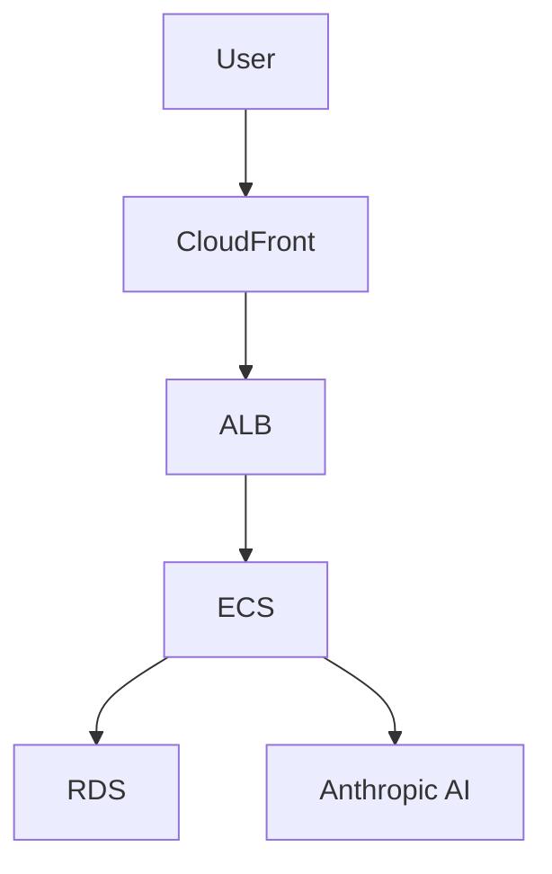
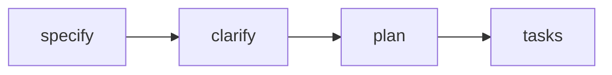

# Patterns Discovered

Recurring code, testing, and debugging patterns that improve reliability and speed.
This is an accumulated knowledge base and should grow over time. Written in English.

## Pattern Template

### Pattern Name
- <short, descriptive name>
- **Discovered**: <YYYY-MM-DD> — **Tool**: <Claude Code | GitHub Copilot>

### Context
- <where this appears: backend/frontend/tests/build/debug>

### Problem
- <what issue repeatedly occurs>

### Solution
- <recommended approach>

### Example
```
// minimal code snippet or pseudocode
```

### Related Files
- <path 1>
- <path 2>

---

### Free Container Runtime for Testcontainers (Go Integration Testing)

### Context
- Backend — integration tests using testcontainers-go; macOS/Linux development environments

### Problem
- Integration tests with testcontainers require Docker API access. Docker Desktop requires paid license for commercial use. Tests fail with "Cannot connect to Docker daemon" without container runtime.

### Solution
- Use **Colima** (or Podman/Rancher Desktop) as free Docker-compatible container runtime:
  1. Install: `brew install colima` (macOS) or from GitHub releases (Linux)
  2. Start: `colima start --cpu 2 --memory 4`
  3. Verify: `docker ps` should work without errors
  4. Colima provides Docker-compatible API that testcontainers can use
  5. Lightweight (uses containerd under the hood)
  6. No licensing restrictions

**Configuration:**
```bash
# Start Colima with recommended settings
colima start --cpu 2 --memory 4 --disk 60

# Verify status
colima status  # Should show "Running"

# Stop when not needed
colima stop
```

**Benefits:**
- Free and open source
- Docker CLI compatibility (no code changes)
- Lightweight (lower resource usage than Docker Desktop)
- Works with testcontainers-go without configuration
- No licensing issues for commercial use

### Example
```bash
# Before running integration tests:
colima status || colima start --cpu 2 --memory 4

# Run tests with PostgreSQL container
go test -v ./internal/database/ -tags=integration

# Testcontainers automatically uses Colima's Docker API
```

### Related Files
- `backend/README.md` — Container Runtime Setup section
- `backend/TESTING.md` — Comprehensive testing strategy guide
- `backend/Makefile` — Test commands with clear documentation
- `backend/internal/database/client_integration_test.go` — uses testcontainers
- `.github/agents/tdd-developer.agent.md` — Container Runtime Requirement section
- `.github/workflows/backend-ci.yml` — CI test configuration

---

### Layered Testing Strategy with Optional Testcontainers (Go)

### Context
- Backend — test organization, CI/CD pipeline, local development workflow; applies to any Go project using testcontainers

### Problem
- Testcontainers require Docker/Colima running locally, creating friction for quick TDD cycles. Developers want fast unit tests for daily work AND comprehensive integration tests before commits. Hard Docker dependency makes local development slower and CI configuration complex. Need consistent behavior between local and CI environments.

### Solution
- **Layered testing with `testing.Short()` flag** to make testcontainers optional:
  1. **Unit tests** (always run) - No database, no Docker, < 10s feedback
  2. **Testcontainer tests** (optional) - Real PostgreSQL, skip with `-short`
  3. **Integration tests** (separate) - Real DATABASE_URL, different build tag

**Test skip pattern:**
```go
func TestWithTestcontainer(t *testing.T) {
    if testing.Short() {
        t.Skip("skipping testcontainer test in short mode")
    }
    // Testcontainer code here
}
```

**Makefile strategy:**
```makefile
# Default: unit tests only (no Docker)
test:
    go test -tags=test -v ./... -short

# Full suite (requires Colima)
test-all:
    go test -tags=test -v ./...

# CI configuration (same as default)
test-coverage:
    go test -tags=test -v ./... -short -race -coverprofile=coverage.out
```

**CI uses:** `make test-coverage` (unit tests only, fast and reliable)

**Benefits:**
- ✅ Fast local TDD cycle (< 10s)
- ✅ No Docker/Colima required for daily dev
- ✅ Optional comprehensive testing (`make test-all`)
- ✅ CI runs fast without Docker-in-Docker
- ✅ Consistent local/CI behavior
- ✅ No test duplication (same tests, conditional execution)

### Example
```bash
# Daily development (fast, no Docker)
make test
# Output: 3 unit tests PASS, 7 testcontainer tests SKIP

# Before creating PR (full coverage, requires Colima)
colima start --cpu 2 --memory 4
make test-all
# Output: All 10 tests PASS

# CI pipeline (matches local default)
make test-coverage
# Output: 3 unit tests PASS, 7 skipped, coverage report generated
```

### Related Files
- `backend/TESTING.md` — Complete testing strategy documentation with troubleshooting
- `backend/Makefile` — Test command definitions with help text
- `backend/README.md` — Quick start testing guide
- `backend/internal/database/client_test.go` — testcontainer tests with Short() checks
- `.github/workflows/backend-ci.yml` — CI pipeline using `make test-coverage`

---

### Automated Mock Generation with Mockery (Go Testing)

### Context
- Backend — all packages with interfaces that need mocking for tests

### Problem
- Manually writing mocks is tedious, error-prone, and requires maintenance when interfaces change. Hand-written mocks lack type safety and can get out of sync with interface definitions. Test setup becomes verbose and repetitive.

### Solution
- Use **vektra/mockery** to automatically generate type-safe mocks from interfaces:
  1. Define interface in production code (Dependency Injection pattern)
  2. Configure `.mockery.yaml` with interface locations and generation settings
  3. Run `mockery` or `make mocks` to generate mock implementations
  4. Generated mocks use `testify/mock` and include fluent expectation API
  5. **Standard: Mocks are placed in `/mocks` subdirectory with `_mock.go` suffix**
  6. Mock files include `//go:build test` tag to exclude from production
  7. Commit generated mocks to git for team consistency

**Mock Location Standard (MANDATORY):**
```
Pattern: <package_path>/mocks/<interface_name>_mock.go

Examples:
  internal/database/client.go          → internal/database/mocks/client_mock.go
  internal/ai/provider.go              → internal/ai/mocks/provider_mock.go
  internal/subscription/service.go     → internal/subscription/mocks/service_mock.go
```

**Mockery Configuration (.mockery.yaml):**
```yaml
with-expecter: true                          # Enable EXPECT() fluent API
dir: "{{.InterfaceDir}}/mocks"              # Generate in /mocks subdirectory
filename: "{{.InterfaceName | snakecase}}_mock.go"  # Use snake_case naming
```

**Benefits:**
- Type-safe: Compiler catches interface changes immediately
- Consistent: All mocks follow same pattern
- Organized: Mocks separated in /mocks subdirectory
- Fluent API: `.EXPECT().Method(args).Return(value).Once()`
- Auto-cleanup: `NewMockClient(t)` registers automatic assertion checking
- Low maintenance: Regenerate when interface changes

### Example
```go
// 1. Define interface (production code)
// File: internal/database/client.go
type Client interface {
    Ping(ctx context.Context) error
    Close() error
}

// 2. Generate mock: make mocks
// Creates: internal/database/mocks/client_mock.go
//go:build test
package database
type MockClient struct { ... }

// 3. Use in tests (note the import alias)
import (
    "github.com/yourproject/internal/database"
    dbmocks "github.com/yourproject/internal/database/mocks"
)

func TestService(t *testing.T) {
    // Create mock from mocks subdirectory
    mockDB := dbmocks.NewMockClient(t)
    mockDB.EXPECT().Ping(mock.Anything).Return(nil).Once()
    
    service := NewService(mockDB)
    err := service.HealthCheck(context.Background())
    
    assert.NoError(t, err)
    // Expectations verified automatically on t.Cleanup()
}
```

### Related Files
- `backend/.mockery.yaml` — mockery configuration
- `backend/internal/database/mocks/client_mock.go` — generated mock example
- `backend/internal/database/client_mock_example_test.go` — usage examples
- `docs/mock-standards.md` — Comprehensive mock generation reference
- `docs/coding-guidelines.md` — Mock Generation section
- `docs/testing-guidelines.md` — Mockery usage patterns

---

### Dependency Injection with Interface-First Design (Go)

### Context
- Backend — all internal packages that need testability and component swapping

### Problem
- Direct dependencies on concrete types make code hard to test (can't mock), hard to change (tight coupling), and hard to extend (can't swap implementations). Testing requires real database connections, external API calls, or complex setup.

### Solution
- **Define the interface first**, then implement it:
  1. Create a small, focused interface (1-5 methods) in the consumer package
  2. Implement the interface with a private concrete type (lowercase name)
  3. Factory function returns the interface, not the concrete type
  4. Consumers depend on the interface, not the implementation
  5. Tests create mock implementations of the interface (use mockery for automation)

**Key principles:**
- Accept interfaces, return interfaces (when multiple implementations exist)
- Interfaces belong to the consumer, not the producer
- Keep interfaces small and focused (Interface Segregation Principle)
- Name interfaces with `-er` suffix when appropriate (Reader, Writer, Client)

### Example
```go
// Define interface (public)
type Client interface {
    Ping(ctx context.Context) error
    Close() error
    Pool() *pgxpool.Pool
}

// Concrete implementation (private)
type pgxClient struct {
    pool   *pgxpool.Pool
    closed bool
}

// Factory returns interface
func NewClient(ctx context.Context, url string) (Client, error) {
    client := &pgxClient{...}
    return client, nil
}

// Usage in consumer
var db database.Client
db, err := database.NewClient(ctx, url)

// Easy mocking in tests (use mockery to generate)
mockDB := database.NewMockClient(t)
mockDB.EXPECT().Ping(mock.Anything).Return(nil)
```

### Related Files
- `backend/internal/database/client.go` — database client with interface
- `backend/internal/subscription/payment/provider.go` — payment provider interface
- `docs/coding-guidelines.md` — Dependency Injection section
- `.github/memory/patterns-discovered.md` — Mockery pattern for automated mock generation

---

### Swappable Payment Provider (Go Interface Pattern)

### Context
- Backend — `internal/subscription/payment/`

### Problem
- MVP needs a mock payment stub, but post-MVP must plug in a real provider (Stripe, etc.) without rewriting subscription domain logic.

### Solution
- Define a `PaymentProvider` interface in `provider.go` with `CreateSubscription`, `CancelSubscription`, and `GetSubscription` methods. Implement `StubProvider` in `stub.go` (always returns `succeeded`, logs `[STUB]`). Inject via constructor; swap by changing the concrete type passed at startup.

### Example
```go
type PaymentProvider interface {
    CreateSubscription(ctx context.Context, req CreateSubscriptionRequest) (*SubscriptionResult, error)
    CancelSubscription(ctx context.Context, subscriptionID string) error
    GetSubscription(ctx context.Context, subscriptionID string) (*SubscriptionStatus, error)
}
```

### Related Files
- `specs/001-product-vision-scope/research.md` (Decision 6)
- `backend/internal/subscription/payment/provider.go`
- `backend/internal/subscription/payment/stub.go`

---\n\n### Suggest-Then-Approve Collaboration Workflow\n\n### Context\n- Backend \u2014 `internal/suggestion/`; Frontend \u2014 `features/suggestions/`\n\n### Problem\n- Multi-user collaboration needs write-access control: partners should be able to contribute without directly modifying the authoritative itinerary.\n\n### Solution\n- Partners submit `Suggestion` records (status: `pending`). The admin is the sole actor who can `approve` (applying the change) or `reject` (no itinerary change). All suggestions are retained permanently \u2014 never hard-deleted \u2014 for audit history.\n\n### Example\n```\nPOST /trips/:id/suggestions        \u2192 partner creates (pending)\nPATCH .../suggestions/:id/approve  \u2192 admin applies + status: approved\nPATCH .../suggestions/:id/reject   \u2192 admin rejects + status: rejected\n```\n\n### Related Files\n- `specs/001-product-vision-scope/spec.md` (FR-009, FR-011)\n- `specs/001-product-vision-scope/data-model.md` (Suggestion entity)\n- `specs/001-product-vision-scope/contracts/api.md` (Suggestions section)

## Example Pattern

### Pattern Name
- Prefer Empty Collection Over Null

### Context
- Service/module state initialization for list-like data.

### Problem
- Initializing collection state with null requires repetitive null guards.

### Solution
- Initialize list-like state as an empty collection and treat it as the default
  no-data state; enables direct iteration without guards.

### Related Files
- <add real paths as they emerge>

---

### Server-Side Prompt Validation Deny-List (AI Security Pattern)

### Context
- Backend — `internal/ai/validator/`; any endpoint that forwards user input to an LLM

### Problem
- Users can submit adversarial prompts that attempt to override the system prompt, extract secrets, switch roles, or drive the AI outside the application's purpose (travel planning). Relying solely on the LLM's own refusal behaviour is not sufficient.

### Solution
- Implement a server-side `PromptValidator` that loads a versioned deny-list from `backend/config/prompt-rules.yml` at startup. Each rule has an `id`, `description`, `pattern`, `match_type` (`substring` | `regex`), and `enabled` flag. Call `Validate(prompt)` before forwarding to the AI provider. On match: return `400 Bad Request` with `{"error":"invalid_prompt","message":"<user-safe text>","request_id":"..."}` and emit a `WARN` slog entry with the matched rule ID (never revealed to the client). The system prompt is kept server-side and treated as a secret (env var, never logged).

### Example
```go
// prompt_validator.go
type PromptValidator struct{ rules []Rule }

func (v *PromptValidator) Validate(prompt string) (ruleID string, matched bool) {
    for _, r := range v.rules {
        if !r.Enabled { continue }
        if r.matches(prompt) { return r.ID, true }
    }
    return "", false
}
```

### Related Files
- `specs/002-nfr-system-constraints/spec.md` (NFR-SEC-007, NFR-SEC-008)
- `backend/internal/ai/validator/prompt_validator.go`
- `backend/config/prompt-rules.yml`

---

### Task Grouping for Issue Management (Roadmap Pattern)

### Context
- Project planning — `docs/roadmap.md`; applies before running `/sync-issues` to create GitHub issues

### Problem
- Large projects generate hundreds of granular tasks. Creating one GitHub issue per task fragments the backlog, increases PR/review overhead, and obscures the big picture. Reviewers see 10 separate PRs for what should be one coherent work item.

### Solution
- Before running `/sync-issues`, identify tasks that share context and can be bundled into a single work item:
  - Tasks in the same file or closely related files (e.g. middleware + tests, component + tests)
  - Tasks in the same domain with no dependency gaps between them
  - Small setup/config tasks that belong together (e.g. linter configs, CI workflow files)
- Assign a shared `Group` value (e.g. `G-SETUP-INIT`, `G-US1-COMPONENTS`) to those rows in the roadmap.
- When `/sync-issues` runs, grouped tasks form ONE issue with a checklist of member tasks. The issue title references the group; the body lists all stable IDs.
- Result: fewer issues (one per group + standalone tasks), cleaner backlog, one PR per logical unit of work.

### Example
```markdown
| ID | Task | Group | Sprint | Priority | Status | ... |
|----|------|-------|--------|----------|--------|-----|
| 001-T002 | Initialize Go module | G-SETUP-INIT | 1 | P1 | Backlog | ... |
| 001-T003 | Initialize React project | G-SETUP-INIT | 1 | P1 | Backlog | ... |

→ When `/sync-issues` runs, these 2 tasks become ONE issue with a 2-item checklist.
```

### Related Files
- `docs/roadmap.md`
- `.github/prompts/build-roadmap.prompt.md`
- `.github/memory/session-notes.md` (2026-07-02 session)

---

### Documentation-Centric SpecKit Workflow

### Context
- SpecKit workflows — applies to features that produce documentation/standards rather than code implementation

### Problem
- Documentation features (standards docs, runbooks, style guides) might seem too simple for full SpecKit workflow. Temptation to skip planning and jump straight to writing the doc. However, this risks ambiguity, missing edge cases, and unclear acceptance criteria.

### Solution
- Documentation features follow the SAME SpecKit workflow as code features: specify → plan → clarify → tasks. Even pure documentation benefits from:
  - **Specification**: User stories defining who needs the doc, what questions it must answer, acceptance criteria (e.g. "backend dev designs compliant endpoint in < 15 min")
  - **Planning**: Research decisions documented (e.g. why offset pagination vs. cursor, why snake_case vs. camelCase), technical context, constitution check
  - **Clarification**: Validate spec completeness across all categories (even docs have edge cases, error handling, user stories)
  - **Tasks**: Dependency-ordered implementation (e.g. standards doc promotion BLOCKS all user story work)
- Result: High-quality documentation with zero ambiguity, clear MVP scope, testable outcomes, and proper dependency ordering.

### Example
```
Spec 007 (API Design Standards) — documentation feature:
- Spec: 4 user stories (backend dev, frontend dev, code reviewer, API consumer)
- Plan: 9 research decisions (resource naming, error format, pagination strategy)
- Clarify: 0 ambiguities found (spec quality validated)
- Tasks: 70 tasks in 7 phases, 38 parallelizable (54%)
- MVP: Phase 1-3 (22 tasks) = standards doc promoted and backend devs can use it
```

### Related Files
- `specs/007-api-design-standards/spec.md`
- `specs/007-api-design-standards/tasks.md`
- `.github/memory/session-notes.md` (2026-07-06 session)

---

### Idempotent Roadmap Reconciliation

### Context
- Project planning — `docs/roadmap.md` maintenance; triggered by `/build-roadmap` workflow

### Problem
- As specs evolve (new specs added, existing specs refined, tasks added/removed), the roadmap must stay in sync with source `tasks.md` files. Naive regeneration would destroy human-curated metadata (sprint assignments, priority overrides, issue links, notes). Manual sync is error-prone and doesn't scale.

### Solution
- Implement **reconciliation, not regeneration**: `/build-roadmap` diffs source specs against existing roadmap and applies minimal add/update/remove operations:
  - **ADD**: Task present in source, absent from roadmap → insert new row with source-derived fields, default human-owned fields (Priority=TBD, Status=Backlog, Issue=empty)
  - **UPDATE**: Task present in both, source changed → refresh ONLY source-derived fields (title, dependencies), preserve ALL human-owned fields (Group, Sprint, Priority, Status, Issue, Notes)
  - **UNCHANGED**: Task present in both, source identical → leave row untouched
  - **REMOVE**: Task present in roadmap, absent from source → archive if has Issue link OR Status > Backlog; hard-delete if Backlog + no Issue (refined away)
- Use **stable global IDs** (`<spec-number>-<task-id>`) as anchor for matching across runs.
- Result: Running `/build-roadmap` repeatedly converges to correct state, never duplicates, preserves human work, supports iterative spec refinement.

### Example
```
Run 1: Spec 007 added → 70 tasks inserted
Run 2: Spec 007 refined (task title changed) → 1 task updated (title only), 69 unchanged
Run 3: Spec 007 task T042 removed from source → archived to "Removed" section (preserves history)
```

### Related Files
- `docs/roadmap.md`
- `.github/prompts/build-roadmap.prompt.md`
- `.github/memory/session-notes.md` (2026-07-06 session)

---
```markdown
| ID | Task | Group | Issue |
|----|------|-------|-------|
| 001-T002 | Initialize Go module | G-SETUP-INIT | |
| 001-T003 | Initialize React project | G-SETUP-INIT | |
| 001-T004 | Configure golangci-lint | G-SETUP-INIT | |
| 001-T005 | Configure ESLint | G-SETUP-INIT | |

→ Creates 1 issue "G-SETUP-INIT — Module & Linter Setup" with 4-item checklist.
```

### Related Files
- `docs/roadmap.md`
- `.github/prompts/build-roadmap.prompt.md`
- `.github/prompts/sync-issues.prompt.md`

---

### NFR Observability Primitives Must Precede Feature Work (Ordering Pattern)

### Context
- Cross-cutting infrastructure; especially when NFR specs are authored after feature specs

### Problem
- An NFR spec defines observability, security, and performance requirements that *validate* application features — but these primitives (request-ID middleware, structured logging, `/healthz`) are foundational to the feature code that gets tested. If they are deprioritised alongside their P2 user story (US4 Observability), they block everything else.

### Solution
- In `tasks.md`, extract the **implementation** of observability primitives into the Foundational phase (Phase 2), regardless of the spec's user-story priority order. The P2 user story then only contains **validation tests** (integration tests asserting log structure, header correlation) that can safely run after the P1 stories. Document this ordering mismatch in the tasks.md cross-spec notes.

### Example
```
Phase 2 (Foundational): T006 RequestID middleware, T008 Logger middleware, T010 /healthz handler
Phase 6 (US4 P2):       T037 integration test for Logger, T038 integration test for RequestID
```

### Related Files
- `specs/002-nfr-system-constraints/tasks.md` (Phase 2 vs Phase 6 split)
- `specs/002-nfr-system-constraints/spec.md` (US4 — Observability, Priority P2)

---

### Foundation Promotion Workflow (Context Propagation Pattern)

### Context
- Project planning — executed after foundation specs stabilize; re-run whenever a foundation spec is refined

### Problem
- SpecKit reads the constitution and the current spec, but NOT other specs. If architectural decisions, NFRs, security rules, or cloud strategy live only in `specs/NNN-*/spec.md`, future feature planning is blind to them. This causes downstream implementations to violate foundational constraints or duplicate decision-making.

### Solution
- Run `/promote-foundations` to extract durable decisions from foundation specs and route them to the two places the entire project reads:
  1. **Constitution** (`.specify/memory/constitution.md`) — non-negotiable principles and mandated technology choices that all specs must honor
  2. **Documentation** (`docs/*.md`) — reference material (architecture, NFRs, security model, data model) wired into `.github/copilot-instructions.md` so every agent invocation inherits it
- Promoted docs use `<!-- PROMOTED:name START -->` markers for idempotent updates and include source attribution
- After promotion, every `/speckit.plan`, `/speckit.tasks`, and implementation inherits foundational context automatically

### Example
```markdown
Constitution gets:
- Mandated stack (AWS/Terraform/ECS)
- Non-negotiable security rules (prompt injection validation, output sanitization)

docs/ gets:
- product-vision.md (personas, MVP scope, roles)
- nfrs.md (measurable targets, validation methods)
- architecture.md (components, integration rules)
- security.md (auth model, secrets management)
- cloud-and-environments.md (infrastructure strategy)
```

### Related Files
- `.github/prompts/promote-foundations.prompt.md`
- `.specify/memory/constitution.md`
- `docs/product-vision.md`, `docs/nfrs.md`, `docs/security.md`, `docs/architecture.md`, `docs/cloud-and-environments.md`
- `.github/copilot-instructions.md` (Documentation References section)

---

### ECS Fargate for AI Workloads (Compute Platform Selection Pattern)

### Context
- Backend infrastructure — AWS compute platform choice for services that integrate with AI providers (Anthropic, OpenAI, etc.)

### Problem
- Lambda is commonly used for serverless APIs, but AI workloads have characteristics that violate Lambda's constraints: multi-turn conversations can exceed the 15-minute timeout, large itinerary responses can exceed the 10MB payload limit, and repeated AI calls benefit from persistent HTTP connection pooling.

### Solution
- Use **ECS Fargate** (not Lambda) for AI-integrated services:
  - **Unlimited execution time** — multi-turn AI conversations can run as long as needed without artificial timeouts
  - **No payload size limits** — large AI-generated responses (detailed itineraries) can be returned without chunking
  - **Persistent HTTP connections** — connection pooling to AI provider APIs improves latency and reliability
  - **ARM64 Graviton2** — 20% cost savings vs x86 without code changes
- Trade-off: lose Lambda's automatic scaling-to-zero, but gain predictable performance for AI workloads

### Example
```hcl
# terraform/modules/ecs/main.tf
resource "aws_ecs_task_definition" "backend" {
  cpu                      = "512"   # 0.5 vCPU
  memory                   = "1024"  # 1 GB
  runtime_platform {
    cpu_architecture = "ARM64"  # Graviton2
  }
}
```

### Related Files
- `specs/003-cloud-env-strategy/spec.md` (US1.2 — Compute Platform)
- `specs/003-cloud-env-strategy/research.md` (Fargate vs Lambda decision)
- `docs/cloud-and-environments.md` (Compute Platform section)

---

### Mermaid Diagrams for Documentation (Visual Documentation Pattern)

### Context
- Documentation — `docs/*.md` files where diagrams can improve clarity

### Problem
- ASCII art diagrams (box-drawing characters) don't render well in all Markdown viewers and are hard to maintain. Simple arrow notation (→) is clean for linear command flows but insufficient for multi-component architectures with bidirectional or parallel relationships.

### Solution
- **Use Mermaid** for true architecture/flow diagrams with multiple connected components:
  - System architecture (CloudFront → ALB → ECS → RDS)
  - Multi-phase workflows with branches (foundations → propagation → delivery → scaling)
  - State machines or decision trees
  - Component hierarchies with multiple levels
- **Keep inline arrow notation** (→) for simple command sequences that read left-to-right:
  - SpecKit pipeline: `/speckit.specify → /speckit.clarify → /speckit.plan → /speckit.tasks`
  - Quick reference flows: `specify → clarify → plan → tasks`
- **Always validate syntax** before committing — Mermaid errors break rendering; test locally or use Mermaid Live Editor
- Use color-coding for semantic grouping (e.g., green for active, purple for optional, dashed lines for dormant)

### Example
```markdown
<!-- Good: Mermaid for multi-component architecture -->


<!-- Good: Arrow notation for linear command flow -->
```
/speckit.specify → /speckit.clarify → /speckit.plan → /speckit.tasks
```

<!-- Bad: Mermaid for simple linear flow (overkill) -->

```

### Related Files
- `docs/architecture.md` (component diagram)
- `docs/security.md` (authorization roles, validation pipeline)
- `docs/cloud-and-environments.md` (environment topology, CI/CD pipeline)
- `docs/testing-guidelines.md` (testing strategy pyramid)
- `docs/ui-guidelines.md` (component hierarchy)
- `docs/project-workflow.md` (kept arrow notation after Mermaid syntax errors)

---

### README Documentation Consistency (Multi-Area Pattern)

### Context
- Project documentation — area READMEs at `backend/`, `frontend/`, `e2e/`, `infra/`

### Problem
- In multi-area projects (backend, frontend, E2E, infrastructure), inconsistent README structures make it hard for new contributors to navigate. Some READMEs focus on architecture, others on commands, some have env vars, others don't — no uniform entry point.

### Solution
- Establish a standard README template for all project areas with these sections in order:
  1. **Title + tagline** — area name, tech stack, one-line purpose
  2. **Breadcrumb links** — `[← Back to root README] | [Spec X] | [Doc Y]`
  3. **Responsibility** — 3-7 bullet points: what this area does, key workflows
  4. **Tech Stack** — table format: `| Concern | Library / Tool |`
  5. **Project Structure** — annotated tree with comments explaining each directory
  6. **Prerequisites** — table format: `| Tool | Version | Check |`
  7. **Environment Variables** — table: `| Variable | Required | Description |`
  8. **Setup** — bash commands to initialize from scratch
  9. **Development** — commands to run, test, lint, build
  10. **Related Documentation** — table linking to specs and docs
- Apply consistently across all areas; when adding a new area, copy the template structure
- Root README should have a "Project Areas" section linking to all area READMEs

### Example
```markdown
# backend

> Go 1.24 REST API for TrAIveler — AI-powered travel itinerary generation.

[← Back to root README](../README.md) | [Spec 001](../specs/001-product-vision-scope/spec.md)

## Responsibility
1. Authentication and subscription
2. AI itinerary generation
...

## Tech Stack
| Concern | Library / Tool |
|---------|----------------|
| Language | Go 1.24 |
...
```

### Related Files
- `README.md` (root — Project Areas section)
- `backend/README.md`
- `frontend/README.md`
- `e2e/README.md`
- `infra/README.md`

---

### Simplified GitHub Issue Workflow (One Task = One Issue)

### Context
- Project management — GitHub issue creation from roadmap tasks; applies to all sprints

### Problem
- Creating parent issues + sub-issues for task groups adds overhead (e.g., 23 tasks → 29 issues with 6 parents). Duplicate tracking occurs: parent completion % vs. individual task status. Parent-child hierarchies require specific creation order (sub-issues first to get numbers, then parent with tasklist references). Scales poorly (Sprint 2: 62 tasks → ~82 issues with parents).

### Solution
- **One task = one issue** (1:1 mapping with roadmap). No parent issues, no sub-issues.
- Use GitHub Projects for organization:
  - **Epic labels** (`epic:architecture-foundation`) for high-level grouping
  - **Group custom field** in Projects (set to `G-ARCH-SETUP-DIRS`, etc.) for work package visualization
  - **Project views** (Sprint Board, Epic Board, Group Board) to see related work together
- Create issues in any order (no parent-first or sub-issue-first constraint)
- Track progress through issue status only (no parent completion % to maintain)
- Result: Cleaner backlog, simpler workflow, scales linearly (N tasks = N issues)

### Example
```bash
# Sprint 1: 23 tasks → 23 issues (not 29)
for task_id in 005-T001 005-T002 ...; do
  gh issue create \
    --title "$task_id — <title>" \
    --label "epic:architecture-foundation,sprint:1,priority:P1"
done

# Set Group in Projects UI for visualization
# No parent issues needed — Projects handles grouping
```

### Related Files
- `.github/ISSUE-CREATION-GUIDELINES.md` (simplified workflow section)
- `.github/prompts/create-sprint-issues.prompt.md`
- `docs/roadmap.md` (Group column for Projects grouping)

---

### Dependency Tracking via Cross-Reference Comments

### Context
- GitHub issue management — making "Blocked by" / "Blocks" relationships visible in UI

### Problem
- GitHub's native relationship dropdown requires manual linking in UI (click issue → Development → Add link → search for blocker). For sprints with 20+ issues and complex dependency chains, manual linking is time-consuming and error-prone. Roadmap has dependency data ("Depends on" column), but GitHub doesn't auto-import it.

### Solution
- **Automated cross-reference comments** create visible relationships:
  - For dependent issues: Add comment `**Dependency Tracking**: Blocked by #<blocker>`
  - For blocker issues: Add comment `**Blocks the following issues**: #A, #B, #C`
  - GitHub auto-links issue numbers in comments → creates clickable cross-references
  - Relationships appear in issue timelines and linked issues sections
  - Visible in GitHub Projects dependency views
- Create script (`.github/scripts/setup-issue-relationships.sh`) that:
  1. Reads roadmap dependencies
  2. Maps stable IDs to issue numbers
  3. Calls `gh issue comment` to create cross-references
  4. Idempotent (checks for existing comments before adding)
- Run after all sprint issues are created

### Example
```bash
# Add relationship tracking
gh issue comment 16 --body "**Dependency Tracking**: Blocked by #13

This task (005-T020) requires completion of the blocking issue before work can begin."

gh issue comment 13 --body "**Blocks the following issues**:
- #14 - #15 - #16 - #25 - #27 - #30 - #31 - #32 - #33

These issues depend on completion of this task."
```

### Related Files
- `.github/scripts/setup-issue-relationships.sh` (template script)
- `.github/ISSUE-CREATION-GUIDELINES.md` (dependency tracking section)
- `docs/roadmap.md` (source of "Depends on" relationships)

---

### GitHub Documentation URL Formatting (Issue Creation Pattern)

### Context
- GitHub issue creation — documentation and spec references in issue descriptions; product-manager mode

### Problem
- When creating GitHub issues with documentation references, URLs were malformed:
  - ❌ Wrong: `https://github.com/OWNER/REPO/docs/architecture.md`
  - ❌ Wrong: `https://github.com/OWNER/REPO/specs/005-system-architecture/spec.md`
- These URLs return 404 because they're missing the `/blob/main/` path segment that GitHub requires for file viewing.

### Solution
- **ALWAYS use full GitHub blob URLs** when referencing documentation or specs in issues:
  - ✅ Correct: `https://github.com/OWNER/REPO/blob/main/docs/architecture.md`
  - ✅ Correct: `https://github.com/OWNER/REPO/blob/main/specs/005-system-architecture/spec.md`
- Pattern for issue generation: `https://github.com/{owner}/{repo}/blob/main/{path}`
- Apply to ALL documentation references: specs, docs/, README files, any project file referenced in issues
- Verify URLs are clickable in issue preview before creating

### Example
```markdown
## Related Specifications

**Specs**: [specs/005-system-architecture/spec.md](https://github.com/JosemaPereira/TrAIveler/blob/main/specs/005-system-architecture/spec.md)  
**Documentation**: [docs/architecture.md](https://github.com/JosemaPereira/TrAIveler/blob/main/docs/architecture.md)

NOT:
**Specs**: [specs/005-system-architecture/spec.md](https://github.com/JosemaPereira/TrAIveler/specs/005-system-architecture/spec.md) ❌
```

### Related Files
- All GitHub issues created by product-manager mode
- Issue enhancement templates in `/tmp/sprint2-enhancements/`
- `.github/memory/session-notes.md` (2026-07-08 Sprint 2 session — issue creation and enhancement)

---

### Template-Based Script Customization for Sprint-Specific Needs

### Context
- Automation scripts — sprint-specific dependency tracking, data transformation, batch operations

### Problem
- Hard-coded scripts become obsolete after one use (e.g., Sprint 1 dependency script can't be used for Sprint 2). Copy-paste leads to errors (wrong issue numbers, missed dependencies). Need reusable pattern that forces correct customization.

### Solution
- **Template scripts with placeholder logic**:
  1. Create script with reusable functions (e.g., `add_relationship()`, `add_blocks_comment()`)
  2. Replace sprint-specific data with comments and examples
  3. Add prominent warning: "⚠️ TEMPLATE SCRIPT — Customize for Your Sprint"
  4. Provide clear instructions and example pattern in script header
  5. Script won't work as-is (forces user to read and customize)
- Pattern: Functions at top, sprint-specific calls at bottom (commented out)
- User must: (1) Analyze their data, (2) Uncomment/adapt example, (3) Run script
- Prevents blind copy-paste; ensures sprint-specific correctness

### Example
```bash
#!/bin/bash
# TEMPLATE SCRIPT — Customize for your sprint

add_relationship() {
  local issue=$1
  local blocker=$2
  # ... function logic
}

# CUSTOMIZE BELOW with your sprint's dependencies:
# Example (Sprint 1 pattern):
# add_blocks_comment 13 "14 15 16"
# add_relationship 14 13 "005-T005"
# add_relationship 15 13 "005-T013"

# ADD YOUR SPRINT'S CALLS HERE:
# (Analyze docs/roadmap.md first)
```

### Related Files
- `.github/scripts/setup-issue-relationships.sh` (template example)
- `.github/scripts/README.md` (template usage instructions)

---

### Multi-Layer Enforcement for Mandatory Steps

### Context
- Process compliance — ensuring critical steps aren't skipped in complex workflows

### Problem
- Single-point documentation is easy to miss. Developers skip steps if they're only mentioned in one place. Example: Dependency tracking was initially documented only in guidelines, but wasn't enforced in workflow prompt or checked in script.

### Solution
- **Enforce mandatory steps through 4+ layers**:
  1. **Workflow prompt** — Add mandatory step in agent workflow (e.g., "Step 11: SET UP DEPENDENCY TRACKING")
  2. **Guidelines** — Add rule with ⚠️ warning (e.g., "Rule #5: Dependency Tracking is MANDATORY")
  3. **Checklist** — Mark item with **MANDATORY** in post-work checklist
  4. **Tool design** — Template script forces customization (won't work as-is)
  5. **README** — Repeat requirement with rationale ("Why it's required")
- Each layer reinforces others; no single failure point
- Add "Why" explanation in at least 2 layers (motivation prevents shortcuts)

### Example
Enforcement layers for dependency tracking:
- Prompt: "Step 11: SET UP DEPENDENCY TRACKING (mandatory)"
- Guidelines: "Rule #5: Dependency Tracking is MANDATORY ⚠️"
- Checklist: "[ ] **MANDATORY: Customize and run dependency tracking script**"
- Script: Template won't work until customized
- README: "Why it's required: Makes dependencies visible..."

### Related Files
- `.github/prompts/create-sprint-issues.prompt.md` (workflow layer)
- `.github/ISSUE-CREATION-GUIDELINES.md` (guidelines + checklist layer)
- `.github/scripts/setup-issue-relationships.sh` (tool design layer)
- `.github/scripts/README.md` (documentation layer)

---

### Consolidation-First Issue Creation (Backlog Optimization Pattern)

### Context
- Sprint planning and issue creation — applies BEFORE creating GitHub issues from roadmap tasks

### Problem
- Creating one GitHub issue per atomic task fragments the backlog and wastes tickets. Small related tasks (middleware files, config pairs, primitive components) should be developed together in one PR but create 3-5 separate issues, increasing review overhead and context switching. Post-creation consolidation requires manual GitHub issue closing and roadmap updates.

### Solution
- **Consolidate BEFORE creating issues, not after**:
  1. Group related tasks during sprint planning by shared context (same area/module + same tech stack + similar size)
  2. Assign Group values (e.g., `G-SPRINT2-BACKEND-MIDDLEWARE`) to roadmap rows
  3. Create ONE issue per group with member tasks as a checklist
  4. Each group becomes one reviewable PR (~150-200 LOC)
- **Consolidation Rules (apply automatically)**:
  - ✅ DO consolidate: Same spec + same area/module + same tech stack + shared context + size 2-4 tasks + no blocking deps + independent tracking not required
  - ❌ DON'T consolidate: Different tech stacks (Go + TypeScript) + critical blocker + different dependency chains + cross-spec + already large (>200 LOC)
- **Optimal group size**: 2-4 tasks per group
- **Target**: 10-25% ticket reduction (Sprint 2 achieved -49%)
- **Permanent integration**: Consolidation analysis is now a MANDATORY step in PM agent's sprint planning workflow

### Example
```markdown
Before Consolidation:
- 005-T024: request_id.go → Issue #X
- 005-T025: logger.go → Issue #Y
- 005-T026: recovery.go → Issue #Z
- 005-T027: cors.go → Issue #A
- 005-T028: body_size.go → Issue #B
Result: 5 issues, 5 PRs

After Consolidation:
- G-SPRINT2-BACKEND-MIDDLEWARE → Issue #N with 5-task checklist
Result: 1 issue, 1 PR (~150 LOC, reviewable in 30-60 min)
```

### Related Files
- `.github/agents/product-manager.agent.md` (Task Consolidation section)
- `.github/prompts/plan-sprints.prompt.md` (mandatory consolidation step)
- `.github/ISSUE-CREATION-GUIDELINES.md` (Consolidation-First Workflow)
- `.github/copilot-instructions.md` (Task Consolidation Policy)
- `.github/PM-WORKFLOW-CONSOLIDATION.md` (detailed workflow reference)

---

### Existing Sprints as Refinement Evidence (Idempotency Pattern)

### Context
- Sprint replanning, roadmap updates — when running `/plan-sprints` or modifying sprint assignments

### Problem
- A sprint with issues already created represents completed planning work. Re-planning or recreating those issues causes duplication, GitHub issue URL conflicts in roadmap, and wasted effort. Manual cleanup is required to reconcile.

### Solution
- **Detect existing sprints by Issue URL presence**: If roadmap tasks in a sprint already have values in the Issue column, treat that sprint as refinement evidence and SKIP all modification:
  - Do NOT propose consolidation (already decided)
  - Do NOT recreate issues (already exist)
  - Do NOT modify Sprint/Priority/Group values (human-curated)
  - Use sprint as historical data to inform future sprint patterns
- **Apply consolidation ONLY to new sprints**: Check if tasks in target sprint have Issue URLs; if empty, proceed with consolidation analysis
- **Idempotent workflow**: Running `/plan-sprints` multiple times converges correctly — completed sprints remain untouched, new sprints receive fresh analysis

### Example
```
Sprint 1: 23 tasks with Issue URLs (#13-35)
Action: SKIP — treat as evidence of 1-task-per-issue approach

Sprint 2: 37 tasks with NO Issue URLs
Action: APPLY — mandatory consolidation analysis, propose groups, assign Sprint

Sprint 3: Empty (no tasks assigned yet)
Action: APPLY — full sprint planning workflow
```

### Related Files
- `.github/agents/product-manager.agent.md` (Handling Existing Sprints section)
- `.github/prompts/plan-sprints.prompt.md` (Step 3: Check for existing sprints)
- `docs/roadmap.md` (Issue column presence = refinement complete)

---

### Pattern Name
- Prefer the official multi-agent integration over hand-porting a tool's own config
- **Discovered**: 2026-07-09 — **Tool**: Claude Code

### Context
- Adding a new AI coding agent (e.g. Claude Code) to a project already set up for a different one
  (e.g. GitHub Copilot) via a shared toolkit that has its own agent/prompt files (here: GitHub
  spec-kit's SpecKit workflow).

### Problem
- It's tempting to hand-adapt the existing agent's config files (frontmatter, prompt text) into the
  new tool's format yourself. This is slow, error-prone, and — critically — if the toolkit later
  ships (or already has) a native integration for the new tool, your hand-port can silently collide
  with it (same invocation names, competing/duplicate definitions) once the official one is added.

### Solution
- Before hand-porting anything, check whether the source toolkit already has first-class support
  for the target AI tool. For spec-kit: `specify integration list` shows all available integrations
  and whether the target is "Multi-install Safe"; `specify integration install <key> --force` adds
  it alongside an existing integration without removing the original (force is only needed when the
  *existing* integration isn't declared multi-install-safe). Only hand-port the parts a toolkit's
  official integration doesn't cover.

### Example
```
specify integration list                        # confirm "claude" exists, check multi-install-safe
specify integration install claude --script sh --force
specify integration status                       # confirm default integration unchanged
```

### Related Files
- `.specify/integration.json`
- `.claude/skills/speckit-*/SKILL.md`
- `CLAUDE.md` ("Local Agents & Workflows" section)

---

### Pattern Name
- Hash-manifest drift detection for hand-ported config pairs
- **Discovered**: 2026-07-09 — **Tool**: Claude Code

### Context
- Any situation where equivalent content must exist in two files/formats that can't be mechanically
  auto-generated from one another (here: GitHub Copilot `.agent.md`/`.prompt.md` pairs vs. Claude
  Code `.claude/agents/*.md` subagents — different frontmatter, prompt+agent merging, phrasing
  adaptation) and either side could be edited independently in the future.

### Problem
- Without a canonical source and without full codegen, edits to one side silently drift out of sync
  with the other, and nothing signals it happened until someone notices a behavioral difference.

### Solution
- Maintain a small JSON manifest recording the sha256 of every file in each pair as of the last
  confirmed sync. A companion script recomputes current hashes and reports, per pair, whether
  nothing changed, one side changed (needs porting), or both changed independently (needs manual
  reconciliation) — exit non-zero on any drift so it can gate a workflow. The script only detects
  drift; a human (or agent) still ports the actual content change and then refreshes the manifest.

### Example
```
python3 scripts/check-agent-drift.py             # reports drift, exit 1 if any
# ... manually port the change to the other side ...
python3 scripts/check-agent-drift.py --update <name>   # refresh stored hashes after reconciling
```

### Related Files
- `scripts/check-agent-drift.py`
- `scripts/agent-port-manifest.json`

---

### Pattern Name

- Mockery scope vs. constructor-injection scope for testability
- **Discovered**: 2026-07-09 — **Tool**: Claude Code

### Context

- Any Go package whose dependencies are entirely stdlib types (`http.Handler`, `*slog.Logger`,
  plain config values) rather than domain interfaces defined in this codebase — e.g.
  `backend/internal/middleware/` (`RequestID`, `Logger`, `Recovery`, `CORS`, `BodySize`).

### Problem

- "Use dependency injection and mock dependencies in tests" (`docs/testing-guidelines.md`) can be
  misread as "every dependency needs a `mockery`-generated mock." Reaching for mockery when there's
  no interface to mock is wasted effort and adds a needless abstraction layer purely to satisfy a
  tool, violating this repo's own KISS/DRY guidance.

### Solution

- Mockery (`.mockery.yaml`) is scoped to actual domain interfaces representing real external
  systems (currently only `internal/database.Client`, wrapping a live PostgreSQL pool) — mocking
  those avoids needing the real system in unit tests. Constructor injection alone (passing
  `*slog.Logger`, a config string, or a `next http.Handler` as a plain function argument) is
  sufficient — and preferred — when the dependency is a stdlib type or a single-method interface
  already trivially satisfied by a literal (`http.HandlerFunc`) or a real in-memory instance
  (`slog.New(slog.NewJSONHandler(&bytes.Buffer{}, ...))`). Before reaching for mockery on a new
  package, grep it for `interface` — if there are none, DI via constructor arguments is the whole
  answer.

### Example

```go
// No interface here — plain constructor injection is enough.
func Logger(logger *slog.Logger) func(http.Handler) http.Handler { ... }

// Test: real logger, in-memory sink, no mock needed.
var buf bytes.Buffer
logger := slog.New(slog.NewJSONHandler(&buf, nil))
Logger(logger)(next).ServeHTTP(rec, req)

// Contrast: internal/database.Client IS mocked, because it wraps a real
// external system (PostgreSQL) that unit tests must not depend on.
mockDB := dbmocks.NewMockClient(t)
mockDB.EXPECT().Ping(mock.Anything).Return(nil).Once()
```

### Related Files

- `backend/internal/middleware/*.go`
- `.mockery.yaml`
- `docs/testing-guidelines.md`

---

### Native Cross-Compilation to Avoid QEMU Emulation in Multi-Platform Docker Builds

### Context
- CI/CD — any multi-stage Dockerfile built for a target platform (e.g. `linux/arm64` for ECS Fargate Graviton2) on a CI runner with a different native architecture (e.g. `amd64` GitHub Actions runners); `backend/Dockerfile` + `.github/workflows/backend-ci.yml`'s "Build Docker Image" job

### Problem
- `docker buildx build --platform linux/arm64` on an amd64 runner, with a Dockerfile whose builder stage has no `--platform` pin, runs the *entire* stage — including compilers, package managers, everything — under QEMU emulation. This is easy to miss because the build still succeeds, just slowly, and `cache-from: type=gha` does not help (the cost is CPU-bound emulated execution, not something a layer cache can skip). Measured via real `gh run view --json jobs`/`--log` timing data: a single `RUN CGO_ENABLED=0 GOOS=linux go build ...` step took 451s — 7.5 of the job's ~8.5 total minutes.

### Solution
- Pin the builder stage to the *build machine's* native platform with `FROM --platform=$BUILDPLATFORM <image> AS builder`, then cross-compile explicitly inside it using the auto-populated `ARG TARGETOS` / `ARG TARGETARCH` build args. Go's own toolchain cross-compiles natively (no emulation needed for the compiler itself, especially trivial with `CGO_ENABLED=0`) — the builder stage now runs at full native speed for `go mod download`, `apk add`, and `go build` alike. Only the final runtime stage (copying a prebuilt static binary, tiny `apk add`, `chown`) still targets the real target platform, which is fast since it does no compilation.
- **Always verify a Dockerfile change like this by actually running the multi-platform build**, not just by reasoning from documentation — install `docker buildx` locally if missing (`brew install docker-buildx`, symlink into `~/.docker/cli-plugins/`) and time the real `docker buildx build --platform <target>` command. Also smoke-test the resulting binary (`docker run --platform <target> <image>`) to confirm it actually starts, not just that it compiled — a cross-compile mistake can produce a binary that builds but is subtly broken (wrong arch/ABI).

### Example
```dockerfile
# Before: builder stage inherits the target platform from the top-level
# `docker buildx build --platform linux/arm64` flag -> entire stage runs
# under QEMU on an amd64 CI runner.
FROM golang:1.26-alpine AS builder
RUN CGO_ENABLED=0 GOOS=linux go build -o api ./cmd/api

# After: builder stage pinned to the build machine's real platform;
# only the Go compiler's *output* targets arm64, not the compiler itself.
FROM --platform=$BUILDPLATFORM golang:1.26-alpine AS builder
ARG TARGETOS
ARG TARGETARCH
RUN CGO_ENABLED=0 GOOS=$TARGETOS GOARCH=$TARGETARCH go build -o api ./cmd/api
```

### Related Files
- `backend/Dockerfile`
- `.github/workflows/backend-ci.yml` ("Build Docker Image" job)
- `.github/memory/session-notes.md` (2026-07-09 session — "Domain Error Handling + Docker Build Investigation")

---

### Required Status Checks Must Always Run (Gate Jobs, Not Workflow Triggers)

### Context
- Any repo with GitHub branch protection / repository rulesets requiring named CI status checks, where the underlying workflows are area-scoped (e.g. separate backend/frontend/infra CI files) — `.github/workflows/backend-ci.yml`, `frontend-ci.yml`, `infra-plan.yml` in this repo, required by the "Protect main" ruleset

### Problem
- Using `paths:` filters on a workflow's `pull_request:` trigger to skip irrelevant CI (e.g. only run `frontend-ci.yml` when `frontend/**` changed) seems like the obvious way to keep required checks scoped and CI fast. But if any job from that workflow is also a *required* status check, a PR that doesn't touch the filtered path never triggers the workflow at all — no check run is ever created for that context. GitHub does **not** treat a required check that never reported as passing/skipped; it shows **"Expected — Waiting for status to be reported"** and blocks merging **indefinitely**. This is confirmed, documented GitHub behavior (see Troubleshooting required status checks, cited below), not an edge case — and it's easy to ship without noticing, since the Dockerfile/workflow still "looks correct" and works fine for PRs that do touch the path.

### Solution
- Never put `paths:`/`branches:`/`paths-ignore:` filters on the *trigger* (`on: pull_request:`) of a workflow that contains a required check. Instead:
  1. Add a cheap `changes` job (using `dorny/paths-filter@v3` or equivalent) that always runs and outputs a boolean per relevant area.
  2. Gate every actual job with `needs: changes` + `if: needs.changes.outputs.<area> == 'true'` (add a `github.event_name == 'workflow_dispatch' ||` escape hatch so manual runs always execute fully, since manual dispatch has no meaningful diff base for the filter action).
  3. Do not add `always()` to these `if:` conditions — the goal is for the job to be skipped (not force-run) when the area didn't change; `always()` would defeat that.
- **A job that reports conclusion "skipped" (via a false job-level `if:`) counts as a *passing* required status check** — this is the distinct, documented behavior that makes the workaround work: "check never ran" blocks forever, "check ran and was skipped" does not. Confirmed via GitHub Actions documentation and community discussions, not assumed.
- Verify with `actionlint` (`brew install actionlint`) after any change to `needs`/`if` graphs — it validates job-dependency and expression syntax without needing to push and wait on a real run.
- **Always confirm the fix on a real PR against the real ruleset**, not just by reading the YAML — the actual GitHub Actions Checks UI is the only way to be sure a required check reports (pass/fail) instead of hanging at "Expected." In this repo, doing so also surfaced two genuine pre-existing bugs (`frontend/package.json` missing a `test` script, two unformatted files) that had gone unnoticed because the old path-filtered workflow had rarely run for real.

### Example
```yaml
# Before: required check can hang forever on a PR that doesn't touch frontend/
on:
  pull_request:
    paths:
      - 'frontend/**'
jobs:
  lint:
    name: Lint Frontend Code   # <- required in branch protection/ruleset
    steps: [...]

# After: workflow always triggers; the job itself is what's conditionally skipped
on:
  pull_request:
jobs:
  changes:
    outputs:
      frontend: ${{ steps.filter.outputs.frontend }}
    steps:
      - uses: dorny/paths-filter@v3
        id: filter
        with:
          filters: |
            frontend:
              - 'frontend/**'
  lint:
    name: Lint Frontend Code
    needs: changes
    if: github.event_name == 'workflow_dispatch' || needs.changes.outputs.frontend == 'true'
    steps: [...]
```

### Related Files
- `.github/workflows/backend-ci.yml`, `frontend-ci.yml`, `infra-plan.yml`
- `.github/memory/session-notes.md` (2026-07-09 session — "Repo Ruleset on `main` + Fixing Path-Filtered Required Checks")
- [Troubleshooting required status checks – GitHub Docs](https://docs.github.com/en/pull-requests/collaborating-with-pull-requests/collaborating-on-repositories-with-code-quality-features/troubleshooting-required-status-checks)

---

### Two-Query Pagination, Not COUNT(*) OVER(), for a Truthful Empty-Page Envelope

### Context
- Backend — any `List`/index repository method that returns both a page of rows and a total count for the standard `data`+`pagination` envelope (`docs/api-design-standards.md` §9); first hit in `internal/example/repository.go`'s `List`.

### Problem
- Combining the paginated `SELECT` and the total count into one query via `COUNT(*) OVER()` (a window function) is tempting — one round trip instead of two. But a window function only produces a value on rows actually returned by that query. When `LIMIT`/`OFFSET` lands past the end of the result set (an out-of-range page), zero rows come back, so the window function never evaluates and the total silently reads as 0 — even though matching rows exist. This breaks the documented contract that an empty page's response must still carry the real `total`/`total_pages` (`docs/api-design-standards.md` §9's "return empty array for page beyond total_pages, not 404" implies the envelope stays truthful, not zeroed out). A unit test against a mocked repository can't catch this — the mock just returns whatever `Total` the test hard-codes; only a real database exercising the actual out-of-range-page SQL surfaces it.

### Solution
- Run two queries: a `SELECT COUNT(*) FROM t WHERE <filters>` first, then only run the paginated `SELECT ... LIMIT $ OFFSET $` if `total > 0` (short-circuit to an empty items slice otherwise, skipping the second round trip entirely for the already-known-empty case). Slightly more DB round trips than a window function in the common case, but correct in the edge case that actually matters for the API contract. Always add an integration test that requests a page number known to be past the end of a small, real seeded dataset and asserts `total` is still correct with an empty `items` — this is the only way the window-function bug reliably surfaces.

### Example
```go
// Wrong: total silently reads 0 for out-of-range pages.
const query = `SELECT id, ..., COUNT(*) OVER() AS total_count
               FROM examples WHERE ... ORDER BY created_at DESC LIMIT $1 OFFSET $2`

// Right: total is always correct, independent of which page was requested.
var total int
db.QueryRow(ctx, `SELECT COUNT(*) FROM examples WHERE ...`, ...).Scan(&total)
if total == 0 {
    return &ListResult{Items: []*Example{}, Total: 0}, nil
}
rows, _ := db.Query(ctx, `SELECT ... FROM examples WHERE ... LIMIT $1 OFFSET $2`, ...)
```

### Related Files
- `backend/internal/example/repository.go` (`List`)
- `backend/internal/example/repository_integration_test.go` (`TestIntegrationList_PaginatesAndFiltersByStatus/empty_result_set_for_out-of-range_page` — the test that caught it)
- `docs/api-design-standards.md` §9 (Pagination)

---

### Testcontainers-go with Colima Needs Two Docker Env Vars, Not Just `docker context`

### Context
- Backend — any `testcontainers-go` test (e.g. `internal/database/client_test.go`, `internal/example/repository_integration_test.go`) run locally on macOS with Colima as the Docker runtime, rather than Docker Desktop.

### Problem
- `docker context ls` showing `colima` as the active context is not sufficient for testcontainers-go to find the daemon — without `DOCKER_HOST` set, it attempts an unsupported "rootless Docker" provider path and fails immediately (`get provider: rootless Docker not found`). Setting `DOCKER_HOST` to Colima's macOS-visible socket path gets past that, but then the Ryuk reaper container (which testcontainers-go starts automatically to clean up test containers) fails to start: it tries to bind-mount the Docker socket path *as seen from inside a container*, and the macOS host path (`/Users/.../.colima/default/docker.sock`) doesn't exist inside the Colima Linux VM — error: `error while creating mount source path '...': mkdir ...: operation not supported`.

### Solution
- Set both env vars before running tests, using two *different* paths for two different purposes:
  1. `DOCKER_HOST=unix:///Users/<you>/.colima/default/docker.sock` — the real host-visible socket, used by the Docker API client itself.
  2. `TESTCONTAINERS_DOCKER_SOCKET_OVERRIDE=/var/run/docker.sock` — the path *as seen inside containers* (Colima's VM maps its own `/var/run/docker.sock` internally), used only for the Ryuk reaper's bind mount.
- Confirm `colima status` shows "Running" first; these two vars are the missing piece once it is.

### Example
```bash
colima status || colima start --cpu 2 --memory 4
export DOCKER_HOST=unix:///Users/$(whoami)/.colima/default/docker.sock
export TESTCONTAINERS_DOCKER_SOCKET_OVERRIDE=/var/run/docker.sock
go test -tags=test ./internal/example/... -run TestIntegration -v
```

### Related Files
- `backend/internal/database/client_test.go`, `backend/internal/example/repository_integration_test.go`
- `.github/memory/patterns-discovered.md` ("Free Container Runtime for Testcontainers" — this entry adds the env-var detail that one was missing)
- `.github/memory/session-notes.md` (2026-07-10 session — "Reference Implementation Pattern")


---

### `internal/example/` Is Throwaway — Delete It Once the First Real Domain Ships

### Context
- Backend — `backend/internal/example/` (model.go, repository.go, service.go, handler.go, mocks, `backend/migrations/20260710120000_create_examples_table.sql`, and its mount in `backend/cmd/api/server.go`/`routes.go`).

### Problem
- This package exists solely to demonstrate the canonical layered pattern (model -> repository -> service -> handler) so future domain packages have a concrete template to copy — see its own package doc comment: "It is not a production feature: future domain packages (Trip, User, ...) should copy this package's structure rather than import it." Nothing prevents it from being forgotten and shipping alongside real domains indefinitely, becoming dead code, a confusing extra `/api/v1/examples` endpoint in the live API, and a stale example once the real patterns diverge from it.

### Solution
- **The first time a real domain package following this pattern is implemented (e.g. Trip: `001-T035`/`001-T038`, or `008-T049`/`008-T078`), delete `backend/internal/example/` in full as part of that same PR**: the four `.go` files, `mocks/`, the goose migration (`backend/migrations/20260710120000_create_examples_table.sql` — write a corresponding down-migration/drop as part of the deletion, don't just remove the file), the `Repository`/`Service` entries in `backend/.mockery.yaml`, and its route mount in `backend/cmd/api/server.go`/`routes.go`. Do not leave it "just in case" — the real domain package becomes the new canonical reference once it exists.
- Flagged in `docs/roadmap.md`'s Notes column on rows `005-T038`-`005-T041` so it surfaces during sprint planning, not just in memory.

### Related Files
- `backend/internal/example/` (entire package)
- `backend/migrations/20260710120000_create_examples_table.sql`
- `backend/cmd/api/server.go`, `backend/cmd/api/routes.go`
- `docs/roadmap.md` (rows `005-T038`-`005-T041`)
- `.github/memory/session-notes.md` (2026-07-10 session — "Reference Implementation Pattern")

---

### Pattern Name
- Treat README command blocks as an executable claim, not prose — verify against `package.json`
- **Discovered**: 2026-07-10 — **Tool**: Claude Code

### Context
- Frontend — `frontend/README.md`, `frontend/package.json`, `.github/workflows/frontend-ci.yml`

### Problem
- `frontend/README.md` documented `npm test` and `npm run test:coverage` as if they worked, but `package.json` had no `test` script at all and no test framework installed — anyone following the README verbatim hit `Missing script: "test"`. The same broken command (`npm test -- --coverage --run`) was also what `frontend-ci.yml`'s `test` job actually ran, so this wasn't just a docs nit — it was a live CI-breaking gap waiting to surface the moment a PR touching `frontend/**` opened. It had already been flagged once in a prior session's follow-up list and left unfixed.

### Solution
- Whenever asked to review or update a README (frontend or backend), cross-check every documented command against the real `package.json` `scripts` + `dependencies`/`devDependencies` (or Go equivalent) before treating the doc as accurate — don't just read it for prose quality. A command that "reads fine" can still be a lie if the underlying script/dependency doesn't exist.
- Also check whether any CI workflow (`.github/workflows/*.yml`) invokes the same command — a docs gap and a CI gap are often the same root cause, and fixing only the doc leaves CI broken (or vice versa).

### Example
```bash
# Don't just read the README — check the claim is real:
grep -A5 '"scripts"' frontend/package.json
grep -n "npm test\|npm run" frontend/README.md .github/workflows/frontend-ci.yml
```

### Related Files
- `frontend/README.md`, `frontend/package.json`, `.github/workflows/frontend-ci.yml`
- `.github/memory/session-notes.md` (2026-07-10 session — "Design System Tokens + Frontend Doc/Test Tooling Audit")

---

### Pattern Name
- Remove `compilerOptions.baseUrl` when only used to support `paths` (avoids the TS 7.0 deprecation)
- **Discovered**: 2026-07-10 — **Tool**: Claude Code

### Context
- Frontend — any `tsconfig.json` using `paths` for import aliases (e.g. `@/*` → `./src/*`)

### Problem
- TypeScript's `baseUrl` compiler option is deprecated and slated for removal in TS 7.0; a project's IDE/`tsc` starts warning "Option 'baseUrl' is deprecated... Specify compilerOption 'ignoreDeprecations': '6.0' to silence this error." The instinctive fix (add `ignoreDeprecations`) only suppresses the warning and defers the real problem.

### Solution
- If `baseUrl` exists only to support `paths` (not for bare/non-relative imports), just delete it — since TypeScript 4.1, `paths` resolves relative to the `tsconfig.json` file's own directory without needing `baseUrl` at all. Verified no behavior change via `npm run type-check`/`npm run build` after removal (the `@/*` → `./src/*` alias still resolves correctly for both `tsc` and Vite's own `resolve.alias`, which is configured independently in `vite.config.ts` and unaffected by this).

### Example
```jsonc
// Before (triggers TS 7.0 deprecation warning)
"baseUrl": ".",
"paths": { "@/*": ["./src/*"] }

// After (same resolution, no deprecation)
"paths": { "@/*": ["./src/*"] }
```

### Related Files
- `frontend/tsconfig.json`
- `.github/memory/session-notes.md` (2026-07-10 session — "Design System Tokens + Frontend Doc/Test Tooling Audit")

---

### Issue-Body Snippets and Doc Diagrams Go Stale — Verify Against the Real Source of Truth
- Resolve conflicts by authority level, not by which text you read first
- **Discovered**: 2026-07-10 — **Tool**: Claude Code

### Context
- Any ticket (frontend or backend) whose GitHub issue body includes illustrative pseudocode, or whose file placement is also described by a narrative doc (e.g. `docs/ui-guidelines.md`'s diagrams/tables)

### Problem
- This is now a recurring failure mode across at least three sessions: an issue body's example code used token names that don't exist in the real `tokens.css` (`--color-surface`, `--space-md`, …), a different issue's pseudocode used real backend package signatures that had since changed (`errors.NotFound`, `database.Client`), and this session's issue #63/#65 placed `Card.tsx` and `Form.tsx` under `components/primitives/` and `components/composites/` respectively — while `docs/ui-guidelines.md`'s atomic-design Mermaid diagram and table list `Card` as a *Composite* living directly in `src/components/`, not a Primitive. Trusting whichever source you read first (often the issue body, since it's front-and-center) produces code that's internally consistent but wrong relative to the actual authoritative source.
- Issue bodies are written once at ticket-creation time and never updated as the codebase evolves; narrative docs like `docs/ui-guidelines.md` can also drift out of sync with the spec that actually generated the task breakdown.

### Solution
- Rank sources by authority, don't just pick the first one found:
  1. **The actual current code** (e.g. `tokens.css`, existing sibling components, package signatures) — always verify identifiers/paths against it before use.
  2. **`specs/<NNN>-*/tasks.md` and its sibling `data-model.md`** — per `docs/roadmap.md`'s own legend, these spec files are "the source of truth for task existence, titles, and dependencies." When a roadmap/issue file path conflicts with a narrative doc's diagram, the spec-level task definition wins (confirmed twice: T048-T051's real path came from `specs/005-system-architecture/tasks.md`, matching `docs/roadmap.md`, both of which disagree with `docs/ui-guidelines.md`'s diagram — go with the two agreeing, more specific sources).
  3. **Root `docs/*.md`** (ui-guidelines, coding-guidelines, etc.) — canonical for conventions and values not pinned down at the spec/task level (e.g. actual token *values*, accessibility rules).
  4. **GitHub issue body illustrative code** — lowest authority; treat as a sketch of intent, not a literal spec. Adapt names/paths/signatures to match tiers 1-3, and say so explicitly in the PR/session notes rather than silently deviating.
- When a narrative doc (tier 3) is found to conflict with tier 1/2, don't try to "reconcile" it by editing both — just follow the higher-authority source and note the doc is stale (fixing the stale doc is a separate, explicit task, not a silent side effect of an unrelated ticket).

### Example
```
Issue #63/#65 code snippets:  var(--color-surface), var(--space-md)   → don't exist
Real tokens.css:               --color-white / --color-neutral-100, --space-4  → use these

docs/ui-guidelines.md diagram: Card = Composite, lives in src/components/
specs/005-.../tasks.md T051:   Card.tsx lives in src/components/primitives/
docs/roadmap.md 005-T051:      same primitives/ path                 → spec+roadmap agree, follow them
```

### Related Files
- `frontend/src/styles/tokens.css`
- `docs/ui-guidelines.md` (atomic-design diagram — stale re: Card/Form placement)
- `specs/005-system-architecture/tasks.md`, `specs/005-system-architecture/data-model.md`
- `docs/roadmap.md`
- `.github/memory/session-notes.md` (2026-07-10 sessions: tokens audit, and "Core UI Primitives + Form Composite")

---

### Vitest Without `test.globals: true` Needs an Explicit `afterEach(cleanup)` for React Testing Library
- Silent cross-test DOM leakage in any file with more than one test case
- **Discovered**: 2026-07-10 — **Tool**: Claude Code

### Context
- Frontend — any Vitest + React Testing Library component test file, this project's `frontend/vitest.config.ts`

### Problem
- React Testing Library auto-registers its DOM cleanup (`cleanup()`) after each test by detecting a global test-framework hook (`afterEach`) on `globalThis`. This project's `vitest.config.ts` does **not** set `test.globals: true` (deliberately — avoids polluting the global namespace), so RTL's auto-detection silently finds nothing and never runs cleanup. This was invisible for a long time because the only pre-existing test file (`App.test.tsx`) had exactly one test — a single-test file can't leak state into a next test that doesn't exist. The bug only surfaces once a file has 2+ tests in one `describe` block: earlier renders' DOM nodes accumulate and `screen.getByRole(...)`-style queries can match stale elements from a previous test, or fail with "multiple elements found" for what looks like a single-element query.

### Solution
- Register cleanup explicitly and centrally in the shared test setup file, once, rather than per-test-file or by flipping on `test.globals`: import `afterEach` from `vitest` and `cleanup` from `@testing-library/react` in `src/test/setup.ts`, and call `afterEach(() => cleanup())`. Every test file already loads this setup file via `vitest.config.ts`'s `test.setupFiles`, so no per-file boilerplate is needed once fixed centrally.

### Example
```ts
// frontend/src/test/setup.ts
import '@testing-library/jest-dom/vitest'
import { afterEach } from 'vitest'
import { cleanup } from '@testing-library/react'

afterEach(() => {
  cleanup()
})
```

### Related Files
- `frontend/src/test/setup.ts`
- `frontend/vitest.config.ts` (`test.globals` intentionally unset)
- `.github/memory/session-notes.md` (2026-07-10 session — "Core UI Primitives + Form Composite")
