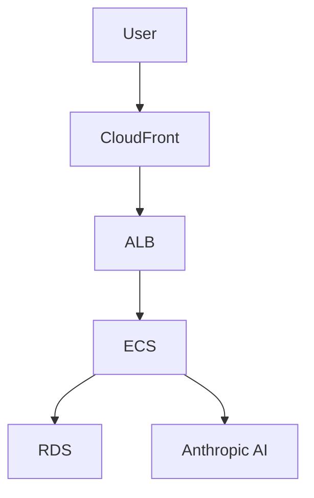
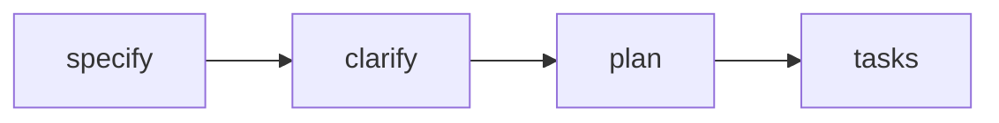

# Patterns Discovered

Recurring code, testing, and debugging patterns that improve reliability and speed.
This is an accumulated knowledge base and should grow over time. Written in English.

## Pattern Template

### Pattern Name
- <short, descriptive name>

### Context
- <where this appears: backend/frontend/tests/build/debug>

### Problem
- <what issue repeatedly occurs>

### Solution
- <recommended approach>

### Example
```
// minimal code snippet or pseudocode
```

### Related Files
- <path 1>
- <path 2>

---\n\n### Swappable Payment Provider (Go Interface Pattern)\n\n### Context\n- Backend \u2014 `internal/subscription/payment/`\n\n### Problem\n- MVP needs a mock payment stub, but post-MVP must plug in a real provider (Stripe, etc.) without rewriting subscription domain logic.\n\n### Solution\n- Define a `PaymentProvider` interface in `provider.go` with `CreateSubscription`, `CancelSubscription`, and `GetSubscription` methods. Implement `StubProvider` in `stub.go` (always returns `succeeded`, logs `[STUB]`). Inject via constructor; swap by changing the concrete type passed at startup.\n\n### Example\n```go\ntype PaymentProvider interface {\n    CreateSubscription(ctx context.Context, req CreateSubscriptionRequest) (*SubscriptionResult, error)\n    CancelSubscription(ctx context.Context, subscriptionID string) error\n    GetSubscription(ctx context.Context, subscriptionID string) (*SubscriptionStatus, error)\n}\n```\n\n### Related Files\n- `specs/001-product-vision-scope/research.md` (Decision 6)\n- `backend/internal/subscription/payment/provider.go`\n- `backend/internal/subscription/payment/stub.go`\n\n---\n\n### Suggest-Then-Approve Collaboration Workflow\n\n### Context\n- Backend \u2014 `internal/suggestion/`; Frontend \u2014 `features/suggestions/`\n\n### Problem\n- Multi-user collaboration needs write-access control: partners should be able to contribute without directly modifying the authoritative itinerary.\n\n### Solution\n- Partners submit `Suggestion` records (status: `pending`). The admin is the sole actor who can `approve` (applying the change) or `reject` (no itinerary change). All suggestions are retained permanently \u2014 never hard-deleted \u2014 for audit history.\n\n### Example\n```\nPOST /trips/:id/suggestions        \u2192 partner creates (pending)\nPATCH .../suggestions/:id/approve  \u2192 admin applies + status: approved\nPATCH .../suggestions/:id/reject   \u2192 admin rejects + status: rejected\n```\n\n### Related Files\n- `specs/001-product-vision-scope/spec.md` (FR-009, FR-011)\n- `specs/001-product-vision-scope/data-model.md` (Suggestion entity)\n- `specs/001-product-vision-scope/contracts/api.md` (Suggestions section)

## Example Pattern

### Pattern Name
- Prefer Empty Collection Over Null

### Context
- Service/module state initialization for list-like data.

### Problem
- Initializing collection state with null requires repetitive null guards.

### Solution
- Initialize list-like state as an empty collection and treat it as the default
  no-data state; enables direct iteration without guards.

### Related Files
- <add real paths as they emerge>

---

### Server-Side Prompt Validation Deny-List (AI Security Pattern)

### Context
- Backend — `internal/ai/validator/`; any endpoint that forwards user input to an LLM

### Problem
- Users can submit adversarial prompts that attempt to override the system prompt, extract secrets, switch roles, or drive the AI outside the application's purpose (travel planning). Relying solely on the LLM's own refusal behaviour is not sufficient.

### Solution
- Implement a server-side `PromptValidator` that loads a versioned deny-list from `backend/config/prompt-rules.yml` at startup. Each rule has an `id`, `description`, `pattern`, `match_type` (`substring` | `regex`), and `enabled` flag. Call `Validate(prompt)` before forwarding to the AI provider. On match: return `400 Bad Request` with `{"error":"invalid_prompt","message":"<user-safe text>","request_id":"..."}` and emit a `WARN` slog entry with the matched rule ID (never revealed to the client). The system prompt is kept server-side and treated as a secret (env var, never logged).

### Example
```go
// prompt_validator.go
type PromptValidator struct{ rules []Rule }

func (v *PromptValidator) Validate(prompt string) (ruleID string, matched bool) {
    for _, r := range v.rules {
        if !r.Enabled { continue }
        if r.matches(prompt) { return r.ID, true }
    }
    return "", false
}
```

### Related Files
- `specs/002-nfr-system-constraints/spec.md` (NFR-SEC-007, NFR-SEC-008)
- `backend/internal/ai/validator/prompt_validator.go`
- `backend/config/prompt-rules.yml`

---

### Task Grouping for Issue Management (Roadmap Pattern)

### Context
- Project planning — `docs/roadmap.md`; applies before running `/sync-issues` to create GitHub issues

### Problem
- Large projects generate hundreds of granular tasks. Creating one GitHub issue per task fragments the backlog, increases PR/review overhead, and obscures the big picture. Reviewers see 10 separate PRs for what should be one coherent work item.

### Solution
- Before running `/sync-issues`, identify tasks that share context and can be bundled into a single work item:
  - Tasks in the same file or closely related files (e.g. middleware + tests, component + tests)
  - Tasks in the same domain with no dependency gaps between them
  - Small setup/config tasks that belong together (e.g. linter configs, CI workflow files)
- Assign a shared `Group` value (e.g. `G-SETUP-INIT`, `G-US1-COMPONENTS`) to those rows in the roadmap.
- When `/sync-issues` runs, grouped tasks form ONE issue with a checklist of member tasks. The issue title references the group; the body lists all stable IDs.
- Result: fewer issues (one per group + standalone tasks), cleaner backlog, one PR per logical unit of work.

### Example
```markdown
| ID | Task | Group | Issue |
|----|------|-------|-------|
| 001-T002 | Initialize Go module | G-SETUP-INIT | |
| 001-T003 | Initialize React project | G-SETUP-INIT | |
| 001-T004 | Configure golangci-lint | G-SETUP-INIT | |
| 001-T005 | Configure ESLint | G-SETUP-INIT | |

→ Creates 1 issue "G-SETUP-INIT — Module & Linter Setup" with 4-item checklist.
```

### Related Files
- `docs/roadmap.md`
- `.github/prompts/build-roadmap.prompt.md`
- `.github/prompts/sync-issues.prompt.md`

---

### NFR Observability Primitives Must Precede Feature Work (Ordering Pattern)

### Context
- Cross-cutting infrastructure; especially when NFR specs are authored after feature specs

### Problem
- An NFR spec defines observability, security, and performance requirements that *validate* application features — but these primitives (request-ID middleware, structured logging, `/healthz`) are foundational to the feature code that gets tested. If they are deprioritised alongside their P2 user story (US4 Observability), they block everything else.

### Solution
- In `tasks.md`, extract the **implementation** of observability primitives into the Foundational phase (Phase 2), regardless of the spec's user-story priority order. The P2 user story then only contains **validation tests** (integration tests asserting log structure, header correlation) that can safely run after the P1 stories. Document this ordering mismatch in the tasks.md cross-spec notes.

### Example
```
Phase 2 (Foundational): T006 RequestID middleware, T008 Logger middleware, T010 /healthz handler
Phase 6 (US4 P2):       T037 integration test for Logger, T038 integration test for RequestID
```

### Related Files
- `specs/002-nfr-system-constraints/tasks.md` (Phase 2 vs Phase 6 split)
- `specs/002-nfr-system-constraints/spec.md` (US4 — Observability, Priority P2)

---

### Foundation Promotion Workflow (Context Propagation Pattern)

### Context
- Project planning — executed after foundation specs stabilize; re-run whenever a foundation spec is refined

### Problem
- SpecKit reads the constitution and the current spec, but NOT other specs. If architectural decisions, NFRs, security rules, or cloud strategy live only in `specs/NNN-*/spec.md`, future feature planning is blind to them. This causes downstream implementations to violate foundational constraints or duplicate decision-making.

### Solution
- Run `/promote-foundations` to extract durable decisions from foundation specs and route them to the two places the entire project reads:
  1. **Constitution** (`.specify/memory/constitution.md`) — non-negotiable principles and mandated technology choices that all specs must honor
  2. **Documentation** (`docs/*.md`) — reference material (architecture, NFRs, security model, data model) wired into `.github/copilot-instructions.md` so every agent invocation inherits it
- Promoted docs use `<!-- PROMOTED:name START -->` markers for idempotent updates and include source attribution
- After promotion, every `/speckit.plan`, `/speckit.tasks`, and implementation inherits foundational context automatically

### Example
```markdown
Constitution gets:
- Mandated stack (AWS/Terraform/ECS)
- Non-negotiable security rules (prompt injection validation, output sanitization)

docs/ gets:
- product-vision.md (personas, MVP scope, roles)
- nfrs.md (measurable targets, validation methods)
- architecture.md (components, integration rules)
- security.md (auth model, secrets management)
- cloud-and-environments.md (infrastructure strategy)
```

### Related Files
- `.github/prompts/promote-foundations.prompt.md`
- `.specify/memory/constitution.md`
- `docs/product-vision.md`, `docs/nfrs.md`, `docs/security.md`, `docs/architecture.md`, `docs/cloud-and-environments.md`
- `.github/copilot-instructions.md` (Documentation References section)

---

### ECS Fargate for AI Workloads (Compute Platform Selection Pattern)

### Context
- Backend infrastructure — AWS compute platform choice for services that integrate with AI providers (Anthropic, OpenAI, etc.)

### Problem
- Lambda is commonly used for serverless APIs, but AI workloads have characteristics that violate Lambda's constraints: multi-turn conversations can exceed the 15-minute timeout, large itinerary responses can exceed the 10MB payload limit, and repeated AI calls benefit from persistent HTTP connection pooling.

### Solution
- Use **ECS Fargate** (not Lambda) for AI-integrated services:
  - **Unlimited execution time** — multi-turn AI conversations can run as long as needed without artificial timeouts
  - **No payload size limits** — large AI-generated responses (detailed itineraries) can be returned without chunking
  - **Persistent HTTP connections** — connection pooling to AI provider APIs improves latency and reliability
  - **ARM64 Graviton2** — 20% cost savings vs x86 without code changes
- Trade-off: lose Lambda's automatic scaling-to-zero, but gain predictable performance for AI workloads

### Example
```hcl
# terraform/modules/ecs/main.tf
resource "aws_ecs_task_definition" "backend" {
  cpu                      = "512"   # 0.5 vCPU
  memory                   = "1024"  # 1 GB
  runtime_platform {
    cpu_architecture = "ARM64"  # Graviton2
  }
}
```

### Related Files
- `specs/003-cloud-env-strategy/spec.md` (US1.2 — Compute Platform)
- `specs/003-cloud-env-strategy/research.md` (Fargate vs Lambda decision)
- `docs/cloud-and-environments.md` (Compute Platform section)

---

### Mermaid Diagrams for Documentation (Visual Documentation Pattern)

### Context
- Documentation — `docs/*.md` files where diagrams can improve clarity

### Problem
- ASCII art diagrams (box-drawing characters) don't render well in all Markdown viewers and are hard to maintain. Simple arrow notation (→) is clean for linear command flows but insufficient for multi-component architectures with bidirectional or parallel relationships.

### Solution
- **Use Mermaid** for true architecture/flow diagrams with multiple connected components:
  - System architecture (CloudFront → ALB → ECS → RDS)
  - Multi-phase workflows with branches (foundations → propagation → delivery → scaling)
  - State machines or decision trees
  - Component hierarchies with multiple levels
- **Keep inline arrow notation** (→) for simple command sequences that read left-to-right:
  - SpecKit pipeline: `/speckit.specify → /speckit.clarify → /speckit.plan → /speckit.tasks`
  - Quick reference flows: `specify → clarify → plan → tasks`
- **Always validate syntax** before committing — Mermaid errors break rendering; test locally or use Mermaid Live Editor
- Use color-coding for semantic grouping (e.g., green for active, purple for optional, dashed lines for dormant)

### Example
```markdown
<!-- Good: Mermaid for multi-component architecture -->


<!-- Good: Arrow notation for linear command flow -->
```
/speckit.specify → /speckit.clarify → /speckit.plan → /speckit.tasks
```

<!-- Bad: Mermaid for simple linear flow (overkill) -->

```

### Related Files
- `docs/architecture.md` (component diagram)
- `docs/security.md` (authorization roles, validation pipeline)
- `docs/cloud-and-environments.md` (environment topology, CI/CD pipeline)
- `docs/testing-guidelines.md` (testing strategy pyramid)
- `docs/ui-guidelines.md` (component hierarchy)
- `docs/project-workflow.md` (kept arrow notation after Mermaid syntax errors)

---

### README Documentation Consistency (Multi-Area Pattern)

### Context
- Project documentation — area READMEs at `backend/`, `frontend/`, `e2e/`, `infra/`

### Problem
- In multi-area projects (backend, frontend, E2E, infrastructure), inconsistent README structures make it hard for new contributors to navigate. Some READMEs focus on architecture, others on commands, some have env vars, others don't — no uniform entry point.

### Solution
- Establish a standard README template for all project areas with these sections in order:
  1. **Title + tagline** — area name, tech stack, one-line purpose
  2. **Breadcrumb links** — `[← Back to root README] | [Spec X] | [Doc Y]`
  3. **Responsibility** — 3-7 bullet points: what this area does, key workflows
  4. **Tech Stack** — table format: `| Concern | Library / Tool |`
  5. **Project Structure** — annotated tree with comments explaining each directory
  6. **Prerequisites** — table format: `| Tool | Version | Check |`
  7. **Environment Variables** — table: `| Variable | Required | Description |`
  8. **Setup** — bash commands to initialize from scratch
  9. **Development** — commands to run, test, lint, build
  10. **Related Documentation** — table linking to specs and docs
- Apply consistently across all areas; when adding a new area, copy the template structure
- Root README should have a "Project Areas" section linking to all area READMEs

### Example
```markdown
# backend

> Go 1.24 REST API for TrAIveler — AI-powered travel itinerary generation.

[← Back to root README](../README.md) | [Spec 001](../specs/001-product-vision-scope/spec.md)

## Responsibility
1. Authentication and subscription
2. AI itinerary generation
...

## Tech Stack
| Concern | Library / Tool |
|---------|----------------|
| Language | Go 1.24 |
...
```

### Related Files
- `README.md` (root — Project Areas section)
- `backend/README.md`
- `frontend/README.md`
- `e2e/README.md`
- `infra/README.md`
