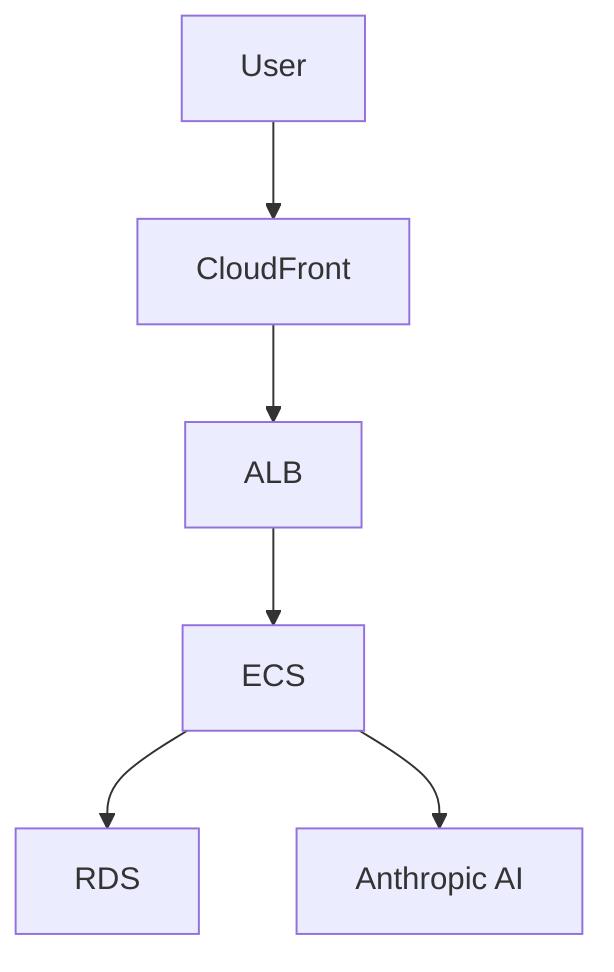

# Patterns Discovered

Recurring code, testing, and debugging patterns that improve reliability and speed.
This is an accumulated knowledge base and should grow over time. Written in English.

**Note**: Simplified/cleaned up 2026-07-11 — merged duplicate entries, removed patterns tied to
deleted tooling (dead file references), fixed corrupted entries, and tightened prose for
readability. No factual content was lost in the process; superseded entries were folded into
their replacement rather than deleted outright where they still added information.

## Pattern Template

### Pattern Name
- <short, descriptive name>
- **Discovered**: <YYYY-MM-DD> — **Tool**: <Claude Code | GitHub Copilot>

### Context
- <where this appears: backend/frontend/tests/build/debug>

### Problem
- <what issue repeatedly occurs>

### Solution
- <recommended approach>

### Example
```
// minimal code snippet or pseudocode
```

### Related Files
- <path 1>
- <path 2>

---

### Free Container Runtime for Testcontainers (Go Integration Testing)

### Context
- Backend — integration tests using testcontainers-go; macOS/Linux dev environments

### Problem
- testcontainers-go needs Docker API access. Docker Desktop requires a paid license for commercial
  use, and tests fail with "Cannot connect to Docker daemon" without a container runtime.

### Solution
- Use **Colima** (or Podman/Rancher Desktop) as a free, Docker-compatible runtime:
  1. Install: `brew install colima` (macOS) or from GitHub releases (Linux)
  2. Start: `colima start --cpu 2 --memory 4`
  3. Verify: `docker ps` works without errors
- Free, Docker-CLI-compatible (no code changes), lighter than Docker Desktop, works with
  testcontainers-go out of the box.

### Example
```bash
colima status || colima start --cpu 2 --memory 4
go test -v ./internal/database/ -tags=integration
colima stop   # when not needed
```

### Related Files
- `backend/README.md` — Container Runtime Setup section
- `backend/TESTING.md` — Testing strategy guide
- `backend/Makefile` — Test commands
- `backend/internal/database/client_integration_test.go`
- `.github/agents/tdd-developer.agent.md` — Container Runtime Requirement section
- `.github/workflows/backend-ci.yml`

---

### Layered Testing Strategy with Optional Testcontainers (Go)

### Context
- Backend — test organization, CI pipeline, local dev workflow; any Go project using testcontainers

### Problem
- Testcontainers require Docker/Colima running locally, adding friction to fast TDD cycles.
  Developers need quick unit tests day-to-day AND comprehensive integration tests before commit,
  without a hard Docker dependency slowing local dev or complicating CI.

### Solution
- Use `testing.Short()` to make testcontainer tests optional:
  1. **Unit tests** (always run) — no DB, no Docker, <10s feedback
  2. **Testcontainer tests** (optional) — real PostgreSQL, skipped with `-short`
  3. **Integration tests** (separate) — real `DATABASE_URL`, different build tag
- CI runs the fast default (`make test-coverage`, unit-only) so it never needs Docker-in-Docker.

### Example
```go
func TestWithTestcontainer(t *testing.T) {
    if testing.Short() {
        t.Skip("skipping testcontainer test in short mode")
    }
    // testcontainer code
}
```
```makefile
test:           go test -tags=test -v ./... -short          # default: no Docker
test-all:       go test -tags=test -v ./...                 # full suite, needs Colima
test-coverage:  go test -tags=test -v ./... -short -race -coverprofile=coverage.out   # CI
```

### Related Files
- `backend/TESTING.md`, `backend/Makefile`, `backend/README.md`
- `backend/internal/database/client_test.go`
- `.github/workflows/backend-ci.yml`

---

### Automated Mock Generation with Mockery (Go Testing)

### Context
- Backend — all packages with interfaces that need mocking for tests

### Problem
- Hand-written mocks are tedious, error-prone, and drift out of sync with interface changes.

### Solution
- Use **vektra/mockery** to generate type-safe mocks from interfaces:
  1. Define the interface in production code (dependency injection)
  2. Configure `.mockery.yaml` with interface locations
  3. Run `mockery` / `make mocks` to generate implementations (testify/mock, fluent `.EXPECT()` API)
  4. **Mocks live in a `/mocks` subdirectory, named `<interface>_mock.go`**, tagged `//go:build test`
  5. Commit generated mocks to git

**Standard**: `<package_path>/mocks/<interface_name>_mock.go` (e.g.
`internal/database/client.go` → `internal/database/mocks/client_mock.go`)

```yaml
# .mockery.yaml
with-expecter: true
dir: "{{.InterfaceDir}}/mocks"
filename: "{{.InterfaceName | snakecase}}_mock.go"
```

### Example
```go
// internal/database/client.go
type Client interface {
    Ping(ctx context.Context) error
    Close() error
}

// test, using the generated mock
dbmocks "github.com/yourproject/internal/database/mocks"
mockDB := dbmocks.NewMockClient(t)
mockDB.EXPECT().Ping(mock.Anything).Return(nil).Once()
// assertions verified automatically on t.Cleanup()
```

### Related Files
- `backend/.mockery.yaml`
- `backend/internal/database/mocks/client_mock.go`
- `docs/mock-standards.md`, `docs/coding-guidelines.md`, `docs/testing-guidelines.md`

---

### Dependency Injection with Interface-First Design (Go)

### Context
- Backend — all internal packages that need testability and component swapping

### Problem
- Direct dependencies on concrete types make code hard to test (can't mock), hard to change (tight
  coupling), and hard to extend (can't swap implementations).

### Solution
- Define a small, focused interface (1-5 methods) in the consumer package, implement it with a
  private concrete type, and have the factory function return the interface. Consumers depend on
  the interface; tests mock it (via mockery). Accept interfaces / return interfaces when multiple
  implementations exist; interfaces belong to the consumer, not the producer.

### Example
```go
type Client interface {
    Ping(ctx context.Context) error
    Close() error
    Pool() *pgxpool.Pool
}

type pgxClient struct { pool *pgxpool.Pool; closed bool }  // private concrete type

func NewClient(ctx context.Context, url string) (Client, error) { ... }  // returns the interface
```

### Related Files
- `backend/internal/database/client.go`
- `backend/internal/subscription/payment/provider.go`
- `docs/coding-guidelines.md`

---

### Swappable Payment Provider (Go Interface Pattern)

### Context
- Backend — `internal/subscription/payment/`

### Problem
- MVP needs a mock payment stub, but a real provider (Stripe, etc.) must plug in post-MVP without
  rewriting subscription domain logic.

### Solution
- Define a `PaymentProvider` interface (`CreateSubscription`, `CancelSubscription`,
  `GetSubscription`) in `provider.go`. Implement `StubProvider` in `stub.go` (always returns
  `succeeded`, logs `[STUB]`). Inject via constructor; swap by changing the concrete type passed at
  startup.

### Example
```go
type PaymentProvider interface {
    CreateSubscription(ctx context.Context, req CreateSubscriptionRequest) (*SubscriptionResult, error)
    CancelSubscription(ctx context.Context, subscriptionID string) error
    GetSubscription(ctx context.Context, subscriptionID string) (*SubscriptionStatus, error)
}
```

### Related Files
- `specs/001-product-vision-scope/research.md` (Decision 6)
- `backend/internal/subscription/payment/provider.go`, `stub.go`

---

### Suggest-Then-Approve Collaboration Workflow

### Context
- Backend — `internal/suggestion/`; Frontend — `features/suggestions/`

### Problem
- Multi-user collaboration needs write-access control: partners should contribute without directly
  modifying the authoritative itinerary.

### Solution
- Partners submit `Suggestion` records (status: `pending`). Only the admin can `approve` (applies
  the change) or `reject` (no itinerary change). Suggestions are never hard-deleted — retained
  permanently for audit history.

### Example
```
POST /trips/:id/suggestions        → partner creates (pending)
PATCH .../suggestions/:id/approve  → admin applies + status: approved
PATCH .../suggestions/:id/reject   → admin rejects + status: rejected
```

### Related Files
- `specs/001-product-vision-scope/spec.md` (FR-009, FR-011)
- `specs/001-product-vision-scope/data-model.md` (Suggestion entity)
- `specs/001-product-vision-scope/contracts/api.md` (Suggestions section)

---

### Server-Side Prompt Validation Deny-List (AI Security Pattern)

### Context
- Backend — `internal/ai/validator/`; any endpoint forwarding user input to an LLM

### Problem
- Users can submit adversarial prompts to override the system prompt, extract secrets, or drive the
  AI outside the app's purpose. Relying only on the LLM's own refusal behavior isn't sufficient.

### Solution
- A server-side `PromptValidator` loads a versioned deny-list from `backend/config/prompt-rules.yml`
  at startup (each rule: `id`, `description`, `pattern`, `match_type` [`substring`|`regex`],
  `enabled`). Call `Validate(prompt)` before forwarding to the AI provider. On match: `400 Bad
  Request` with a user-safe message + `request_id`, and a `WARN` slog entry with the matched rule ID
  (never revealed to the client). The system prompt itself is a server-side secret (env var, never
  logged).

### Example
```go
func (v *PromptValidator) Validate(prompt string) (ruleID string, matched bool) {
    for _, r := range v.rules {
        if r.Enabled && r.matches(prompt) { return r.ID, true }
    }
    return "", false
}
```

### Related Files
- `specs/002-nfr-system-constraints/spec.md` (NFR-SEC-007, NFR-SEC-008)
- `backend/internal/ai/validator/prompt_validator.go`, `backend/config/prompt-rules.yml`

---

### Documentation-Centric SpecKit Workflow

### Context
- SpecKit workflows — features that produce documentation/standards rather than code

### Problem
- Documentation features (standards docs, runbooks, style guides) can seem too simple to warrant
  the full SpecKit workflow, tempting a shortcut straight to writing the doc — which risks
  ambiguity and unclear acceptance criteria.

### Solution
- Run documentation features through the SAME specify → clarify → plan → tasks pipeline as code:
  user stories for who needs the doc, research decisions (e.g. why snake_case over camelCase),
  clarification of edge cases, and dependency-ordered tasks (e.g. "doc promotion blocks all
  downstream work"). Result: unambiguous docs with clear MVP scope and testable outcomes.

### Example
```
Spec 007 (API Design Standards): 4 user stories, 9 research decisions, 0 ambiguities,
70 tasks / 7 phases (54% parallelizable). MVP = Phase 1-3 (22 tasks).
```

### Related Files
- `specs/007-api-design-standards/spec.md`, `tasks.md`

---

### Idempotent Roadmap Reconciliation

### Context
- Project planning — `docs/roadmap.md` maintenance; triggered by `/build-roadmap`

### Problem
- As specs evolve, the roadmap must stay in sync with source `tasks.md` files without destroying
  human-curated metadata (sprint assignments, priority, issue links, notes). Naive regeneration or
  manual sync doesn't scale.

### Solution
- **Reconcile, don't regenerate**: diff source specs against the existing roadmap and apply minimal
  ADD / UPDATE / REMOVE operations, keyed by a **stable global ID** (`<spec>-<task-id>`):
  - ADD: new task in source → insert row, default human fields (Priority=TBD, Status=Backlog)
  - UPDATE: task changed in source → refresh only source-derived fields, preserve all human fields
  - REMOVE: task gone from source → archive if it has an Issue link or Status > Backlog, else
    hard-delete
- Running `/build-roadmap` repeatedly converges to the correct state without duplicating rows or
  losing human work.

### Example
```
Run 1: Spec 007 added → 70 tasks inserted
Run 2: Spec 007 task title changed → 1 task updated (title only), 69 unchanged
Run 3: Spec 007 task T042 removed from source → archived to "Removed" section
```

### Related Files
- `docs/roadmap.md`
- `.github/prompts/build-roadmap.prompt.md`

---

### NFR Observability Primitives Must Precede Feature Work (Ordering Pattern)

### Context
- Cross-cutting infrastructure; especially when NFR specs are authored after feature specs

### Problem
- An NFR spec's observability/security/performance requirements *validate* features, but the
  primitives themselves (request-ID middleware, structured logging, `/healthz`) are foundational —
  if deprioritized alongside their own P2 user story, they end up blocking everything else.

### Solution
- Extract the **implementation** of observability primitives into the Foundational phase (Phase 2)
  regardless of the spec's user-story priority order. The P2 user story then contains only
  **validation tests** (e.g. integration tests asserting log structure) that safely run after P1
  stories. Document the ordering mismatch in the tasks.md cross-spec notes.

### Example
```
Phase 2 (Foundational): T006 RequestID middleware, T008 Logger middleware, T010 /healthz handler
Phase 6 (US4, P2):      T037 integration test for Logger, T038 integration test for RequestID
```

### Related Files
- `specs/002-nfr-system-constraints/tasks.md` (Phase 2 vs Phase 6 split)

---

### Foundation Promotion Workflow (Context Propagation Pattern)

### Context
- Project planning — run after foundation specs stabilize; re-run whenever one is refined

### Problem
- SpecKit reads the constitution and the current spec, but not other specs. If architectural
  decisions, NFRs, security rules, or cloud strategy live only inside `specs/NNN-*/spec.md`, future
  planning is blind to them, causing downstream work to violate foundational constraints.

### Solution
- Run `/promote-foundations` to route durable decisions to the two places the whole project reads:
  1. **Constitution** (`.specify/memory/constitution.md`) — non-negotiable principles/mandated tech
  2. **`docs/*.md`** — reference material wired into `.github/copilot-instructions.md`, so every
     agent invocation inherits it
- Promoted docs use `<!-- PROMOTED:name START -->` markers for idempotent re-runs, with source
  attribution.

### Related Files
- `.github/prompts/promote-foundations.prompt.md`
- `.specify/memory/constitution.md`
- `docs/product-vision.md`, `docs/nfrs.md`, `docs/security.md`, `docs/architecture.md`,
  `docs/cloud-and-environments.md`
- `.github/copilot-instructions.md`

---

### ECS Fargate for AI Workloads (Compute Platform Selection Pattern)

### Context
- Backend infrastructure — AWS compute platform choice for AI-integrated services

### Problem
- Lambda is the default serverless choice, but AI workloads violate its constraints: multi-turn
  conversations can exceed the 15-minute timeout, large itinerary responses can exceed the 10MB
  payload limit, and repeated AI calls benefit from persistent connection pooling.

### Solution
- Use **ECS Fargate** (not Lambda): unlimited execution time, no payload limits, persistent HTTP
  connections to the AI provider, and ARM64 Graviton2 for ~20% cost savings with no code changes.
  Trade-off: no scale-to-zero, but predictable performance for AI workloads.

### Example
```hcl
resource "aws_ecs_task_definition" "backend" {
  cpu    = "512"
  memory = "1024"
  runtime_platform { cpu_architecture = "ARM64" }  # Graviton2
}
```

### Related Files
- `specs/003-cloud-env-strategy/research.md` (Fargate vs Lambda decision)
- `docs/cloud-and-environments.md` (Compute Platform section)

---

### Mermaid Diagrams for Documentation (Visual Documentation Pattern)

### Context
- Documentation — `docs/*.md` files where diagrams improve clarity

### Problem
- ASCII box-drawing diagrams render poorly across Markdown viewers and are hard to maintain.
  Arrow notation (→) is clean for linear flows but insufficient for multi-component architectures.

### Solution
- Use **Mermaid** for real architecture/flow diagrams (multi-component systems, branching
  workflows, state machines). Keep plain arrow notation for simple left-to-right command sequences
  (e.g. `/speckit.specify → /speckit.clarify → /speckit.plan → /speckit.tasks`). Always validate
  Mermaid syntax before committing — errors break rendering.

### Example


### Related Files
- `docs/architecture.md`, `docs/security.md`, `docs/cloud-and-environments.md`,
  `docs/testing-guidelines.md`, `docs/ui-guidelines.md`
- `docs/project-workflow.md` (kept arrow notation after a Mermaid syntax error)

---

### README Documentation Consistency (Multi-Area Pattern)

### Context
- Project documentation — area READMEs at `backend/`, `frontend/`, `e2e/`, `infra/`

### Problem
- Inconsistent README structures across project areas make navigation hard for new contributors.

### Solution
- Standard section order for every area README: Title + tagline → breadcrumb links →
  Responsibility (3-7 bullets) → Tech Stack (table) → Project Structure (annotated tree) →
  Prerequisites (table) → Environment Variables (table) → Setup → Development commands → Related
  Documentation (table). Root README links to all area READMEs from a "Project Areas" section.

### Related Files
- `README.md`, `backend/README.md`, `frontend/README.md`, `e2e/README.md`, `infra/README.md`

---

### Simplified GitHub Issue Workflow (One Flat Issue, No Native Sub-Issues)

### Context
- GitHub issue structure — applies to every sprint, independent of how many issues a sprint has

### Problem
- GitHub's native parent/sub-issue tasklists add real overhead: creation order matters (sub-issues
  must exist before the parent can reference them), and they duplicate progress tracking (parent
  completion % vs. individual issue status).

### Solution
- Use **flat issues only** — no parent/sub-issue hierarchy. Use GitHub Projects instead for
  grouping: epic labels (`epic:architecture-foundation`) for high-level grouping, a custom `Group`
  field for work-package visualization, and Project views (Sprint/Epic/Group boards). This is
  orthogonal to *how many* issues a sprint has — see "Consolidation-First Issue Creation" below for
  reducing issue count; this pattern is only about avoiding the hierarchy feature itself.

### Related Files
- `.github/SPRINT-CONSOLIDATION-CHECKLIST.md`
- `.github/prompts/create-sprint-issues.prompt.md`
- `docs/roadmap.md` (Group column for Projects grouping)

---

### Consolidation-First Issue Creation (Backlog Optimization Pattern)

### Context
- Sprint planning and issue creation — applies BEFORE creating GitHub issues from roadmap tasks

### Problem
- One GitHub issue per atomic task fragments the backlog. Small related tasks (a middleware file
  set, a component + its styles) end up as 3-5 separate issues reviewed in 3-5 separate PRs, when
  they'd naturally ship together. Consolidating *after* creation means manually closing issues and
  rewriting the roadmap — wasted work.

### Solution
- **Consolidate before creating issues**: during sprint planning, group tasks sharing an
  area/module + tech stack + context into a `Group` value (e.g. `G-SPRINT2-BACKEND-MIDDLEWARE`) on
  their `docs/roadmap.md` rows, then create ONE issue per group with member tasks as a checklist.
  - ✅ Consolidate: same spec + same area/module + same tech stack + 2-4 tasks + no blocking deps
  - ❌ Don't: mixed tech stacks, critical blockers, cross-spec, already >200 LOC
  - Optimal group size: 2-4 tasks. Target: 10-25% issue-count reduction (Sprint 2 hit -49%, later
    refined to -62%)
- This consolidation step is now a **mandatory** part of the PM agent's sprint-planning workflow,
  not an optional cleanup pass.

### Example
```
Before: 005-T024..T028 (5 middleware files) → 5 issues, 5 PRs
After:  G-SPRINT2-BACKEND-MIDDLEWARE → 1 issue, 1 PR (~150 LOC, reviewable in 30-60 min)
```

### Related Files
- `.claude/agents/product-manager.md` / `.github/agents/product-manager.agent.md` (Task
  Consolidation section)
- `.github/prompts/plan-sprints.prompt.md`
- `.github/SPRINT-CONSOLIDATION-CHECKLIST.md`
- `.github/copilot-instructions.md` (Task Consolidation Policy)
- `docs/roadmap.md` (Group column)

---

### Existing Sprints as Refinement Evidence (Idempotency Pattern)

### Context
- Sprint replanning — running `/plan-sprints` again, or modifying sprint assignments

### Problem
- A sprint whose issues already exist represents completed planning work. Re-planning or
  recreating those issues causes duplicates and Issue-URL conflicts in the roadmap.

### Solution
- **Detect by Issue-URL presence**: if a sprint's roadmap rows already have an `Issue` value, treat
  it as refinement evidence and skip it entirely — don't re-propose consolidation, don't recreate
  issues, don't touch Sprint/Priority/Group. Apply consolidation analysis only to sprints with no
  Issue URLs yet. Running `/plan-sprints` repeatedly then converges correctly: closed sprints stay
  untouched, new sprints get fresh analysis.

### Example
```
Sprint 1: 23 tasks with Issue URLs (#13-35)  → SKIP
Sprint 2: 37 tasks, no Issue URLs            → APPLY consolidation + sprint assignment
Sprint 3: no tasks assigned yet              → APPLY full planning workflow
```

### Related Files
- `.claude/agents/product-manager.md` / `.github/agents/product-manager.agent.md`
- `.github/prompts/plan-sprints.prompt.md`
- `docs/roadmap.md`

---

### GitHub Documentation URL Formatting (Issue Creation Pattern)

### Context
- GitHub issue creation — referencing docs/specs in issue bodies

### Problem
- URLs like `https://github.com/OWNER/REPO/docs/architecture.md` 404 — they're missing the
  `/blob/main/` path segment GitHub requires for file viewing.

### Solution
- Always use full blob URLs: `https://github.com/{owner}/{repo}/blob/main/{path}`. Apply to every
  doc/spec/README reference in an issue body, and verify the link renders before creating the issue.

### Example
```markdown
✅ [docs/architecture.md](https://github.com/JosemaPereira/TrAIveler/blob/main/docs/architecture.md)
❌ https://github.com/JosemaPereira/TrAIveler/docs/architecture.md
```

### Related Files
- GitHub issues created by the `product-manager` agent

---

### Prefer the Official Multi-Agent Integration Over Hand-Porting a Tool's Own Config
- **Discovered**: 2026-07-09 — **Tool**: Claude Code

### Context
- Adding a new AI coding agent (e.g. Claude Code) to a project already set up for a different one
  (e.g. GitHub Copilot) via a shared toolkit with its own agent/prompt files (here: GitHub
  spec-kit's SpecKit workflow)

### Problem
- Hand-adapting an existing agent's config into the new tool's format is slow, error-prone, and —
  critically — collides with the toolkit's own native integration if one already exists (or ships
  later): same invocation names, competing definitions.

### Solution
- Before hand-porting anything, check whether the source toolkit already has first-class support
  for the target tool. For spec-kit: `specify integration list` shows available integrations and
  whether the target is "Multi-install Safe"; `specify integration install <key> --force` adds it
  alongside an existing integration (force is only needed when the *existing* integration isn't
  declared multi-install-safe). Only hand-port what the official integration doesn't cover.

### Example
```
specify integration list                             # confirm "claude" exists + multi-install-safe
specify integration install claude --script sh --force
specify integration status                           # confirm default integration unchanged
```

### Related Files
- `.specify/integration.json`
- `.claude/skills/speckit-*/SKILL.md`
- `CLAUDE.md` ("Local Agents & Workflows" section)

---

### Hash-Manifest Drift Detection for Hand-Ported Config Pairs
- **Discovered**: 2026-07-09 — **Tool**: Claude Code

### Context
- Any pair of files that must stay equivalent but can't be mechanically generated from one another
  (here: GitHub Copilot `.agent.md`/`.prompt.md` files vs. Claude Code `.claude/agents/*.md`
  subagents — different frontmatter, prompt+agent merging, phrasing adaptation) where either side
  could be edited independently later.

### Problem
- Without a canonical source and without full codegen, an edit to one side silently drifts out of
  sync with the other — nothing signals it until someone notices a behavioral difference.

### Solution
- Maintain a small JSON manifest recording the sha256 of every file in each pair as of the last
  confirmed sync. A companion script recomputes current hashes and reports per pair: unchanged, one
  side changed (needs porting), or both changed independently (needs manual reconciliation) —
  non-zero exit on any drift. The script only detects drift; a human/agent still ports the change
  and refreshes the manifest.

### Example
```bash
python3 scripts/check-agent-drift.py                    # reports drift, exit 1 if any
# ... manually port the change to the other side ...
python3 scripts/check-agent-drift.py --update <name>     # refresh stored hashes
```

### Related Files
- `scripts/check-agent-drift.py`, `scripts/agent-port-manifest.json`

---

### Mockery Scope vs. Constructor-Injection Scope for Testability
- **Discovered**: 2026-07-09 — **Tool**: Claude Code

### Context
- Any Go package whose dependencies are stdlib types (`http.Handler`, `*slog.Logger`, plain config
  values) rather than domain interfaces — e.g. `backend/internal/middleware/`

### Problem
- "Use DI and mock dependencies in tests" can be misread as "every dependency needs a
  mockery-generated mock." Reaching for mockery when there's no interface to mock is wasted effort
  and adds an abstraction layer purely to satisfy a tool.

### Solution
- Mockery is scoped to real domain interfaces worth isolating in unit tests — that includes
  interfaces wrapping external systems (`internal/database.Client`, wrapping live PostgreSQL) AND
  internal layer-boundary interfaces like `Repository`/`Service` in a layered package (e.g.
  `internal/example/`), since those also need mocking to unit-test the layer above them without a
  real dependency. Constructor injection alone — passing a `*slog.Logger`, a config string, or a
  `next http.Handler` as a plain argument — is preferred only when the dependency is a stdlib type
  or a single-method interface trivially satisfied by a literal or a real in-memory instance. Before
  reaching for mockery on a new package, grep it for `interface` — if there are none, plain DI is
  the whole answer; if there are internal layer boundaries, mock those too, not just external-system
  wrappers.

### Example
```go
// No interface here — plain constructor injection is enough.
func Logger(logger *slog.Logger) func(http.Handler) http.Handler { ... }

var buf bytes.Buffer
logger := slog.New(slog.NewJSONHandler(&buf, nil))   // real logger, in-memory sink, no mock

// Contrast: internal/database.Client IS mocked — it wraps a real external system.
mockDB := dbmocks.NewMockClient(t)
mockDB.EXPECT().Ping(mock.Anything).Return(nil).Once()
```

### Related Files
- `backend/internal/middleware/*.go`, `backend/.mockery.yaml`, `docs/testing-guidelines.md`

---

### Native Cross-Compilation to Avoid QEMU Emulation in Multi-Platform Docker Builds

### Context
- CI/CD — multi-stage Dockerfiles built for a target platform (e.g. `linux/arm64` for ECS Fargate
  Graviton2) on a differently-arched CI runner (amd64); `backend/Dockerfile` +
  `.github/workflows/backend-ci.yml`

### Problem
- `docker buildx build --platform linux/arm64` on an amd64 runner, with no `--platform` pin on the
  builder stage, runs the *entire* stage — compilers, package managers, everything — under QEMU
  emulation. Easy to miss: the build still succeeds, just slowly, and `cache-from: type=gha`
  doesn't help (the cost is CPU-bound emulated execution). Measured: one
  `RUN CGO_ENABLED=0 GOOS=linux go build` step took 451s of an ~8.5-minute job.

### Solution
- Pin the builder stage to the build machine's native platform with
  `FROM --platform=$BUILDPLATFORM <image> AS builder`, then cross-compile explicitly using the
  auto-populated `ARG TARGETOS`/`ARG TARGETARCH`. Go's toolchain cross-compiles natively (no
  emulation needed, especially with `CGO_ENABLED=0`), so the builder stage runs at full speed. Only
  the runtime stage (copying the prebuilt binary) still targets the real platform — fast, since it
  does no compilation.
- **Verify by actually running the multi-platform build** (`docker buildx build --platform
  <target>`, timed) rather than reasoning from docs, and smoke-test the resulting binary
  (`docker run --platform <target> <image>`) — a cross-compile mistake can produce a binary that
  builds but is subtly broken (wrong arch/ABI).

### Example
```dockerfile
# Before: builder stage inherits the target platform → runs under QEMU on amd64 CI
FROM golang:1.26-alpine AS builder
RUN CGO_ENABLED=0 GOOS=linux go build -o api ./cmd/api

# After: builder pinned to the real build machine; only the compiler's *output* targets arm64
FROM --platform=$BUILDPLATFORM golang:1.26-alpine AS builder
ARG TARGETOS
ARG TARGETARCH
RUN CGO_ENABLED=0 GOOS=$TARGETOS GOARCH=$TARGETARCH go build -o api ./cmd/api
```

### Related Files
- `backend/Dockerfile`, `.github/workflows/backend-ci.yml` ("Build Docker Image" job)

---

### Required Status Checks Must Always Run (Gate Jobs, Not Workflow Triggers)

### Context
- Repos with branch protection / rulesets requiring named CI status checks, where the underlying
  workflows are area-scoped (`backend-ci.yml`, `frontend-ci.yml`, `infra-plan.yml`)

### Problem
- Filtering a workflow's `pull_request:` trigger with `paths:` seems like the obvious way to keep
  required checks fast and scoped. But if a job from that workflow is a *required* status check, a
  PR that doesn't touch the filtered path never triggers the workflow — no check run is ever
  created. GitHub does not treat a required check that never reported as passing; it shows
  **"Expected — Waiting for status to be reported"** and blocks merging **indefinitely**. This is
  documented GitHub behavior, not an edge case, and easy to ship unnoticed.

### Solution
- Never filter the *trigger*. Instead:
  1. Add a cheap `changes` job (`dorny/paths-filter@v3`) that always runs and outputs a boolean per
     area.
  2. Gate every real job with `needs: changes` + `if: needs.changes.outputs.<area> == 'true'` (plus
     `github.event_name == 'workflow_dispatch' ||` so manual runs always execute fully).
  3. Don't add `always()` to that `if:` — the goal is for the job to be *skipped*, not force-run,
     when the area didn't change.
- **A job reporting "skipped" via a false job-level `if:` counts as a passing required check** —
  that's what makes this work ("never ran" blocks forever; "ran and was skipped" doesn't). Verify
  with `actionlint` after touching `needs`/`if` graphs, and confirm on a real PR against the real
  ruleset — the Checks UI is the only way to be sure.

### Example
```yaml
# Before: required check can hang forever on a PR that doesn't touch frontend/
on: { pull_request: { paths: ['frontend/**'] } }
jobs:
  lint: { name: Lint Frontend Code, steps: [...] }   # required, but may never run

# After: workflow always triggers; the job itself is what's conditionally skipped
on: { pull_request: {} }
jobs:
  changes:
    outputs: { frontend: "${{ steps.filter.outputs.frontend }}" }
    steps: [{ uses: dorny/paths-filter@v3, id: filter, with: { filters: "frontend:\n  - 'frontend/**'" } }]
  lint:
    name: Lint Frontend Code
    needs: changes
    if: github.event_name == 'workflow_dispatch' || needs.changes.outputs.frontend == 'true'
    steps: [...]
```

### Related Files
- `.github/workflows/backend-ci.yml`, `frontend-ci.yml`, `infra-plan.yml`
- [Troubleshooting required status checks – GitHub Docs](https://docs.github.com/en/pull-requests/collaborating-with-pull-requests/collaborating-on-repositories-with-code-quality-features/troubleshooting-required-status-checks)

---

### Two-Query Pagination, Not `COUNT(*) OVER()`, for a Truthful Empty-Page Envelope

### Context
- Backend — any `List` repository method returning both a page of rows and a total count for the
  standard `data`+`pagination` envelope (`docs/api-design-standards.md` §9)

### Problem
- Combining the paginated `SELECT` and total count via `COUNT(*) OVER()` looks efficient (one round
  trip), but a window function only produces a value on rows the query actually returns. When
  `LIMIT`/`OFFSET` lands past the end of the result set, zero rows come back, so the total silently
  reads 0 even though matching rows exist — breaking the documented contract that an empty page's
  `total`/`total_pages` must still be truthful. A unit test against a mocked repository can't catch
  this; only a real database exercising the actual out-of-range-page SQL surfaces it.

### Solution
- Run two queries: `SELECT COUNT(*)` first, then only run the paginated `SELECT ... LIMIT/OFFSET`
  if `total > 0` (short-circuit to an empty slice otherwise). Always add an integration test that
  requests a page past the end of a small seeded dataset and asserts `total` is still correct with
  an empty `items`.

### Example
```go
// Wrong: total silently reads 0 for out-of-range pages.
const query = `SELECT id, ..., COUNT(*) OVER() AS total_count FROM examples WHERE ... LIMIT $1 OFFSET $2`

// Right: total is always correct, independent of which page was requested.
var total int
db.QueryRow(ctx, `SELECT COUNT(*) FROM examples WHERE ...`, ...).Scan(&total)
if total == 0 { return &ListResult{Items: []*Example{}, Total: 0}, nil }
rows, _ := db.Query(ctx, `SELECT ... FROM examples WHERE ... LIMIT $1 OFFSET $2`, ...)
```

### Related Files
- `backend/internal/example/repository.go` (`List`) and its integration test
- `docs/api-design-standards.md` §9 (Pagination)

---

### Testcontainers-go with Colima Needs Two Docker Env Vars, Not Just `docker context`

### Context
- Backend — any `testcontainers-go` test run locally on macOS with Colima instead of Docker Desktop

### Problem
- `docker context ls` showing `colima` as active isn't enough: without `DOCKER_HOST`,
  testcontainers-go attempts an unsupported "rootless Docker" path and fails immediately. Setting
  `DOCKER_HOST` alone then breaks the Ryuk reaper container, which tries to bind-mount the Docker
  socket path *as seen from inside a container* — the macOS host path doesn't exist inside Colima's
  Linux VM.

### Solution
- Set both, for two different purposes:
  1. `DOCKER_HOST=unix:///Users/<you>/.colima/default/docker.sock` — real host socket, used by the
     Docker API client
  2. `TESTCONTAINERS_DOCKER_SOCKET_OVERRIDE=/var/run/docker.sock` — the path as seen *inside*
     containers, used only for Ryuk's bind mount

### Example
```bash
colima status || colima start --cpu 2 --memory 4
export DOCKER_HOST=unix:///Users/$(whoami)/.colima/default/docker.sock
export TESTCONTAINERS_DOCKER_SOCKET_OVERRIDE=/var/run/docker.sock
go test -tags=test ./internal/example/... -run TestIntegration -v
```

### Related Files
- `backend/internal/database/client_test.go`, `backend/internal/example/repository_integration_test.go`

---

### `internal/example/` Is Throwaway — Delete It Once the First Real Domain Ships

### Context
- Backend — `backend/internal/example/` (model/repository/service/handler, mocks, its goose
  migration, and its mount in `backend/cmd/api/server.go`/`routes.go`)

### Problem
- This package exists only to demonstrate the canonical layered pattern so future domains have a
  concrete template. Nothing stops it from being forgotten and shipping alongside real domains
  indefinitely — dead code plus a confusing `/api/v1/examples` endpoint in the live API.

### Solution
- **The first time a real domain package following this pattern ships (e.g. Trip), delete
  `backend/internal/example/` in the same PR**: all four `.go` files, `mocks/`, the goose migration
  (with a proper down-migration), its entries in `backend/.mockery.yaml`, and its route mount. Don't
  keep it "just in case" — the real domain becomes the new canonical reference.
- Flagged in `docs/roadmap.md`'s Notes column on rows `005-T038`-`005-T041`.

### Related Files
- `backend/internal/example/` (entire package)
- `backend/cmd/api/server.go`, `routes.go`
- `docs/roadmap.md` (rows `005-T038`-`005-T041`)

---

### Treat README Command Blocks as an Executable Claim, Not Prose — Verify Against `package.json`
- **Discovered**: 2026-07-10 — **Tool**: Claude Code

### Context
- Frontend — `frontend/README.md`, `frontend/package.json`, `.github/workflows/frontend-ci.yml`

### Problem
- `frontend/README.md` documented `npm test`/`npm run test:coverage` as working, but `package.json`
  had no `test` script and no test framework installed — anyone following the README hit `Missing
  script: "test"`. The same broken command was also what `frontend-ci.yml`'s `test` job actually
  ran, so this was a live CI-breaking gap, not just a docs nit — and it had already been flagged
  once before and left unfixed.

### Solution
- When reviewing or updating a README, cross-check every documented command against the real
  `package.json` `scripts`/dependencies (or Go equivalent) — don't just read it for prose quality. A
  command that "reads fine" can still be a lie if the script doesn't exist. Also check whether any
  CI workflow invokes the same command: a docs gap and a CI gap are often the same root cause.

### Related Files
- `frontend/README.md`, `frontend/package.json`, `.github/workflows/frontend-ci.yml`

---

### Remove `compilerOptions.baseUrl` When Only Used to Support `paths` (Avoids the TS 7.0 Deprecation)
- **Discovered**: 2026-07-10 — **Tool**: Claude Code

### Context
- Frontend — any `tsconfig.json` using `paths` for import aliases (e.g. `@/*` → `./src/*`)

### Problem
- `baseUrl` is deprecated and slated for removal in TS 7.0, triggering an IDE/`tsc` warning. The
  instinctive fix (`ignoreDeprecations`) only suppresses the warning.

### Solution
- If `baseUrl` exists only to support `paths` (not bare imports), just delete it — since TS 4.1,
  `paths` resolves relative to `tsconfig.json`'s own directory without needing `baseUrl`. Verify no
  behavior change via `npm run type-check`/`build` after removal.

### Example
```jsonc
// Before (triggers TS 7.0 deprecation warning)
"baseUrl": ".", "paths": { "@/*": ["./src/*"] }
// After (same resolution, no deprecation)
"paths": { "@/*": ["./src/*"] }
```

### Related Files
- `frontend/tsconfig.json`

---

### Issue-Body Snippets Are the Lowest-Authority Source — Verify Against the Real Source of Truth
- Applies to code identifiers/paths AND to things that look like directory trivia (e.g. test file
  placement) — not just illustrative pseudocode
- **Discovered**: 2026-07-10 — **Tool**: Claude Code

### Context
- Any ticket whose GitHub issue body includes illustrative pseudocode, a "Files Created" path, or
  whose file placement is also described by a narrative doc (e.g. `docs/ui-guidelines.md`'s
  diagrams)

### Problem
- A recurring failure mode: an issue body's example code used token names that don't exist in the
  real `tokens.css`; another used backend package signatures that had since changed; issue
  #63/#65 placed `Card.tsx`/`Form.tsx` under `primitives`/`composites` while
  `docs/ui-guidelines.md`'s atomic-design diagram disagreed; issue #60's "Files Created" section
  specified a `__tests__/` path that violated `docs/testing-guidelines.md`'s Layer 1 (unit, mocked
  fetch) vs. Layer 2 (integration, `__tests__/`) split. Issue bodies are written once at ticket
  creation and never updated as the codebase evolves; narrative docs can drift too.

### Solution
- Rank sources by authority, don't just use whichever you read first:
  1. **The actual current code** (tokens.css, sibling components, package signatures, existing test
     file locations) — verify identifiers/paths against it before use
  2. **`specs/<NNN>-*/tasks.md` + `data-model.md`** — the source of truth for task existence,
     titles, and file paths, per `docs/roadmap.md`'s own legend
  3. **Root `docs/*.md`** — canonical for conventions not pinned at the spec/task level
  4. **GitHub issue body illustrative code/paths** — lowest authority; treat as a sketch of intent,
     adapt to match tiers 1-3, and say so explicitly rather than silently deviating
- When a narrative doc (tier 3) conflicts with tier 1/2, follow the higher-authority source and
  note the doc is stale — fixing it is a separate, explicit task, not a silent side effect.

### Example
```
Issue #63/#65 snippets:  var(--color-surface), var(--space-md)     → don't exist
Real tokens.css:         --color-white / --color-neutral-100, --space-4  → use these

docs/ui-guidelines.md:   Card = Composite, lives in src/components/
specs/005-.../tasks.md:  Card.tsx lives in src/components/primitives/   → spec+roadmap agree, follow

Issue #60 "Files Created": frontend/src/lib/__tests__/api-client.test.ts   (wrong — implies integration test)
Real convention (unit test, mocks fetch): frontend/src/lib/api-client.test.ts
```

### Related Files
- `frontend/src/styles/tokens.css`
- `docs/ui-guidelines.md` (atomic-design diagram — stale re: Card/Form placement)
- `docs/testing-guidelines.md`
- `specs/005-system-architecture/tasks.md`, `data-model.md`
- `docs/roadmap.md`
- `frontend/src/lib/api-client.test.ts`, `query-client.test.ts`

---

### Vitest Without `test.globals: true` Needs an Explicit `afterEach(cleanup)` for React Testing Library
- **Discovered**: 2026-07-10 — **Tool**: Claude Code

### Context
- Frontend — any Vitest + React Testing Library component test file; `frontend/vitest.config.ts`

### Problem
- RTL auto-registers DOM cleanup by detecting a global `afterEach` hook on `globalThis`. This
  project's `vitest.config.ts` deliberately doesn't set `test.globals: true`, so RTL's
  auto-detection finds nothing and cleanup never runs. Invisible with a single-test file; once a
  file has 2+ tests, earlier renders' DOM nodes accumulate and queries can match stale elements or
  fail with "multiple elements found."

### Solution
- Register cleanup once, centrally, in the shared test setup file: import `afterEach` from `vitest`
  and `cleanup` from `@testing-library/react`, call `afterEach(() => cleanup())`. Every test file
  already loads this setup via `vitest.config.ts`'s `test.setupFiles`.

### Example
```ts
// frontend/src/test/setup.ts
import '@testing-library/jest-dom/vitest'
import { afterEach } from 'vitest'
import { cleanup } from '@testing-library/react'
afterEach(() => cleanup())
```

### Related Files
- `frontend/src/test/setup.ts`, `frontend/vitest.config.ts` (`test.globals` intentionally unset)

---

### A Hardcoded Env-Var Fallback Can Silently Hide a CI Wiring Gap
- **Discovered**: 2026-07-10 — **Tool**: Claude Code

### Context
- Frontend — any `import.meta.env.VITE_*` read at runtime; this instance:
  `frontend/src/lib/api-client.ts`'s `getBaseUrl()`

### Problem
- `getBaseUrl()` fell back to a hardcoded `http://localhost:8080/api/v1` when `VITE_API_BASE_URL`
  was unset — a style violation on its face, but removing it revealed the real bug:
  `frontend-ci.yml`'s **test** job never injected `VITE_API_BASE_URL` at all (only the **build** job
  did). Every test that didn't explicitly `vi.stubEnv(...)` was passing *because of* the fallback,
  not despite it — masking a real CI gap that would bite the moment another step also forgot to
  inject the var.

### Solution
- When you find a hardcoded fallback for an env-var that "should never really be needed," remove it
  and see what actually breaks. If tests were unknowingly relying on it, fix that (add a committed
  `.env.<mode>` file so the test runner has a deterministic value without a code-level fallback).
  Make the missing-var case throw loudly instead of defaulting, so a future misconfiguration
  surfaces immediately.

### Example
```ts
// After: fails loud; frontend/.env.test (committed) supplies the test-mode value instead
function getBaseUrl(): string {
  const baseUrl = import.meta.env.VITE_API_BASE_URL
  if (!baseUrl) throw new Error('VITE_API_BASE_URL is not set. Copy frontend/.env.example to frontend/.env.local and set it.')
  return baseUrl
}
```

### Related Files
- `frontend/src/lib/api-client.ts`, `frontend/.env.test`, `.env.example`
- `.github/workflows/frontend-ci.yml`

---

### Targeted (Grep-First) Memory Loading Instead of Full-File Reads in Subagent Prompts
- **Discovered**: 2026-07-10 — **Tool**: Claude Code

### Context
- Any subagent instruction that mandates loading this repo's shared memory
  (`session-notes.md`, `patterns-discovered.md`) before doing work

### Problem
- Both memory files are append-only and grow every sprint. A "read both files in full before
  implementing" instruction consumed most of a subagent's context budget before it touched any
  code, and gets worse every sprint.

### Solution
- Two-tier loading: always read the small, non-growing `scratch/working-notes.md` in full, then
  `grep` the two large files for keywords derived from the current task (component name, domain,
  tech) and read only matching entries. Fall back to a full read only if the grep yields nothing
  **and** the task touches a foundational/cross-cutting area (auth, data model, API conventions).
  State which entries were used (or that none matched), so a missed match is visible.
- When porting this kind of instruction change, remember it's hand-ported content tracked in
  `scripts/agent-port-manifest.json` — update both `.claude/agents/<name>.md` and its Copilot mirror
  in the same pass, then refresh the manifest hashes.

### Example
```
Before: read_file(session-notes.md); read_file(patterns-discovered.md)   — full read, every time
After:  read scratch/working-notes.md (full) → grep both large files for task keywords → read only matches
```

### Related Files
- `.claude/agents/tdd-developer.md`, `.github/prompts/implement-feature.prompt.md`
- `scripts/agent-port-manifest.json`, `scripts/check-agent-drift.py`

---

### Claude Code's Shell-Snapshot Mechanism Drops Single-Underscore-Prefixed Shell Functions
- **Discovered**: 2026-07-09 — **Tool**: Claude Code

### Context
- Machine-level (not project code) — any macOS/Linux dev machine running Claude Code's Bash tool
  with `gvm` (Go Version Manager) installed, or any other tool whose shell integration defines
  functions named with a single leading underscore

### Problem
- Every `cd` inside a Bash-tool command produced `command not found: _encode ...` noise. Root cause
  (confirmed empirically via `GVM_DEBUG=1`, direct snapshot inspection, and process-tree
  introspection — not guesswork): Claude Code's shell-snapshot mechanism
  (`~/.claude/shell-snapshots/snapshot-zsh-*.sh`) systematically drops shell functions whose name
  starts with a single underscore (confirmed: zero `_x...`-named functions survived in an
  11798-line snapshot, while `__xx` double-underscore and non-underscore functions all did). gvm's
  `cd()`-based per-directory `.go-version` auto-switch depends on its `_encode`/`_decode` helpers,
  which hit this gap on every shell the tool spins up.
- A red herring on the way to the real cause: a duplicate `source` line in `.zshrc` was also real
  and worth fixing, but fixing it alone did not resolve the issue.

### Solution
- If gvm's per-directory auto-switch isn't actually needed (this machine's projects don't rely on
  it — `GOROOT`/`GOPATH`/`PATH` already come from `environments/default`, a plain env-var file),
  disable it: comment out `. "$GVM_ROOT/scripts/env/cd" && cd .` in `~/.gvm/scripts/gvm-default`,
  then delete the stale cached shell snapshot and re-test. This is a `~/.gvm`/`~/.claude` fix
  outside any repo — worth remembering if the same noise reappears on a machine with gvm + Claude
  Code, or with any other tool defining single-underscore-prefixed shell functions.

### Related Files
- `~/.gvm/scripts/gvm-default`
- `~/.claude/shell-snapshots/snapshot-zsh-*.sh` (Claude Code internal, not project-owned)

---

### Append Local-Dev-Only Doc Overrides After a `PROMOTED:...END` Marker, Don't Edit Promoted Content
- **Discovered**: 2026-07-10 — **Tool**: Claude Code

### Context
- Any spec-generated doc under `docs/*.md` that carries `<!-- PROMOTED:name START/END -->` markers
  (see "Foundation Promotion Workflow" above), when a change is genuinely local/dev-only and
  shouldn't be mistaken for a revision to the promoted architectural decision — first hit when
  adding a free local Ollama-based AI client for dev/MVP testing alongside the promoted
  Anthropic-Claude-as-provider decision

### Problem
- `docs/architecture.md` and `docs/cloud-and-environments.md` both commit to Anthropic Claude as
  *the* AI provider inside their `PROMOTED:...` blocks. Editing those blocks directly to mention a
  local Ollama dev path would misrepresent it as a staging/production architecture change, and — since
  `/promote-foundations` treats `PROMOTED:...` blocks as its own idempotent-update territory — a
  future promotion run could clobber or misinterpret a hand-edit made inside one.

### Solution
- Append a new section (e.g. "Local Development Note") **after** the doc's
  `<!-- PROMOTED:name END -->` marker instead of editing inside it. The promoted content keeps
  describing the real staging/production architecture unchanged; the addendum survives future
  `/promote-foundations` re-runs cleanly since it lives outside the block the workflow manages.
  Reuse this whenever a promoted doc needs a local/dev-only override or clarification that isn't
  actually a change to the promoted decision itself.

### Example
```markdown
<!-- PROMOTED:ai-provider START -->
... staging/production architecture: Anthropic Claude ...
<!-- PROMOTED:ai-provider END -->

## Local Development Note
For local dev and MVP testing, `AI_PROVIDER=ollama` runs against a free local Ollama server
(see `docs/local-ai-setup.md`) instead of Anthropic — staging/production still use Anthropic
as documented above.
```

### Related Files
- `docs/architecture.md`, `docs/cloud-and-environments.md` (each carries a "Local Development Note"
  appended after its `PROMOTED:...END` marker)
- `docs/local-ai-setup.md`
- `backend/config/config.go` (`AI_PROVIDER` switch between `AnthropicConfig`/`OllamaConfig`)

---

### GitHub Rulesets / Branch Protection Require a Public Repo or Pro Plan on Personal Accounts
- **Discovered**: 2026-07-09 — **Tool**: Claude Code

### Context
- Any personal-account (non-organization) GitHub repo where you want to configure repository
  rulesets or classic branch protection (e.g. require PR + approval + status checks on `main`)

### Problem
- Both the Rulesets API and the classic branch-protection API returned
  `403 Upgrade to GitHub Pro or make this repository public` while the repo was private — a
  personal-account plan limitation, confirmed empirically by testing both endpoints directly, not
  assumed from documentation (which can be ambiguous about exactly which plan tiers this applies
  to).

### Solution
- On a personal account, either upgrade to GitHub Pro or make the repository public before
  configuring rulesets/branch protection. If going public, re-run the same `gh api` calls once
  `isPrivate: false` is confirmed — no other change needed. Verify operationally consequential
  GitHub platform behavior like this against live API responses (or current docs), not recalled
  training data, since plan-tier gating changes over time.

### Related Files
- GitHub repo settings / Rulesets API (`gh api repos/{owner}/{repo}/rulesets`)

---

### A Version Pin Can Be Deliberate Architecture, Not Drift — Check Docs Before "Fixing" It
- **Discovered**: 2026-07-09 — **Tool**: Claude Code

### Context
- Any Dockerfile/compose file version pin that looks stale at a glance (e.g. `alpine:3.19`,
  `postgres:15.4-alpine`) — this repo's `backend/Dockerfile` and `docker-compose.yml`

### Problem
- Not every old-looking version pin is accidental drift. In the same session, `alpine:3.19` really
  was unpinned-anywhere drift (safe to bump to `3.23` for CVE fixes), but `postgres:15.4-alpine`
  turned out to be an **explicit architectural decision** documented across `docs/architecture.md`,
  `docs/cloud-and-environments.md`, `docs/data-model.md`, and roadmap tasks `003-T022`/`005-T079`
  (tied to the planned RDS `engine_version`) — the same surface pattern (an old-looking pin), two
  different correct responses.

### Solution
- Before bumping any version pin "for hygiene," grep `docs/*.md` and the roadmap for the exact
  version string. If it's referenced as a deliberate decision (tied to a managed-service version,
  a compatibility requirement, or a future infra config), flag it to the user for a coordinated
  update instead of bumping it unilaterally — a load-bearing pin needs Terraform/docs updated in
  the same pass, not a silent Dockerfile patch. If it's genuinely unpinned anywhere, it's safe to
  treat as ordinary drift and bump directly.

### Related Files
- `backend/Dockerfile` (`alpine` — bumped, was drift)
- `docker-compose.yml`, `.github/workflows/backend-ci.yml` (`postgres:15.4-alpine` — deliberate pin,
  still unresolved as of Sprint 2 close: user hasn't decided whether to check its current CVE status)
- `docs/architecture.md`, `docs/cloud-and-environments.md`, `docs/data-model.md`

---

### What "Keep docs/ Updated" Actually Means for an Infra Module PR
- **Discovered**: 2026-07-12 — **Tool**: Claude Code

### Context
- Any Terraform module PR under `infra/modules/` (established while building the CloudFront/S3
  module, issue #88, after the VPC/RDS/ALB modules had already shipped without anyone checking
  whether `docs/architecture.md`/`docs/cloud-and-environments.md` needed a matching update)

### Problem
- The user's standing instruction is "every time we touch infra, make sure `/docs` is up to date" —
  but naively that reads as "edit `docs/architecture.md` and `docs/cloud-and-environments.md` every
  time a module ships," which is wrong and would fight the `PROMOTED:...` marker workflow (see the
  "Append Local-Dev-Only Doc Overrides..." pattern above). `git log -p` on both files confirmed their
  CloudFront/S3 content (e.g. the `alb-sg → ecs-sg → rds-sg` line, the S3+CloudFront bullets) has been
  untouched since the original 2026-07-03 foundation promotion — it was never edited when VPC, RDS, or
  ALB were actually built either, and it didn't need to be: those docs describe agreed target
  architecture at a high level, which the built modules already matched.

### Solution
- Split "infra docs" into two tiers and treat them differently on every infra PR:
  1. **Implementation-status trackers — update every time, no exceptions**: `infra/README.md`'s
     Implementation Status line/Project Structure tree, and `docs/roadmap.md`'s task rows (rows flip
     Backlog → Done with a PR reference, but only **after** merge — matches the RDS/ALB precedent, see
     `docs/roadmap.md` lines around `005-T078`/`005-T085`).
  2. **Target-architecture docs (`architecture.md`, `cloud-and-environments.md`, inside their
     `PROMOTED:...` blocks) — only touch if something is factually *wrong*, not just "not yet built."**
     Before editing, grep the file for the relevant resource/decision and check `git log -p` on it: if
     the content is generic/high-level and still accurate to the target design, leave it. If it's
     actively misleading (e.g. a README section describing a workflow file as if it exists when it
     doesn't), that's real drift — fix it, but outside a `PROMOTED` block or via the
     `/promote-foundations` workflow if it's genuinely inside one.
- Applied concretely in this session: `infra/README.md`'s "CI/CD Integration" section was rewritten
  because it described `.github/workflows/infra-apply.yml` as if it existed and ran automated staging
  applies — it doesn't exist yet (`005-T108`, Backlog), and `infra-plan.yml`'s own `plan` step is still
  a placeholder pending root module wiring (`005-T107`, Backlog, blocked on `G-SPRINT3-INFRA-ROOT-WIRING`
  / issue #90). `architecture.md`/`cloud-and-environments.md` needed no edits — verified via `git log -p`
  that their S3/CloudFront content predates and was unaffected by every module implementation so far.

### Related Files
- `infra/README.md`, `docs/roadmap.md` (update every infra PR)
- `docs/architecture.md`, `docs/cloud-and-environments.md` (edit only on genuine target-design drift)
- `docs/README.md` (new doc-index menu added this same session, categorizing all of `docs/` — includes
  a note pointing at this same tiering so future readers don't have to rediscover it)

---

### Lighthouse CI Can't Assert Real INP in a Standard `lhci autorun` — Use Total Blocking Time
- **Discovered**: 2026-07-12 — **Tool**: Claude Code

### Context
- Frontend — `lighthouserc.yml` / `.github/workflows/accessibility.yml` (issue #93,
  `G-SPRINT3-A11Y-CI`), any future Lighthouse CI config asserting Core Web Vitals

### Problem
- `docs/nfrs.md` (NFR-PERF-003) targets INP ≤ 200 ms, and the original assertion used Lighthouse's
  `interaction-to-next-paint` audit id directly (`maxNumericValue: 200`) — this passed local review
  and `terraform`-style config validation, but failed on every real `lhci autorun` in CI with
  `interaction-to-next-paint failure for auditRan assertion: expected >=1, found 0, all values: 0, 0, 0`.
  Reading the actual Lighthouse source
  (`lighthouse/core/audits/metrics/interaction-to-next-paint.js`) confirmed why: that audit declares
  `supportedModes: ['timespan']` and returns `{score: null, notApplicable: true}` whenever there's no
  recorded real interaction event in the trace — which is always true for a standard single-URL
  navigation `lhci autorun` with no simulated click/input. It isn't a config mistake; the audit
  structurally cannot produce a numeric value in that collection mode, so the `auditRan`
  pseudo-assertion LHCI adds automatically will always fail it.

### Solution
- Assert `total-blocking-time` instead. Per Google's own guidance
  (https://web.dev/articles/tbt), TBT is the recommended lab-mode proxy for input responsiveness when
  real INP can't be measured (no timespan/user-flow trace) — and its "good" threshold happens to be the
  same 200 ms as the INP target, so the NFR's numeric threshold didn't need to change, only the audit
  id being asserted. Before trusting any Lighthouse/LHCI audit id in an assertion, check whether it
  actually runs under the collection mode you're using (`supportedModes` in the audit's own source,
  or just run `lhci autorun` locally and read the real output) rather than assuming the id from a spec
  or issue body will produce a value — same "verify platform behavior instead of assuming it" lesson
  already established for GitHub required-status-check semantics and Docker cross-compile, now
  extended to Lighthouse CI.

### Example
```yaml
# Wrong — always fails under a standard single-navigation lhci autorun:
'interaction-to-next-paint': ['error', { maxNumericValue: 200 }]

# Right — real lab-mode proxy, same threshold:
'total-blocking-time': ['error', { maxNumericValue: 200 }]
```

### Related Files
- `lighthouserc.yml` (repo root — full explanatory comment left in place above the assertion)
- `frontend/README.md` (Continuous Integration section notes the substitution)
- `docs/nfrs.md` (NFR-PERF-003 — left untouched, inside a `PROMOTED:...` block; the target-level INP
  ≤ 200 ms requirement is still accurate, only the CI *implementation detail* of how it's validated
  changed, so no edit was needed there per the "target-architecture docs" tier above)

---

### New Workflow's Required Status Check Stuck at "Expected" — Verify the Job `name:` Against the Live Ruleset
- **Discovered**: 2026-07-12 — **Tool**: Claude Code

### Context
- Any new GitHub Actions workflow file whose job is meant to satisfy an existing branch-protection
  required status check (this repo: the "Protect main" ruleset, `gh api
  repos/<owner>/<repo>/rulesets/<id>`) — found while adding `.github/workflows/accessibility.yml`
  (issue #93)

### Problem
- PR #103's "Accessibility Audit" required check sat at "Expected — Waiting for status to be
  reported" indefinitely, while every other check on the PR reported normally. This looks identical
  to this repo's already-documented "stuck at Expected" bug (a required check whose workflow never
  triggers because of a `paths:` filter) — but `accessibility.yml` already used the correct
  always-triggering / `dorny/paths-filter`-gated-job pattern, so that wasn't it. The real cause:
  branch-protection `required_status_checks` match on the exact job **name** string (the check
  "context"), not the workflow file name or job id. This repo's ruleset had `"Accessibility Audit"`
  pre-provisioned (added during Sprint 1 CI setup, before this workflow existed) matching the short,
  no-parenthetical naming convention of every sibling required check ("Lint Backend Code", "Run
  Frontend Tests", etc.). The actual job was named `Accessibility Audit (Lighthouse + axe-core)` — a
  string mismatch invisible in code review (the workflow YAML alone looks completely correct), only
  surfacing once a real PR waited on it forever.

### Solution
- When a new workflow is meant to back an *existing* required status check, don't just write
  well-formed YAML and assume it'll match — pull the live ruleset and diff job names against it
  before trusting a PR to actually gate correctly:
  ```
  gh api repos/<owner>/<repo>/rulesets/<id> --jq \
    '.rules[] | select(.type=="required_status_checks") | .parameters.required_status_checks[].context'
  ```
  Then grep every `.github/workflows/*.yml` for a `name:` (job-level, not the top-level workflow
  `name:`) that matches each context string exactly. Fix the job's `name:` to match the
  pre-provisioned context — not the ruleset — since the ruleset reflects the repo's existing, already
  load-bearing convention, and editing branch protection is the higher-blast-radius, shared-state
  change of the two options.

### Related Files
- `.github/workflows/accessibility.yml` (job renamed from `Accessibility Audit (Lighthouse + axe-core)`
  to `Accessibility Audit`)
- `.github/workflows/backend-ci.yml`, `frontend-ci.yml`, `infra-plan.yml` (the other workflows whose
  job names were cross-checked against the same ruleset and confirmed already matching)
