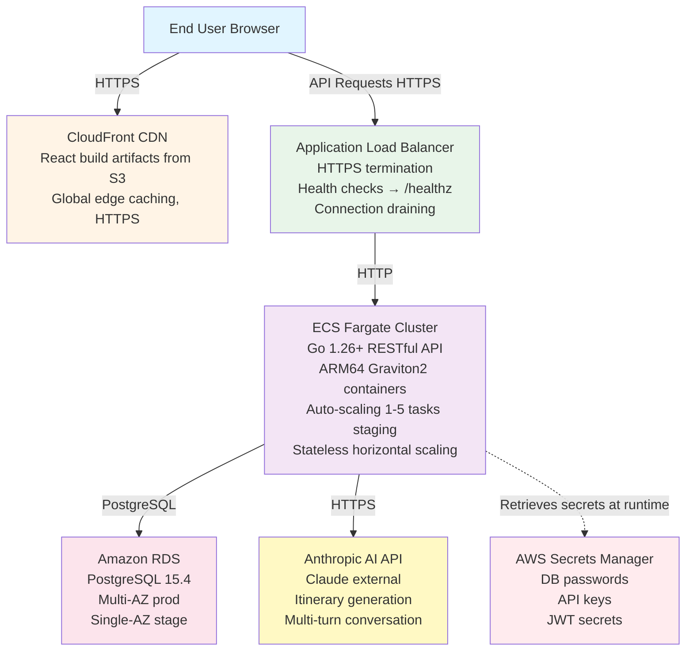

# System Architecture

<!-- PROMOTED:architecture START -->
<!-- Generated from specs/001-product-vision-scope/spec.md, specs/002-nfr-system-constraints/spec.md, and specs/003-cloud-env-strategy/spec.md -->
<!-- Last promoted: 2026-07-03 -->

## Overview

TrAIveler is a three-tier web application with a stateless RESTful API backend, a React single-page application frontend, and AWS-managed infrastructure for compute, storage, and content delivery.

## Component Architecture

## Component Boundaries

### Frontend (React 19+ SPA)

**Technology**:
- React 19 with TypeScript (strict mode)
- Vite build tool
- TanStack Query for data fetching
- Zustand for state management
- CSS Modules + CSS custom properties for styling
- Lucide React for icons

**Responsibilities**:
- Render all user-facing UI
- Handle user authentication state (JWT stored in HTTP-only cookies)
- Make HTTP requests to backend REST API
- Client-side routing (React Router v7)
- Form validation and error handling
- Accessibility compliance (WCAG 2.1 AA)

**Deployment**:
- Static build artifacts (`dist/`) synced to S3
- Served globally via CloudFront CDN
- Invalidation on deployment for cache busting

**Entry Points**:
- `/` - Landing page
- `/login`, `/register` - Authentication
- `/dashboard` - Trip list
- `/trips/:id` - Trip detail view
- `/generate` - AI itinerary generation

### Backend (Go 1.24+ REST API)

**Technology**:
- Go 1.24 or higher
- Chi router for HTTP routing
- pgx/v5 for PostgreSQL database access
- goose/v3 for database migrations
- Anthropic SDK for AI integration
- slog for structured JSON logging

**Responsibilities**:
- Authenticate users (JWT tokens)
- Enforce authorization rules (admin vs partner roles)
- CRUD operations for trips, destinations, days, activities
- AI conversation management (multi-turn input flow)
- Itinerary generation via Claude API
- Collaboration features (suggestions, approvals)
- Prompt validation (injection prevention)
- Output sanitization (XSS prevention)
- Structured logging with correlation IDs
- Health check endpoint (`/healthz`)

**Deployment**:
- Docker containers on ECS Fargate
- ARM64 Graviton2 for cost efficiency
- Auto-scaling based on CPU utilization (70% target)
- Rolling updates with health checks
- Automatic rollback on failures

**API Endpoints** (see `specs/*/contracts/api.md` for full schemas):
- `POST /auth/register`, `/auth/login`, `/auth/logout`
- `GET /auth/me`
- `GET /subscription/plans`, `POST /subscription/checkout`, `GET /subscription/current`
- `GET /trips`, `POST /trips`, `GET /trips/:id`, `PUT /trips/:id`, `DELETE /trips/:id`
- `POST /trips/:id/conversation`, `GET /trips/:id/conversation`
- `POST /trips/:id/collaborators`, `DELETE /trips/:id/collaborators/:userId`
- `GET /suggestions`, `POST /suggestions`, `PATCH /suggestions/:id`
- `GET /healthz`

### Database (PostgreSQL 15.4 on Amazon RDS)

**Schema** (8 core tables):
1. `users` - User accounts (email, password hash, subscription_id)
2. `subscription_plans` - Plan definitions (name, collaborator limit, feature flags)
3. `subscriptions` - Active subscriptions (user_id, plan_id, status)
4. `trips` - Trip metadata (title, start/end dates, status, owner_id)
5. `destinations` - Destinations within trips (city, country, order)
6. `days` - Daily itinerary structure (date, destination_id)
7. `activities` - Activities within days (time, title, description, type, order)
8. `trip_collaborators` - Many-to-many for shared trips (trip_id, user_id, role)
9. `conversation_sessions` - AI conversation context (trip_id, status)
10. `conversation_messages` - Message history (session_id, role, content, timestamp)
11. `suggestions` - Partner modification proposals (trip_id, target_type, target_id, content, status)

**Relationships**:
- User → Subscription (1:1)
- User → Trips (1:N as owner)
- Trip → Destinations (1:N)
- Destination → Days (1:N)
- Day → Activities (1:N)
- Trip ↔ Users (M:N via trip_collaborators)
- Trip → ConversationSession (1:N)
- ConversationSession → ConversationMessages (1:N)
- Trip → Suggestions (1:N)

**Configuration**:
- Staging: db.t4g.micro, single-AZ, 7-day backups
- Production: db.t4g.small, Multi-AZ, 30-day backups
- Connection pooling configured in backend
- Secrets retrieved from AWS Secrets Manager at runtime

### External Dependencies

**Anthropic Claude API**:
- Multi-turn conversational AI for itinerary generation
- Streaming responses for real-time feedback
- Tool use for structured itinerary extraction
- Connection pooling from backend for efficiency

**AWS Services**:
- **ECS Fargate**: Container orchestration
- **RDS**: Managed PostgreSQL database
- **S3**: Static asset storage
- **CloudFront**: CDN for global delivery
- **ALB**: Load balancing and HTTPS termination
- **Secrets Manager**: Credential storage
- **CloudWatch**: Logging and monitoring
- **IAM**: Access control and service roles

## Integration Rules

### Backend ↔ Database

- **Connection Pooling**: pgxpool with configurable min/max connections
- **Migrations**: goose for versioned schema changes
- **Transactions**: Used for all multi-table operations to ensure consistency
- **Error Handling**: All SQL errors wrapped with context before returning

### Backend ↔ Anthropic AI

- **Authentication**: API key retrieved from AWS Secrets Manager
- **Request Format**: Multi-turn conversation with system prompt
- **Response Handling**: Streaming for real-time feedback; tool-use parsing for structured data
- **Error Handling**: Rate limits (429) fast-fail with user-facing message; other errors logged with correlation ID
- **Validation**: Prompt validation layer runs before every AI request (injection prevention)
- **Sanitization**: Output sanitization runs on all AI responses before storage or rendering

### Frontend ↔ Backend

- **Protocol**: HTTPS only (HTTP redirects to HTTPS)
- **Authentication**: JWT tokens in HTTP-only cookies
- **Request Format**: JSON request bodies, standard HTTP methods (GET, POST, PUT, PATCH, DELETE)
- **Response Format**: JSON with consistent error structure
- **Correlation**: X-Request-ID header on all requests/responses for tracing
- **Error Handling**: Typed error responses with actionable messages

### CI/CD ↔ AWS

- **Authentication**: OIDC federation (GitHub Actions assumes IAM role)
- **Infrastructure**: Terraform state in S3 with DynamoDB locking
- **Container Registry**: ECR for Docker images
- **Deployment**: Rolling updates via ECS service updates
- **Rollback**: Automatic via deployment circuit breaker on health check failures

## Scalability Constraints

### Stateless Backend

- All ECS tasks are stateless - no in-process shared state
- Sessions stored in database or client-side (JWT)
- Horizontal scaling supported via ECS auto-scaling

### Database Connection Pooling

- Configured pool size prevents connection exhaustion under load
- Health checks ensure connections released properly

### Auto-Scaling

- ECS tasks scale based on CPU utilization (70% target)
- Limits: 1-5 tasks (staging), 2-20 tasks (production)
- Prevents runaway costs from unexpected spikes

### Load Shedding

- Returns `503 Service Unavailable` with `Retry-After` header when capacity exceeded
- Protects backend from overload and database connection exhaustion

## Security Boundaries

### Network Isolation

- **Public Subnets**: ALB only (internet-facing)
- **Private Subnets**: ECS tasks, RDS (no direct internet access)
- **Security Groups**: Layered (alb-sg → ecs-sg → rds-sg)
- **NACLs**: Environment VPCs isolated (10.0.0.0/16 staging, 10.1.0.0/16 production)

### Authentication & Authorization

- **Authentication**: JWT tokens with 24-hour expiration
- **Authorization**: Role-based (admin vs partner) enforced at API layer
- **Session Management**: HTTP-only cookies prevent XSS token theft

### Input Validation

- **API Layer**: All inputs validated before processing (SQL injection, XSS, path traversal blocked)
- **Prompt Validation**: AI inputs validated for injection attempts before sending to provider
- **Output Sanitization**: AI responses sanitized before rendering or storage

### Secrets Management

- No secrets in code or Git
- All secrets in AWS Secrets Manager
- IAM role-based access from ECS tasks
- Secret rotation supported without redeployment

## Observability

### Structured Logging

- **Format**: JSON with required fields (timestamp, correlation ID, method, path, status, duration, service)
- **Destination**: CloudWatch Logs
- **Retention**: 7 days (staging), 30 days (production)

### Health Checks

- **Endpoint**: `GET /healthz`
- **Response**: `200 OK` with `{"status":"ok"}` in < 100ms
- **ALB Configuration**: 30-second intervals, 3 healthy / 2 unhealthy thresholds

### Metrics & Alerts

- **ECS**: Task count, CPU/memory utilization
- **ALB**: Request count, target response time
- **RDS**: CPU utilization, database connections
- **Alerts**: CPU > 80%, connections > 80, unhealthy targets = 0

### Request Tracing

- **X-Request-ID**: Generated or propagated on all requests
- **Log Correlation**: Same ID in logs and response headers
- **Debugging**: Search CloudWatch by request ID

<!-- PROMOTED:architecture END -->
