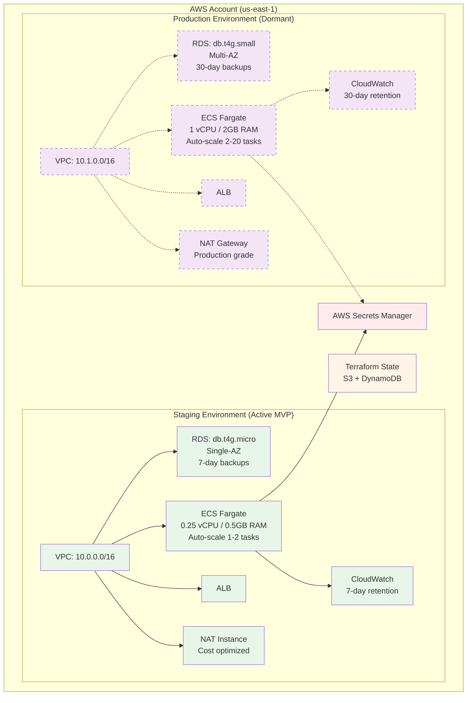
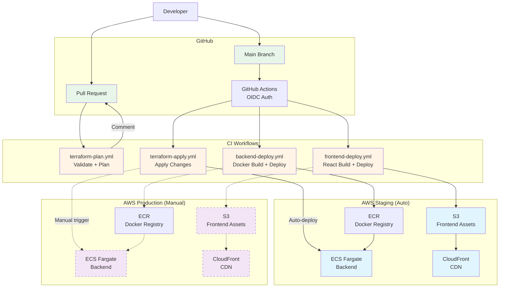

# Cloud and Environments Strategy

<!-- PROMOTED:cloud-environments START -->
<!-- Generated from specs/003-cloud-env-strategy/spec.md -->
<!-- Last promoted: 2026-07-03 -->

## Cloud Provider

**Provider**: AWS (Amazon Web Services)  
**Region**: us-east-1 (North America, optimized for primary user base)  
**Account Strategy**: Single AWS account with VPC-based environment isolation

## Environment Topology

The project maintains **two distinct environments**:

**Staging**: $200/month (active) | **Production**: $300-400/month (when provisioned)

### Staging Environment

- **Status**: Active MVP environment
- **Purpose**: Running all user-facing functionality with cost-optimized configuration
- **Configuration**:
  - VPC: 10.0.0.0/16 CIDR block
  - RDS: db.t4g.micro PostgreSQL 15.4, single-AZ, 7-day backups
  - ECS Fargate: 0.25 vCPU / 0.5 GB RAM tasks, ARM64 Graviton2, auto-scaling 1-2 tasks
  - NAT: NAT instance (cost savings: ~$57/month vs NAT Gateway)
  - CloudWatch logs: 7-day retention
- **Cost Budget**: $200/month

### Production Environment

- **Status**: IaC-defined but dormant (not provisioned until alpha release)
- **Purpose**: Production-grade configuration ready for deployment when approved
- **Configuration**:
  - VPC: 10.1.0.0/16 CIDR block (non-overlapping with staging)
  - RDS: db.t4g.small PostgreSQL 15.4, Multi-AZ for high availability, 30-day backups
  - ECS Fargate: 1 vCPU / 2GB RAM tasks, ARM64 Graviton2, auto-scaling 2-20 tasks
  - NAT: NAT Gateway (production-grade reliability)
  - CloudWatch logs: 30-day retention
- **Cost Budget**: $300-400/month (when provisioned)

## Infrastructure as Code (IaC)

**Tool**: Terraform 1.5+  
**Language**: HCL (HashiCorp Configuration Language)  
**Organization**: Terraform workspaces with shared module definitions

### Key Principles

1. **Modularity**: Reusable modules for VPC, ECS, RDS, ALB, S3+CloudFront, IAM
2. **Environment-Specific Configuration**: Workspace-specific `.tfvars` files for staging and production
3. **Remote State**: S3 backend with DynamoDB locking for team collaboration
4. **Idempotency**: Repeated execution produces same result without errors
5. **Version Control**: All infrastructure changes via Git with PR review before apply

### Terraform State Management

- **Backend**: AWS S3 bucket `trAIveler-terraform-state` with versioning and encryption
- **Locking**: DynamoDB table `trAIveler-terraform-locks` prevents concurrent modifications
- **Key Pattern**: `env/${terraform.workspace}/terraform.tfstate`

## Compute Platform

**Backend Services**: AWS ECS Fargate (not Lambda)

### Why ECS Fargate?

Lambda was initially considered but rejected for AI workload requirements:
- **Unlimited execution time**: Multi-turn AI conversations can exceed Lambda's 15-minute timeout
- **No payload limits**: Large itinerary responses can exceed Lambda's 10MB payload limit
- **Persistent HTTP connections**: Connection pooling to Anthropic API improves performance and reliability

### ECS Configuration

- **Architecture**: ARM64 Graviton2 (20% cost savings vs x86)
- **Task Definitions**: Multi-stage Docker builds for Go backend
- **Service Configuration**: 
  - ALB target group integration
  - Health checks against `/healthz` endpoint
  - Deployment circuit breaker with automatic rollback
  - Auto-scaling based on CPU utilization (70% target)
- **Container Registry**: Amazon ECR for private Docker images

## Frontend Delivery

- **Storage**: S3 bucket for static React build artifacts
- **CDN**: CloudFront distribution for global delivery with HTTPS
- **Caching**: CloudFront caching policies for optimal performance
- **Price Class**: PriceClass_100 (staging), PriceClass_200 (production)

## Networking Architecture

### VPC Design

Each environment has its own VPC with:
- **Public subnets** (2 AZs): Application Load Balancer
- **Private subnets** (2 AZs): ECS Fargate tasks, RDS database
- **Internet Gateway**: Outbound internet access
- **NAT**: Instance (staging) or Gateway (production)
- **Security Groups**: Layered security (alb-sg → ecs-sg → rds-sg)

### Load Balancing

- **Type**: Application Load Balancer (ALB)
- **Listeners**: 
  - HTTP (port 80) → redirect to HTTPS
  - HTTPS (port 443) → forward to ECS target group
- **Health Checks**: `/healthz` endpoint with 30-second intervals
- **Connection Draining**: 30-second deregistration delay

## CI/CD Pipeline

**Platform**: GitHub Actions  
**Triggered by**: Git events (push, pull request, tag)

### Authentication

- **Method**: OIDC federation (OpenID Connect)
- **Mechanism**: GitHub Actions assumes AWS IAM role (no long-lived credentials)
- **Roles**: Separate IAM roles for staging and production with environment-scoped trust policies

### Workflows

1. **terraform-plan.yml**:
   - Triggers on PR with paths `infra/terraform/**`
   - Validates Terraform syntax and formatting
   - Runs `terraform plan` and posts output as PR comment
   - Read-only AWS role

2. **terraform-apply.yml**:
   - Triggers on push to main (auto-deploy staging) OR manual workflow_dispatch (production)
   - Runs `terraform apply` after validation
   - Manual approval required for production deployments
   - Read-write AWS role

3. **backend-deploy.yml**:
   - Triggers on push to main with paths `backend/**` (auto-deploy staging) OR manual workflow_dispatch (production)
   - Builds Docker image for linux/arm64
   - Pushes to ECR with semantic version tag
   - Updates ECS task definition and service
   - Waits for service stability

4. **frontend-deploy.yml**:
   - Triggers on push to main with paths `frontend/**` (auto-deploy staging) OR manual workflow_dispatch (production)
   - Builds React production bundle
   - Syncs to S3 bucket
   - Invalidates CloudFront cache

### Deployment Strategy

- **Staging**: Automatic deployment on merge to main
- **Production**: Manual deployment only (workflow_dispatch) with explicit approval
- **Rollback**: Automatic via ECS deployment circuit breaker on health check failures
- **Artifacts**: Immutable Docker images and static bundles promoted from staging to production

## Secrets & Configuration Management

### Secrets (AWS Secrets Manager)

- **Storage**: All sensitive values (database passwords, API keys, JWT secrets)
- **Naming Convention**: `${environment}/${service}/${secret_name}`
- **Access**: IAM role-based authentication from ECS tasks
- **Rotation**: Supported without requiring redeployment
- **Examples**:
  - `staging/backend/database-url`
  - `staging/backend/anthropic-api-key`
  - `staging/backend/jwt-secret`

### Non-Secret Configuration

- **Method**: Environment variables in ECS task definitions
- **Source**: AWS Parameter Store or Terraform variables
- **Examples**: API URLs, feature flags, environment names

## Cost Strategy

### Staging (Active MVP)

**Target**: $200/month

**Resource Breakdown**:
- ECS Fargate (0.25 vCPU ARM64): ~$9-18/month (assuming 1-2 tasks running continuously)
- RDS db.t4g.micro single-AZ: ~$14.46/month
- Application Load Balancer: ~$25/month
- NAT Instance t4g.nano: ~$8/month (vs $57/month for NAT Gateway)
- S3 + CloudFront: ~$15/month (minimal traffic)
- Data transfer: ~$20/month
- Secrets Manager: ~$3/month (6 secrets)
- CloudWatch: ~$10/month (7-day retention, moderate logs)

### Production (Dormant Until Alpha)

**Target**: $300-400/month (when provisioned)

**Resource Breakdown**:
- ECS Fargate (1 vCPU ARM64, 2-3 tasks): ~$75/month
- RDS db.t4g.small Multi-AZ: ~$60/month
- Application Load Balancer: ~$25/month
- NAT Gateway (2 AZs): ~$65/month
- S3 + CloudFront: ~$30/month (higher traffic)
- Data transfer: ~$40/month
- Secrets Manager: ~$3/month
- CloudWatch: ~$20/month (30-day retention)

### Cost Controls

- **Budget Alerts**: Configured at 80% and 100% thresholds via AWS Budgets
- **Auto-Scaling Limits**: Max 5 tasks (staging), max 20 tasks (production) to prevent runaway costs
- **Resource Tagging**: All resources tagged with `Project`, `Environment`, `ManagedBy`, `CostCenter` for cost tracking
- **Cost Explorer**: Monthly cost breakdown by service and environment

## Observability & Monitoring

### Logging

- **Format**: Structured JSON logs
- **Destination**: AWS CloudWatch Logs
- **Retention**: 7 days (staging), 30 days (production)
- **Required Fields**: timestamp, correlation ID, method, path, status code, duration, service name

### Metrics

- **Collection**: AWS CloudWatch metrics
- **Dashboards**: Environment-specific dashboards showing:
  - ECS task count, CPU/memory utilization
  - ALB request count, target response time
  - RDS CPU utilization, database connections
  - Application error rates

### Alerts

- **ECS High CPU**: Triggers when service CPU > 80% for 5 minutes
- **RDS High Connections**: Triggers when connections > 80 for 5 minutes
- **ALB Unhealthy Targets**: Triggers when 0 healthy targets for 2 minutes
- **Delivery**: SNS topic notifications (email/Slack)

## Access Control

### IAM Principles

- **Least Privilege**: All roles grant minimum permissions required
- **Service Roles**: IAM roles for ECS tasks, Lambda functions, GitHub Actions
- **No Long-Lived Keys**: All authentication via IAM roles with temporary credentials
- **Audit Logging**: All infrastructure changes logged via CloudTrail

### Developer Access

- **Staging**: Read-only access for observability and debugging
- **Production**: Read-only access; write access requires approval
- **Infrastructure Changes**: Only via CI/CD pipeline (no manual terraform apply)

<!-- PROMOTED:cloud-environments END -->

## Local Development Note: AI Provider Override (Ollama)

This section is a local-development addendum, outside the promoted cloud/environment strategy
above — staging and production still integrate with **Anthropic Claude** via the
`staging/backend/anthropic-api-key` Secrets Manager entry noted earlier in this document.

For local development and MVP testing only, no AWS Secrets Manager entry or external API key is
needed: the backend defaults to a locally-running **Ollama** server with a **Gemma** model,
configured via plain environment variables (`AI_PROVIDER=ollama`, `OLLAMA_HOST`, `OLLAMA_MODEL` —
see `backend/.env.example`). This keeps local/dev environments free to run and independent of AWS
credentials for AI functionality.

See **[docs/local-ai-setup.md](local-ai-setup.md)** for setup steps.
