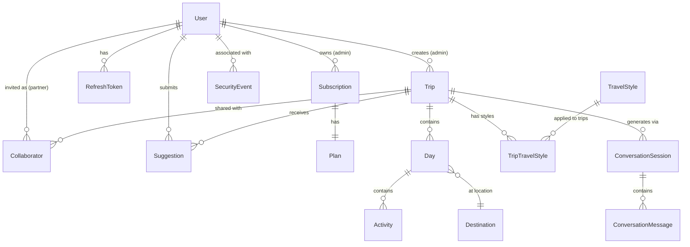

# Data Model

<!-- PROMOTED:data-model START -->
<!-- Generated from specs/001-product-vision-scope/data-model.md and specs/004-security-auth-model/data-model.md -->
<!-- Last promoted: 2026-07-03 -->

## Overview

This document defines the core entities, relationships, invariants, and business rules that form the foundation of the TrAIveler data model. All entities use PostgreSQL 15.4+ with UUID primary keys.

## Entity Relationship Diagram

## Core Entities

### User

Authenticated account with role-based permissions.

**Key Attributes**:
- `id` (UUID, PK)
- `email` (VARCHAR, UNIQUE) — RFC 5322 compliant
- `password_hash` (TEXT) — bcrypt with cost factor 12+
- `role` (ENUM: 'admin' | 'partner') — determines permissions, immutable after creation
- `subscription_id` (UUID, FK → subscriptions.id, NULLABLE)
- `last_login_at` (TIMESTAMP, NULLABLE)

**Business Rules**:
- Email must be unique (case-insensitive)
- Password must be 8-72 characters, contain uppercase, lowercase, and digit
- Admin role: Full CRUD on own trips, approve suggestions, invite 1 partner per basic plan
- Partner role: View shared trips, submit suggestions (cannot edit directly)
- Password hash never returned in API responses

**State Transitions**:
- Active → Deleted: User deletes account, all tokens invalidated immediately, PII removed within 30 days

---

### RefreshToken

Long-lived token for obtaining new access tokens without re-authentication.

**Key Attributes**:
- `id` (UUID, PK)
- `user_id` (UUID, FK → users.id, CASCADE)
- `token_hash` (VARCHAR, UNIQUE) — SHA-256 hash of token (never store plaintext)
- `expires_at` (TIMESTAMP) — 30 days from issuance
- `revoked_at` (TIMESTAMP, NULLABLE) — logout or password change

**Business Rules**:
- Token must be cryptographically random (32 bytes minimum)
- Validation checks: `expires_at > NOW() AND revoked_at IS NULL`
- User can have multiple active tokens (different devices)
- All user tokens revoked on password change if user selects "Log out all devices"

**Indexes**:
- `idx_refresh_tokens_token_hash` (UNIQUE) — fast lookup during refresh
- `idx_refresh_tokens_user_id` — user-level token queries
- `idx_refresh_tokens_expires_at` — cleanup of expired tokens

---

### JWTSigningKey

RSA key pair for signing and validating JWT tokens with zero-downtime rotation support.

**Key Attributes**:
- `key_id` (VARCHAR, PK) — e.g., "key-2026-07-01"
- `public_key` (TEXT) — PEM-encoded RSA public key (2048-bit minimum)
- `private_key_secret_arn` (VARCHAR) — AWS Secrets Manager ARN (private key never in DB)
- `status` (ENUM: 'active' | 'retired')
- `retire_at` (TIMESTAMP, NULLABLE) — grace period end

**Business Rules**:
- Multiple active keys allowed simultaneously for zero-downtime rotation
- New tokens signed with current primary key
- Validation accepts any active key (enables rolling key updates)
- Retired keys excluded from validation, retained for audit only
- Backend retrieves private key from Secrets Manager at runtime

**Key Rotation Strategy**:
1. Generate new key, store in Secrets Manager, add to DB with status='active'
2. Update application config to use new key as primary for signing
3. Old key remains active for validation (existing tokens remain valid)
4. After grace period (typically 30 days), mark old key as 'retired'

---

### SecurityEvent

Structured log entry for authentication, authorization, and validation failures.

**Key Attributes**:
- `id` (UUID, PK)
- `correlation_id` (UUID) — request tracing across services
- `event_type` (ENUM) — see event types below
- `user_id` (UUID, FK → users.id, SET NULL, NULLABLE)
- `severity` (ENUM: 'info' | 'warning' | 'error')
- `ip_address` (VARCHAR, NULLABLE)
- `user_agent` (VARCHAR, NULLABLE)
- `details` (JSONB) — event-specific structured details
- `timestamp` (TIMESTAMP)

**Event Types**:
- `auth_login_success`, `auth_login_failure`, `auth_token_refresh`, `auth_logout`, `auth_password_change`
- `authz_denied` — 403 Forbidden responses
- `validation_prompt_injection`, `validation_sql_injection`, `validation_xss_injection`
- `concurrency_conflict` — 409 Conflict (optimistic locking)

**Business Rules**:
- No sensitive data in details field (no passwords, tokens, full payloads)
- Correlation ID propagated from HTTP headers or generated on ingress
- Events sent to CloudWatch Logs with 30-day retention
- Metrics emitted for rates: auth failures, authz denials, prompt injections

**Indexes**:
- `idx_security_events_correlation_id` — request trace queries
- `idx_security_events_user_id` — user activity audit
- `idx_security_events_event_type` — type-specific queries
- `idx_security_events_timestamp` — time-range queries

---

### Plan

Subscription tier governing account limits. Only `basic` plan exists in MVP.

**Key Attributes**:
- `id` (UUID, PK)
- `name` (VARCHAR, UNIQUE) — 'basic'
- `max_admin_users` (INT, DEFAULT 1)
- `max_partner_users` (INT, DEFAULT 1)

**Business Rules**:
- Basic plan: 1 admin user, 1 partner collaborator per trip
- Plan limits enforced at service layer during collaborator invite

---

### Subscription

Links user account to a plan. Tracks mock payment reference for future integration.

**Key Attributes**:
- `id` (UUID, PK)
- `user_id` (UUID, FK → users.id, CASCADE)
- `plan_id` (UUID, FK → plans.id)
- `status` (ENUM: 'stub_pending' | 'active' | 'cancelled')
- `stub_payment_ref` (VARCHAR, NULLABLE) — provider transaction ID from stub

**State Transitions**:
- `stub_pending` → `active` (on stub checkout confirmation)
- `active` → `cancelled` (user cancels subscription)

---

### Trip

Top-level container for a planned journey. Owned by admin user.

**Key Attributes**:
- `id` (UUID, PK)
- `creator_id` (UUID, FK → users.id) — must have role='admin'
- `title` (VARCHAR)
- `description` (TEXT, NULLABLE)
- `status` (ENUM: 'draft' | 'published')
- `version` (BIGINT, DEFAULT 1) — optimistic locking counter

**Business Rules**:
- Only admin can create, update, delete trips
- All admin modifications increment version number atomically
- Concurrent updates detected by version mismatch → 409 Conflict
- State transitions: `draft` → `published` (admin only)

**Concurrency Control**:
- Client sends `If-Match: <version>` header on PUT/DELETE
- Backend checks `WHERE id=? AND version=?`
- If 0 rows affected → 409 Conflict with current version in response body
- On success, `SET version=version+1`

---

### Day

Single calendar day within a trip, belonging to a destination.

**Key Attributes**:
- `id` (UUID, PK)
- `trip_id` (UUID, FK → trips.id, CASCADE)
- `destination_id` (UUID, FK → destinations.id, NULLABLE) — NULL for arrival/transfer days
- `day_number` (INT) — 1-indexed position in trip
- `label` (VARCHAR, NULLABLE) — e.g., "Tokyo Day 1"

**Constraints**:
- UNIQUE(`trip_id`, `day_number`)

---

### Activity

Specific event assigned to a day. Covers all content types (visit, food, logistics, transfer).

**Key Attributes**:
- `id` (UUID, PK)
- `day_id` (UUID, FK → days.id, CASCADE)
- `title` (VARCHAR)
- `type` (ENUM: 'visit' | 'food' | 'logistics' | 'transfer')
- `sequence_order` (INT) — display order within day
- `description` (TEXT, NULLABLE)
- `is_ai_generated` (BOOLEAN, DEFAULT true)
- `metadata` (JSONB, NULLABLE) — extensible for future fields
- `version` (BIGINT, DEFAULT 1) — optimistic locking counter

**Business Rules**:
- Admin modifications increment version number
- Optimistic locking enforced on updates/deletes

---

### Collaborator

Explicit partner invite granting view and suggestion rights on a trip.

**Key Attributes**:
- `id` (UUID, PK)
- `trip_id` (UUID, FK → trips.id, CASCADE)
- `user_id` (UUID, FK → users.id) — must have role='partner'
- `invited_at` (TIMESTAMP)
- `accepted_at` (TIMESTAMP, NULLABLE) — NULL if invitation pending

**Constraints**:
- UNIQUE(`trip_id`, `user_id`)

**Business Rules**:
- Basic plan: maximum 1 active collaborator per trip
- Enforced in service layer before insert

---

### Suggestion

Proposed modification submitted by partner collaborator; requires admin approval.

**Key Attributes**:
- `id` (UUID, PK)
- `trip_id` (UUID, FK → trips.id, CASCADE)
- `author_id` (UUID, FK → users.id) — must be partner collaborator on trip
- `target_type` (ENUM: 'day' | 'activity')
- `target_id` (UUID) — ID of affected entity
- `suggested_action` (ENUM: 'add' | 'edit' | 'delete')
- `payload` (JSONB) — proposed changes
- `status` (ENUM: 'pending' | 'approved' | 'rejected')
- `reviewed_by` (UUID, FK → users.id, NULLABLE) — admin who reviewed
- `reviewed_at` (TIMESTAMP, NULLABLE)

**Business Rules**:
- Only partners with active collaborator record can submit suggestions
- Only trip owner (admin) can approve/reject
- Approved suggestions trigger corresponding action on target entity

---

### TravelStyle

Lookup table for available travel styles.

**Key Attributes**:
- `id` (UUID, PK)
- `slug` (VARCHAR, UNIQUE) — e.g., 'gastronomy', 'sports'
- `label` (VARCHAR) — human-readable label

**Seed Values**:
- `gastronomy`, `sports`, `technology`, `museums-and-art`, `film-audiovisual`

---

### TripTravelStyle

Many-to-many join between Trip and TravelStyle (a trip may carry multiple styles).

**Key Attributes**:
- `trip_id` (UUID, FK → trips.id, CASCADE)
- `travel_style_id` (UUID, FK → travel_styles.id)
- `assigned_by` (UUID, FK → users.id) — which traveler added this style

**Primary Key**: (`trip_id`, `travel_style_id`, `assigned_by`)

---

## Database Migrations

Migrations are executed sequentially using goose. Foundational migrations:

1. **001_create_plans_table.sql** — Plans
2. **002_create_users_table.sql** — Users
3. **003_create_subscriptions_table.sql** — Subscriptions
4. **004_create_refresh_tokens_table.sql** — Refresh tokens
5. **005_create_jwt_signing_keys_table.sql** — JWT signing keys
6. **006_create_security_events_table.sql** — Security events
7. **007_create_trips_table.sql** — Trips (with version column)
8. **008_create_destinations_table.sql** — Destinations
9. **009_create_days_table.sql** — Days
10. **010_create_activities_table.sql** — Activities (with version column)
11. **011_create_travel_styles_table.sql** — Travel styles (with seed data)
12. **012_create_trip_travel_styles_table.sql** — Trip-style join
13. **013_create_collaborators_table.sql** — Collaborators
14. **014_create_suggestions_table.sql** — Suggestions
15. **015_create_conversation_sessions_table.sql** — Conversation sessions
16. **016_create_conversation_messages_table.sql** — Conversation messages

---

## Invariants and Business Rules

### Authentication & Authorization

1. **JWT tokens** must be signed with RS256 using any active signing key
2. **Access tokens** expire after 24 hours
3. **Refresh tokens** expire after 30 days
4. **Password hashes** use bcrypt cost factor 12 minimum
5. **Role-based access**:
   - Admin: Full CRUD on own trips, approve suggestions, invite 1 partner
   - Partner: View shared trips, submit suggestions (no direct edits)

### Concurrency

6. **Optimistic locking** enforced on all admin trip/activity modifications
7. **Version numbers** increment atomically on successful updates
8. **Concurrent modifications** return 409 Conflict with current resource version

### Data Protection

9. **Passwords** never stored in plaintext, never returned in API responses
10. **Private keys** never stored in database (only AWS Secrets Manager ARN)
11. **Sensitive data** never logged (no tokens, passwords, API keys, PII except user ID)
12. **Security events** retained for 30 days in CloudWatch Logs

### Plan Limits

13. **Basic plan** limits: 1 admin user, 1 partner collaborator per trip
14. **Collaborator invite** blocked if limit reached
15. **Subscription required** for all trip operations

### GDPR Compliance

16. **Account deletion** invalidates all tokens immediately
17. **PII removal** completed within 30 days of deletion request
18. **User ID** retained in foreign keys (anonymized) for referential integrity

<!-- PROMOTED:data-model END -->
