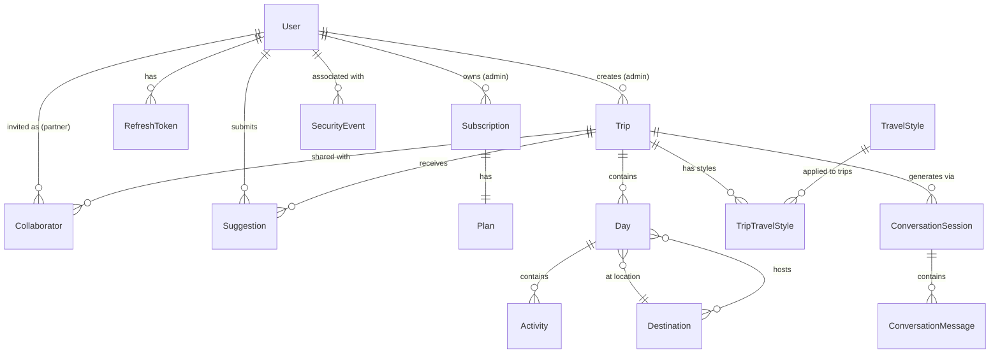
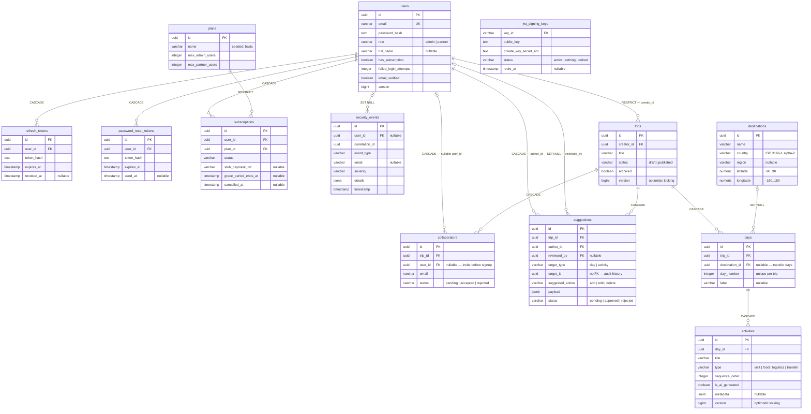

# Data Model

<!-- Generated from specs/001-product-vision-scope/data-model.md, specs/004-security-auth-model/data-model.md, and specs/006-core-domain-model/data-model.md -->
<!-- PROMOTED:data-model START -->
<!-- Last promoted: 2026-07-06 — includes gap-filled entity catalog with validation layers, indexes, and state transitions -->

## Overview

This document defines the complete set of 16 core entities with full attribute specifications, three-layer validation rules, performance-critical indexes, forward-only state transitions, and cascade behavior documentation. All entities use PostgreSQL 15.4+ with UUID primary keys unless otherwise specified.

## Entity Relationship Diagram



---

## Core Entities

### User

Authenticated account with role-based permissions (admin/partner).

**Key Attributes**:
- `id` (UUID, PK)
- `email` (VARCHAR(255), UNIQUE) — RFC 5322 compliant
- `password_hash` (TEXT) — bcrypt with cost factor 12+
- `role` (ENUM: 'admin' | 'partner') — determines permissions, immutable after creation
- `subscription_id` (UUID, FK → subscriptions.id, NULLABLE, SET NULL)
- `last_login_at` (TIMESTAMP, NULLABLE)
- `created_at` (TIMESTAMP, DEFAULT NOW())
- `updated_at` (TIMESTAMP, DEFAULT NOW())

**Validation Rules**:
- [DB] `email` must be unique (UNIQUE constraint, case-insensitive via expression index)
- [DB] `email` NOT NULL
- [DB] `password_hash` NOT NULL
- [DB] `role` must be 'admin' or 'partner' (ENUM constraint)
- [API] Email format validated against RFC 5322 pattern (returns 400 Bad Request)
- [Logic] Password must be 8-72 characters, contain uppercase, lowercase, and digit (validated before bcrypt hashing)
- [Logic] Role is immutable after creation (UPDATE blocked if role changes)

**Business Rules**:
- Admin role: Full CRUD on own trips, approve/reject suggestions, invite 1 partner per basic plan
- Partner role: View shared trips, submit suggestions (no direct edits)
- Password hash never returned in API responses (excluded from JSON serialization)

**State Transitions** (Forward-Only):
- Active → Deleted: User deletes account; all RefreshTokens CASCADE deleted, SecurityEvents.user_id SET NULL, PII removed within 30 days
- Rationale: Immutable audit trail; no account reactivation (user must re-register)

**Cascade Behavior**:
- RefreshToken → CASCADE (tokens invalid after account deletion)
- Trip → RESTRICT (must transfer ownership or cascade delete trips first)
- Collaborator → CASCADE (partnership invitations removed)
- Suggestion → CASCADE (orphaned suggestions removed)
- SecurityEvent → SET NULL (preserve audit log with anonymized user_id)

**Indexes**:
- `idx_users_email` (UNIQUE, expression: LOWER(email)) — case-insensitive login queries
- `idx_users_subscription_id` — subscription lookup

---

### RefreshToken

Long-lived token for obtaining new access tokens without re-authentication.

**Key Attributes**:
- `id` (UUID, PK)
- `user_id` (UUID, FK → users.id, CASCADE)
- `token_hash` (VARCHAR(64), UNIQUE) — SHA-256 hash of token (never store plaintext)
- `expires_at` (TIMESTAMP) — 30 days from issuance
- `revoked_at` (TIMESTAMP, NULLABLE) — logout or password change
- `created_at` (TIMESTAMP, DEFAULT NOW())

**Validation Rules**:
- [DB] `user_id` NOT NULL (FK constraint)
- [DB] `token_hash` UNIQUE
- [DB] `token_hash` NOT NULL
- [DB] `expires_at` NOT NULL
- [Logic] Token must be cryptographically random (32 bytes minimum, generated via crypto.rand)
- [Logic] Validation checks: `expires_at > NOW() AND revoked_at IS NULL`

**Business Rules**:
- User can have multiple active tokens (different devices)
- All user tokens revoked on password change if user selects "Log out all devices" option
- Expired tokens cleaned up via scheduled job (daily)

**Cascade Behavior**:
- User → CASCADE (all tokens deleted when user account deleted)

**Indexes**:
- `idx_refresh_tokens_token_hash` (UNIQUE) — fast lookup during token refresh
- `idx_refresh_tokens_user_id` — user-level token queries (revoke all tokens)
- `idx_refresh_tokens_expires_at` — cleanup of expired tokens (batch delete job)

---

### JWTSigningKey

RSA key pair for signing and validating JWT tokens with zero-downtime rotation support.

**Key Attributes**:
- `key_id` (VARCHAR(50), PK) — e.g., "key-2026-07-01"
- `public_key` (TEXT) — PEM-encoded RSA public key (2048-bit minimum)
- `private_key_secret_arn` (VARCHAR(255)) — AWS Secrets Manager ARN (private key never in DB)
- `status` (ENUM: 'active' | 'retired')
- `retire_at` (TIMESTAMP, NULLABLE) — grace period end for validation
- `created_at` (TIMESTAMP, DEFAULT NOW())

**Validation Rules**:
- [DB] `key_id` PK
- [DB] `public_key` NOT NULL
- [DB] `private_key_secret_arn` NOT NULL
- [DB] `status` must be 'active' or 'retired' (ENUM constraint)
- [Logic] Public key must be valid PEM format (validated on insert)
- [Logic] Private key retrieved from AWS Secrets Manager at runtime (never logged)

**Business Rules**:
- Multiple active keys allowed simultaneously for zero-downtime rotation
- New tokens signed with current primary key (configured in application)
- Validation accepts any active key (enables rolling key updates)
- Retired keys excluded from validation, retained for audit only

**Key Rotation Strategy**:
1. Generate new RSA 2048-bit key pair
2. Store private key in AWS Secrets Manager, get ARN
3. Insert new row with status='active', private_key_secret_arn=ARN
4. Update application config to use new key_id as primary for signing
5. Old key remains status='active' for validation (existing tokens remain valid)
6. After grace period (typically 30 days), SET status='retired' for old key

**Indexes**:
- `idx_jwt_signing_keys_status` — filter active keys for validation

---

### SecurityEvent

Structured log entry for authentication, authorization, validation failures, and concurrency conflicts.

**Key Attributes**:
- `id` (UUID, PK)
- `correlation_id` (UUID) — request tracing across services
- `event_type` (VARCHAR(50)) — see event types below
- `user_id` (UUID, FK → users.id, SET NULL, NULLABLE)
- `severity` (ENUM: 'info' | 'warning' | 'error')
- `ip_address` (VARCHAR(45), NULLABLE) — IPv4 or IPv6
- `user_agent` (VARCHAR(500), NULLABLE)
- `details` (JSONB, NULLABLE) — event-specific structured details
- `timestamp` (TIMESTAMP, DEFAULT NOW())

**Event Types**:
- `auth_login_success`, `auth_login_failure`, `auth_token_refresh`, `auth_logout`, `auth_password_change`
- `authz_denied` — 403 Forbidden responses
- `validation_prompt_injection`, `validation_sql_injection`, `validation_xss_injection`
- `concurrency_conflict` — 409 Conflict (optimistic locking)

**Validation Rules**:
- [DB] `correlation_id` NOT NULL
- [DB] `event_type` NOT NULL
- [DB] `severity` must be 'info', 'warning', or 'error' (ENUM constraint)
- [DB] `timestamp` NOT NULL (DEFAULT NOW())
- [Logic] No sensitive data in details field (no passwords, tokens, full request payloads)
- [Logic] Correlation ID propagated from X-Request-ID header or generated on ingress

**Business Rules**:
- Events sent to CloudWatch Logs with 30-day retention
- Metrics emitted for event rates: auth failures, authz denials, prompt injections
- Alarms configured for anomalous patterns (spike in auth failures, prompt injection attempts)

**Cascade Behavior**:
- User → SET NULL (preserve audit log; user_id anonymized after account deletion)

**Indexes**:
- `idx_security_events_correlation_id` — request trace queries
- `idx_security_events_user_id` — user activity audit
- `idx_security_events_event_type` — type-specific queries (filter by event category)
- `idx_security_events_timestamp` — time-range queries (daily reports, retention cleanup)

---

### Plan

Subscription tier governing account limits. Only `basic` plan exists in MVP.

**Key Attributes**:
- `id` (UUID, PK)
- `name` (VARCHAR(50), UNIQUE) — 'basic'
- `max_admin_users` (INT, DEFAULT 1)
- `max_partner_users` (INT, DEFAULT 1)
- `created_at` (TIMESTAMP, DEFAULT NOW())

**Validation Rules**:
- [DB] `name` UNIQUE
- [DB] `name` NOT NULL
- [DB] `max_admin_users` CHECK (max_admin_users > 0)
- [DB] `max_partner_users` CHECK (max_partner_users >= 0)

**Business Rules**:
- Basic plan: 1 admin user, 1 partner collaborator per trip
- Plan limits enforced at service layer during collaborator invite (check count before insert)

**Seed Data**:
```sql
INSERT INTO plans (id, name, max_admin_users, max_partner_users)
VALUES ('00000000-0000-0000-0000-000000000001', 'basic', 1, 1);
```

---

### Subscription

Links user account to a plan. Tracks mock payment reference for future integration.

**Key Attributes**:
- `id` (UUID, PK)
- `user_id` (UUID, FK → users.id, CASCADE)
- `plan_id` (UUID, FK → plans.id, RESTRICT)
- `status` (ENUM: 'stub_pending' | 'active' | 'cancelled')
- `stub_payment_ref` (VARCHAR(100), NULLABLE) — provider transaction ID from stub
- `created_at` (TIMESTAMP, DEFAULT NOW())
- `cancelled_at` (TIMESTAMP, NULLABLE)

**Validation Rules**:
- [DB] `user_id` NOT NULL (FK constraint)
- [DB] `plan_id` NOT NULL (FK constraint)
- [DB] `status` must be 'stub_pending', 'active', or 'cancelled' (ENUM constraint)
- [Logic] Only one active subscription per user (enforced before insert)

**Business Rules**:
- Stub payment always succeeds in MVP (visible mock checkout for POC)
- Active subscription required for trip creation and management operations

**State Transitions** (Forward-Only):
- `stub_pending` → `active`: Stub checkout confirmation received
- `active` → `cancelled`: User cancels subscription
- Rationale: No reactivation flow; user creates new subscription to resume service

**Cascade Behavior**:
- User → CASCADE (subscription deleted with user account)
- Plan → RESTRICT (cannot delete plan with active subscriptions)

**Indexes**:
- `idx_subscriptions_user_id` (UNIQUE) — one subscription per user enforcement
- `idx_subscriptions_status` — filter active subscriptions

---

### Trip

Top-level container for a planned journey. Owned by admin user. Supports optimistic locking for concurrent modifications.

**Key Attributes**:
- `id` (UUID, PK)
- `creator_id` (UUID, FK → users.id, RESTRICT) — must have role='admin'
- `title` (VARCHAR(200))
- `description` (TEXT, NULLABLE)
- `status` (ENUM: 'draft' | 'published')
- `version` (BIGINT, DEFAULT 1) — optimistic locking counter
- `created_at` (TIMESTAMP, DEFAULT NOW())
- `updated_at` (TIMESTAMP, DEFAULT NOW())

**Validation Rules**:
- [DB] `creator_id` NOT NULL (FK constraint)
- [DB] `title` NOT NULL
- [DB] `status` must be 'draft' or 'published' (ENUM constraint)
- [DB] `version` NOT NULL, DEFAULT 1
- [Logic] Only admin users can create trips (role check before insert)
- [API] Title length 1-200 characters (returns 400 Bad Request)

**Business Rules**:
- Only admin (creator) can update or delete trips
- All admin modifications increment version number atomically (`SET version = version + 1`)
- Concurrent updates detected by version mismatch → 409 Conflict with current version in response body

**State Transitions** (Forward-Only):
- `draft` → `published`: Admin publishes trip
- Rationale: No unpublish operation; create new draft trip for modifications after publishing

**Concurrency Control**:
- Client sends `If-Match: <version>` header on PUT/DELETE requests
- Backend executes `UPDATE trips SET ... WHERE id=? AND version=?`
- If 0 rows affected → version mismatch detected → return 409 Conflict with current {id, version, updated_at}
- On success, version incremented automatically via `SET version = version + 1`

**Cascade Behavior**:
- User → RESTRICT (must transfer trip ownership or explicitly delete trips before account deletion)
- Day → CASCADE (all days deleted when trip deleted)
- Collaborator → CASCADE (all collaborations deleted)
- Suggestion → CASCADE (all suggestions deleted)
- TripTravelStyle → CASCADE (all style associations deleted)
- ConversationSession → CASCADE (all AI generation sessions deleted)

**Indexes**:
- `idx_trips_creator_id` — user's trip list queries (SELECT trips WHERE creator_id = ?)
- `idx_trips_status` — filter published/draft trips

---

### Destination

Geographic location associated with trip days. Includes coordinates for mapping and distance calculations.

**Key Attributes**:
- `id` (UUID, PK)
- `name` (VARCHAR(200)) — city or location name
- `country` (VARCHAR(2)) — ISO 3166-1 alpha-2 country code (e.g., 'US', 'JP')
- `region` (VARCHAR(100), NULLABLE) — state/province/region
- `latitude` (DECIMAL(9,6)) — geographic coordinate (-90 to +90)
- `longitude` (DECIMAL(9,6)) — geographic coordinate (-180 to +180)
- `created_at` (TIMESTAMP, DEFAULT NOW())

**Validation Rules**:
- [DB] `name` NOT NULL
- [DB] `country` NOT NULL, CHECK (LENGTH(country) = 2)
- [DB] `latitude` NOT NULL, CHECK (latitude BETWEEN -90 AND 90)
- [DB] `longitude` NOT NULL, CHECK (longitude BETWEEN -180 AND 180)
- [API] Country code must match ISO 3166-1 alpha-2 standard (returns 400 Bad Request)
- [Logic] Coordinates validated as valid decimal degrees format

**Business Rules**:
- Destination records shared across trips (reference data)
- Name + country + latitude + longitude should be unique (but not enforced; allows minor coordinate variations)
- Coordinates enable future map visualization and distance-based features without schema migration

**Indexes**:
- `idx_destinations_country` — filter destinations by country
- `idx_destinations_coordinates` (spatial index if PostGIS enabled) — geospatial queries

---

### Day

Single calendar day within a trip, belonging to a destination.

**Key Attributes**:
- `id` (UUID, PK)
- `trip_id` (UUID, FK → trips.id, CASCADE)
- `destination_id` (UUID, FK → destinations.id, SET NULL, NULLABLE) — NULL for arrival/transfer days
- `day_number` (INT) — 1-indexed position in trip
- `label` (VARCHAR(100), NULLABLE) — e.g., "Tokyo Day 1"
- `created_at` (TIMESTAMP, DEFAULT NOW())

**Validation Rules**:
- [DB] `trip_id` NOT NULL (FK constraint)
- [DB] `day_number` NOT NULL, CHECK (day_number > 0)
- [DB] UNIQUE(`trip_id`, `day_number`) — prevent duplicate day numbers in same trip
- [Logic] Day numbers should be contiguous (1, 2, 3...) but gaps allowed for deleted days

**Business Rules**:
- Days belong to exactly one trip
- Destination may be NULL for travel/transfer days between locations
- Day ordering determined by day_number (not creation timestamp)

**Cascade Behavior**:
- Trip → CASCADE (all days deleted when trip deleted)
- Destination → SET NULL (destination removed but day record preserved)
- Activity → CASCADE (all activities deleted when day deleted)

**Indexes**:
- `idx_days_trip_id` — trip detail queries (SELECT days WHERE trip_id = ?)
- `idx_days_destination_id` — destination usage queries

---

### Activity

Specific event assigned to a day. Covers all content types (visit, food, logistics, transfer). Supports optimistic locking for concurrent modifications.

**Key Attributes**:
- `id` (UUID, PK)
- `day_id` (UUID, FK → days.id, CASCADE)
- `title` (VARCHAR(200))
- `type` (ENUM: 'visit' | 'food' | 'logistics' | 'transfer')
- `sequence_order` (INT) — display order within day (1-indexed)
- `description` (TEXT, NULLABLE)
- `is_ai_generated` (BOOLEAN, DEFAULT true)
- `metadata` (JSONB, NULLABLE) — extensible for future fields (pricing, booking URLs, etc.)
- `version` (BIGINT, DEFAULT 1) — optimistic locking counter
- `created_at` (TIMESTAMP, DEFAULT NOW())
- `updated_at` (TIMESTAMP, DEFAULT NOW())

**Validation Rules**:
- [DB] `day_id` NOT NULL (FK constraint)
- [DB] `title` NOT NULL
- [DB] `type` must be 'visit', 'food', 'logistics', or 'transfer' (ENUM constraint)
- [DB] `sequence_order` NOT NULL, CHECK (sequence_order > 0)
- [DB] `is_ai_generated` NOT NULL, DEFAULT true
- [DB] `version` NOT NULL, DEFAULT 1
- [API] Title length 1-200 characters (returns 400 Bad Request)
- [Logic] sequence_order should be unique within day (not enforced by DB; allows manual reordering)

**Business Rules**:
- Admin modifications increment version number atomically
- Optimistic locking enforced on updates/deletes (same mechanism as Trip)
- Activities marked as AI-generated can be edited manually (flag preserved for analytics)

**Concurrency Control**:
- Same as Trip: client sends `If-Match: <version>`, backend checks version, returns 409 on mismatch

**Cascade Behavior**:
- Day → CASCADE (all activities deleted when day deleted)

**Indexes**:
- `idx_activities_day_id` — day detail queries (SELECT activities WHERE day_id = ? ORDER BY sequence_order)

---

### Collaborator

Explicit partner invite granting view and suggestion rights on a trip.

**Key Attributes**:
- `id` (UUID, PK)
- `trip_id` (UUID, FK → trips.id, CASCADE)
- `user_id` (UUID, FK → users.id, CASCADE) — must have role='partner'
- `invited_at` (TIMESTAMP, DEFAULT NOW())
- `accepted_at` (TIMESTAMP, NULLABLE) — NULL if invitation pending

**Validation Rules**:
- [DB] `trip_id` NOT NULL (FK constraint)
- [DB] `user_id` NOT NULL (FK constraint)
- [DB] UNIQUE(`trip_id`, `user_id`) — prevent duplicate invitations
- [DB] `invited_at` NOT NULL
- [Logic] User must have role='partner' (checked before insert)
- [Logic] Basic plan limit: maximum 1 active collaborator per trip (counted before insert)

**Business Rules**:
- Basic plan: maximum 1 active collaborator per trip (enforced in service layer)
- Pending invitations (accepted_at IS NULL) count toward limit
- Partner can view trip details and submit suggestions after accepting invitation

**Cascade Behavior**:
- Trip → CASCADE (collaborations deleted when trip deleted)
- User → CASCADE (collaborations deleted when partner account deleted)

**Indexes**:
- `idx_collaborators_trip_id` — trip collaboration queries
- `idx_collaborators_user_id` — user's collaboration queries (trips shared with me)

---

### Suggestion

Proposed modification submitted by partner collaborator; requires admin approval.

**Key Attributes**:
- `id` (UUID, PK)
- `trip_id` (UUID, FK → trips.id, CASCADE)
- `author_id` (UUID, FK → users.id, CASCADE) — must be partner collaborator on trip
- `target_type` (ENUM: 'day' | 'activity')
- `target_id` (UUID) — ID of affected entity (no FK; target may be deleted)
- `suggested_action` (ENUM: 'add' | 'edit' | 'delete')
- `payload` (JSONB) — proposed changes (structure varies by action)
- `status` (ENUM: 'pending' | 'approved' | 'rejected')
- `reviewed_by` (UUID, FK → users.id, SET NULL, NULLABLE) — admin who reviewed
- `reviewed_at` (TIMESTAMP, NULLABLE)
- `created_at` (TIMESTAMP, DEFAULT NOW())

**Validation Rules**:
- [DB] `trip_id` NOT NULL (FK constraint)
- [DB] `author_id` NOT NULL (FK constraint)
- [DB] `target_type` must be 'day' or 'activity' (ENUM constraint)
- [DB] `target_id` NOT NULL
- [DB] `suggested_action` must be 'add', 'edit', or 'delete' (ENUM constraint)
- [DB] `payload` NOT NULL
- [DB] `status` must be 'pending', 'approved', or 'rejected' (ENUM constraint)
- [Logic] Author must have active Collaborator record for trip (checked before insert)
- [Logic] Only trip creator (admin) can approve/reject (role + ownership check)

**Business Rules**:
- Only partners with active Collaborator record can submit suggestions
- Only trip owner (admin) can approve or reject suggestions
- Approved suggestions trigger corresponding action on target entity (add Day/Activity, edit fields, delete entity)
- Suggestions never hard-deleted (preserved for audit history, even after approval/rejection)

**State Transitions** (Forward-Only):
- `pending` → `approved`: Admin applies suggestion; triggers target entity modification
- `pending` → `rejected`: Admin declines suggestion; no entity modification
- Rationale: Immutable audit trail; rejected suggestion that's modified becomes new suggestion record

**Cascade Behavior**:
- Trip → CASCADE (all suggestions deleted when trip deleted)
- User (author_id) → CASCADE (suggestions deleted when partner account deleted)
- User (reviewed_by) → SET NULL (preserve review record with anonymized reviewer)

**Indexes**:
- `idx_suggestions_trip_id` — trip suggestion queries
- `idx_suggestions_author_id` — user's suggestion history
- `idx_suggestions_status` — filter pending/approved/rejected suggestions

---

### TravelStyle

Lookup table for available travel styles (seed data).

**Key Attributes**:
- `id` (UUID, PK)
- `slug` (VARCHAR(50), UNIQUE) — e.g., 'gastronomy', 'sports'
- `label` (VARCHAR(100)) — human-readable label

**Validation Rules**:
- [DB] `slug` UNIQUE
- [DB] `slug` NOT NULL
- [DB] `label` NOT NULL

**Business Rules**:
- Travel styles are reference data (seed values loaded during migration)
- Admin cannot add/remove styles in MVP (fixed set)

**Seed Values**:
```sql
INSERT INTO travel_styles (id, slug, label) VALUES
  ('00000000-0000-0000-0000-000000000001', 'gastronomy', 'Gastronomy'),
  ('00000000-0000-0000-0000-000000000002', 'sports', 'Sports'),
  ('00000000-0000-0000-0000-000000000003', 'technology', 'Technology'),
  ('00000000-0000-0000-0000-000000000004', 'museums-and-art', 'Museums and Art'),
  ('00000000-0000-0000-0000-000000000005', 'film-audiovisual', 'Film and Audiovisual');
```

**Indexes**:
- `slug` UNIQUE (primary lookup key)

---

### TripTravelStyle

Many-to-many join between Trip and TravelStyle (a trip may carry multiple styles).

**Key Attributes**:
- `trip_id` (UUID, FK → trips.id, CASCADE)
- `travel_style_id` (UUID, FK → travel_styles.id, RESTRICT)
- `assigned_by` (UUID, FK → users.id, SET NULL, NULLABLE) — which traveler added this style
- `created_at` (TIMESTAMP, DEFAULT NOW())

**Primary Key**: (`trip_id`, `travel_style_id`)

**Validation Rules**:
- [DB] `trip_id` NOT NULL (FK constraint)
- [DB] `travel_style_id` NOT NULL (FK constraint)
- [DB] Composite PK prevents duplicate style assignments per trip

**Business Rules**:
- Trip can have 0 to N travel styles (no maximum)
- assigned_by tracks which user (admin or partner) added the style (analytics/audit)

**Cascade Behavior**:
- Trip → CASCADE (style associations deleted when trip deleted)
- TravelStyle → RESTRICT (cannot delete style with existing associations)
- User (assigned_by) → SET NULL (preserve association with anonymized user)

**Indexes**:
- Composite PK automatically indexed
- `idx_trip_travel_styles_travel_style_id` — reverse lookup (trips with this style)

---

### ConversationSession

AI-assisted trip planning session. Tracks multi-turn conversation between user and AI provider.

**Key Attributes**:
- `id` (UUID, PK)
- `trip_id` (UUID, FK → trips.id, CASCADE)
- `started_at` (TIMESTAMP, DEFAULT NOW())
- `completed_at` (TIMESTAMP, NULLABLE) — NULL if session in progress
- `status` (ENUM: 'in_progress' | 'completed' | 'abandoned')
- `total_tokens` (INT, DEFAULT 0) — cumulative token count for session (cost tracking)
- `ai_provider` (VARCHAR(50), DEFAULT 'anthropic-claude') — provider identifier
- `created_at` (TIMESTAMP, DEFAULT NOW())

**Validation Rules**:
- [DB] `trip_id` NOT NULL (FK constraint)
- [DB] `started_at` NOT NULL
- [DB] `status` must be 'in_progress', 'completed', or 'abandoned' (ENUM constraint)
- [DB] `total_tokens` CHECK (total_tokens >= 0)
- [Logic] Only one active session (status='in_progress') per trip at a time (enforced before insert)

**Business Rules**:
- Session started when user initiates AI-assisted trip planning conversation
- Session marked completed when user accepts final itinerary or explicitly ends conversation
- Session abandoned if inactive for >30 minutes (background job updates status)
- Token count accumulated from ConversationMessage records (used for cost analysis)

**State Transitions** (Forward-Only):
- `in_progress` → `completed`: User accepts itinerary or ends conversation successfully
- `in_progress` → `abandoned`: Session timeout (30 min inactivity)
- Rationale: Immutable session history; new planning requires new session

**Cascade Behavior**:
- Trip → CASCADE (all conversation sessions deleted when trip deleted)
- ConversationMessage → CASCADE (all messages deleted when session deleted)

**Indexes**:
- `idx_conversation_sessions_trip_id` — trip session history queries
- `idx_conversation_sessions_status` — filter active/completed sessions

---

### ConversationMessage

Individual message within an AI conversation session (user input, system prompt, AI response).

**Key Attributes**:
- `id` (UUID, PK)
- `session_id` (UUID, FK → conversation_sessions.id, CASCADE)
- `role` (ENUM: 'system' | 'user' | 'assistant') — message sender
- `content` (TEXT) — message text (sanitized before storage if from AI)
- `token_count` (INT, DEFAULT 0) — tokens in this message (provider-reported)
- `timestamp` (TIMESTAMP, DEFAULT NOW())

**Validation Rules**:
- [DB] `session_id` NOT NULL (FK constraint)
- [DB] `role` must be 'system', 'user', or 'assistant' (ENUM constraint)
- [DB] `content` NOT NULL
- [DB] `token_count` CHECK (token_count >= 0)
- [DB] `timestamp` NOT NULL
- [Logic] AI-generated content (role='assistant') sanitized via bluemonday before storage (strip script tags, event handlers)
- [Logic] User input (role='user') validated via PromptValidator before forwarding to AI (deny-list patterns)

**Business Rules**:
- Messages ordered by timestamp within session (chronological conversation history)
- System messages include initial system prompt (never exposed to client)
- User messages stored after prompt injection validation passes
- Assistant messages stored after output sanitization
- Token count aggregated to ConversationSession.total_tokens for cost tracking

**Cascade Behavior**:
- ConversationSession → CASCADE (all messages deleted when session deleted)

**Indexes**:
- `idx_conversation_messages_session_id` — message history queries (SELECT messages WHERE session_id = ? ORDER BY timestamp)

---

## Database Migrations

Migrations are executed sequentially using goose. Foundational migrations (16 total):

1. **001_create_plans_table.sql** — Plans (seed data: basic plan)
2. **002_create_users_table.sql** — Users (with role ENUM)
3. **003_create_subscriptions_table.sql** — Subscriptions
4. **004_create_refresh_tokens_table.sql** — Refresh tokens (with indexes)
5. **005_create_jwt_signing_keys_table.sql** — JWT signing keys (with status index)
6. **006_create_security_events_table.sql** — Security events (with 4 indexes)
7. **007_create_trips_table.sql** — Trips (with version column, indexes)
8. **008_create_destinations_table.sql** — Destinations (with coordinate constraints, indexes)
9. **009_create_days_table.sql** — Days (with UNIQUE constraint, indexes)
10. **010_create_activities_table.sql** — Activities (with version column, index)
11. **011_create_travel_styles_table.sql** — Travel styles (seed data: 5 styles)
12. **012_create_trip_travel_styles_table.sql** — Trip-style join (composite PK, index)
13. **013_create_collaborators_table.sql** — Collaborators (UNIQUE constraint, indexes)
14. **014_create_suggestions_table.sql** — Suggestions (with 3 indexes)
15. **015_create_conversation_sessions_table.sql** — Conversation sessions (with indexes)
16. **016_create_conversation_messages_table.sql** — Conversation messages (with index)

---

## Invariants and Business Rules

### Authentication & Authorization

1. **JWT tokens** must be signed with RS256 using any active signing key (multiple keys supported)
2. **Access tokens** expire after 24 hours (short-lived, stateless validation)
3. **Refresh tokens** expire after 30 days (long-lived, database-backed revocation)
4. **Password hashes** use bcrypt cost factor 12 minimum (adjustable for future hardware)
5. **Role-based access**:
   - Admin: Full CRUD on own trips, approve/reject suggestions, invite 1 partner per basic plan
   - Partner: View shared trips, submit suggestions (no direct edits)
6. **[Logic]** User role is immutable after account creation (prevents privilege escalation)

### Concurrency

7. **Optimistic locking** enforced on all admin Trip and Activity modifications
8. **Version numbers** increment atomically on successful updates (`SET version = version + 1`)
9. **Concurrent modifications** return 409 Conflict with current resource version in response body
10. **[API]** Client must send `If-Match: <version>` header for all PUT/DELETE on versioned entities

### Data Protection

11. **[DB]** Passwords never stored in plaintext (password_hash column only)
12. **[Logic]** Password hashes never returned in API responses (excluded from JSON serialization)
13. **[DB]** Private keys never stored in database (only AWS Secrets Manager ARN stored)
14. **[Logic]** Sensitive data never logged (no tokens, passwords, API keys; only anonymized user_id in SecurityEvents)
15. **[Logic]** Security events retained for 30 days in CloudWatch Logs (automated retention policy)
16. **[Logic]** AI-generated content sanitized before storage (bluemonday strips HTML/script tags)
17. **[API]** User input sent to AI validated via PromptValidator (deny-list patterns for injection attempts)

### Plan Limits

18. **[Logic]** Basic plan limits: 1 admin user, 1 partner collaborator per trip
19. **[Logic]** Collaborator invite blocked if limit reached (counted before insert)
20. **[DB]** Subscription required for all trip operations (FK constraint on Trip.creator_id)

### GDPR Compliance

21. **[Logic]** Account deletion invalidates all RefreshTokens immediately (CASCADE delete)
22. **[Logic]** PII removal completed within 30 days of deletion request (background job)
23. **[DB]** User ID retained in foreign keys (anonymized) for referential integrity (SET NULL on SecurityEvent, Suggestion.reviewed_by)

### State Transition Immutability

24. **[Logic]** All state transitions are forward-only (no reactivation, no unpublish, no state reset)
25. **[Logic]** Reversals require creating new records (e.g., rejected suggestion resubmitted as new suggestion)
26. **Rationale**: Immutable audit trail prevents data tampering and preserves decision history

<!-- PROMOTED:data-model END -->

## Implementation Status Note: As-Built Migration Numbering (Sprint 5)

Addendum outside the promoted content above (2026-07-15). The "Database Migrations" list above is
the target 16-migration catalog agreed at promotion time; the migrations actually applied so far
(PR #154, Spec 004 security tables) landed in a different order, so **the literal filenames above
no longer match the repository**:

- `backend/migrations/` is a single flat goose directory shared across specs (config lives in
  `backend/internal/database/migrations/` — `Dir` + `SetDialect()`; not `pkg/database/migrations/`).
- As-built (updated 2026-07-30, issue #170): `001_create_users_table.sql`,
  `002_create_refresh_tokens_table.sql`, `003_create_jwt_signing_keys_table.sql`,
  `004_create_security_events_table.sql`, `005_alter_users_add_auth_fields.sql`,
  `006_create_plans_table.sql`, `007_create_subscriptions_table.sql`,
  `008_create_password_reset_tokens_table.sql`, `009_alter_security_events_add_email.sql`,
  `010_create_trips_table.sql`, `011_create_collaborators_table.sql`,
  `012_create_suggestions_table.sql`, `013_create_destinations_table.sql`,
  `014_create_days_table.sql`, `015_create_activities_table.sql`, plus the throwaway
  timestamp-versioned `20260710120000_create_examples_table.sql` (deleted with `internal/example/`
  when the first real domain ships).
- Consequently `plans` is **not** migration 001 and `users` is **not** 002 as listed above. Two of
  the as-built migrations (`005`, `009`) have no counterpart in the target list at all — they are
  ALTERs extending Spec 004 tables with Spec 008 fields rather than creating anything.
- The entities still unbuilt (travel styles, trip travel styles, conversation sessions,
  conversation messages) must take the next free sequential numbers — `016`+ — when they land.
- The as-built `users` table (001) follows this document's User entity (`role` CHECK
  admin/partner, `last_login_at`); Spec 008 task text (008-T011) describes a *different* users
  scheme (`full_name`, `has_subscription`, `failed_login_attempts`, `version`, ...) — implementers
  must reconcile by `ALTER`ing/extending the existing table in a new migration, never by creating a
  second `users` table. Goose applies one directory strictly in version order and stops at the
  first failure, so a migration must never reference a table created by a later, not-yet-landed
  migration (see `.github/memory/patterns-discovered.md`).

## As-Built Schema Diagram

Addendum outside the promoted content above (2026-07-30, issue #170). The diagram at the top of
this document is the **target conceptual model** (16 entities, no columns, several not yet built).
This one is the **schema as it actually exists** in `backend/migrations/`: real column names, real
foreign keys, and each FK's `ON DELETE` action — recorded nowhere else in one place.

Update it in the same PR as any migration that adds, drops, or re-points a table or foreign key.



Not shown: `examples` (throwaway, dropped with `internal/example/`) and `goose_db_version`.

**Divergences from the target diagram above** — real code wins, per the authority ranking in
`.github/memory/patterns-discovered.md`:

- **No `users.subscription_id`.** The link runs the other way (`subscriptions.user_id`), plus a
  denormalized `users.has_subscription` flag for the JWT claim. No FK on the `users` side.
- **A Day has *zero or one* Destination, not exactly one** — `days.destination_id` is NULLABLE for
  transfer days. The target diagram says otherwise twice, and inconsistently (`Day }o--|| Destination`
  plus a contradictory many-to-many `Destination }o--o{ Day`). Left uncorrected on purpose: that
  block is inside `PROMOTED:data-model` and would be clobbered by the next `/promote-foundations`.
- **Not yet built**: `travel_styles`, `trip_travel_styles`, `conversation_sessions`,
  `conversation_messages` (`016`+ when they land).
