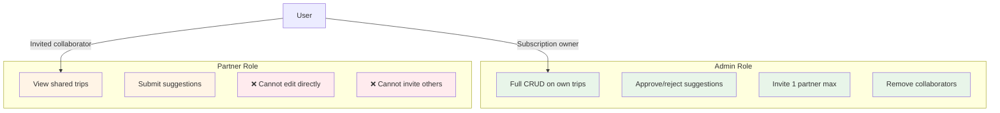

# Security & Authorization

<!-- PROMOTED:security START -->
<!-- Generated from specs/001-product-vision-scope/spec.md and specs/002-nfr-system-constraints/spec.md -->
<!-- Last promoted: 2026-07-03 -->

## Authentication Model

All trip creation, editing, deletion, and sharing operations require authenticated user accounts. Authentication is implemented using JWT tokens stored in HTTP-only cookies.

**Token Expiration**:
- Access tokens: 24 hours maximum lifetime
- Refresh tokens: 30 days maximum lifetime

## Authorization & Roles

The system enforces two distinct roles with specific permissions:

### Admin Role

- Full CRUD (Create, Read, Update, Delete) operations on their own trips
- Exclusive authority to approve or reject partner suggestions
- Can invite up to one partner collaborator (basic plan limit)
- Can remove collaborators from trips

### Partner Role

- Can view trips they are invited to
- Can submit suggestions for modifications to shared itineraries
- **Cannot** directly apply changes to any itinerary item (suggestions must be approved by admin)
- Cannot invite additional collaborators

## Subscription Plan Limits

**Basic Plan** (MVP scope):
- One admin user per subscription
- Maximum one partner collaborator per trip
- Full trip management features

## Data Protection

### Secrets Management

- All secrets (database passwords, API keys, tokens, certificates) MUST be stored in AWS Secrets Manager
- Secrets are never committed to code or stored in environment variables in Git
- Services retrieve secrets at runtime using IAM role-based authentication
- Secret rotation is supported without requiring redeployment

### PII Handling

The system is GDPR-aware and implements the following protections:

1. **Minimal Data Collection**: Only PII directly required by functional requirements is stored (email address, trip preferences)
2. **Right to Deletion**: Users can delete their account, removing all associated PII within 30 days
3. **Privacy Policy**: A privacy policy page is accessible from registration/login flows before any data collection
4. **Data in Transit**: All client-server and service-to-service communication uses TLS 1.2 or higher

### Input Validation & Sanitization

```mermaid
graph LR
    Input[User Input]
    
    subgraph "API Layer"
        V1[Schema Validation]
        V2[SQL Injection Check]
        V3[XSS Prevention]
        V4[Path Traversal Check]
    end

    subgraph "AI Prompt Layer"
        P1[Prompt Validation]
        P2[Instruction Override Check]
        P3[System Prompt Extraction Check]
        P4[Off-topic Detection]
    end

    subgraph "AI Response Layer"
        S1[HTML/Script Stripping]
        S2[Executable Content Filter]
        S3[Safe Rendering]
    end

    Input --> V1
    V1 --> V2
    V2 --> V3
    V3 --> V4
    V4 --> |To AI| P1
    P1 --> P2
    P2 --> P3
    P3 --> P4
    P4 --> |AI Response| S1
    S1 --> S2
    S2 --> S3
    S3 --> |Persist/Render|DB[(Database)]

    V1 -->|400 Bad Request| Reject1[Rejected]
    P1 -->|400 Bad Request| Reject2[Rejected]

    style V1 fill:#e8f5e9
    style V2 fill:#e8f5e9
    style V3 fill:#e8f5e9
    style V4 fill:#e8f5e9
    style P1 fill:#fff4e6
    style P2 fill:#fff4e6
    style P3 fill:#fff4e6
    style P4 fill:#fff4e6
    style S1 fill:#e1f5ff
    style S2 fill:#e1f5ff
    style S3 fill:#e1f5ff
    style Reject1 fill:#ffebee
    style Reject2 fill:#ffebee
```

**Prompt Injection Protection** (NFR-SEC-007):
- All user input sent to the AI provider passes through a prompt-validation layer
- Rejects requests containing:
  - Instruction-override patterns (e.g., "ignore previous instructions")
  - Attempts to extract system prompts or internal configuration
  - Off-topic prompts unrelated to travel planning
- Rejected requests return `400 Bad Request` with correlation ID logged for security review

**Output Sanitization** (NFR-SEC-008):
- All AI-generated content is sanitized before rendering in browser or persisting to database
- HTML/script tags and executable content are stripped or escaped
- No AI-generated content is executed as code or used as raw SQL/template values

**API Input Validation** (NFR-SEC-005):
- All API inputs validated and sanitized before use
- SQL injection, XSS, and path-traversal payloads rejected with `400 Bad Request`
- Security-focused integration tests verify injection attempts are blocked

### Dependency Security

- No critical or high-severity CVEs permitted in direct or transitive dependencies at release time
- Backend: `gosec` must report zero high-severity findings on every PR
- Frontend: `npm audit --audit-level=high` must pass before merge
- Dependencies: `govulncheck` (Go) and `npm audit` (frontend) run in CI

### Secret Scanning

- No secrets, API keys, or credentials may be committed to the repository
- `gitleaks` secret scanner runs on every commit in CI
- Pre-commit hook and PR gate enforce zero secrets detected

## Security Testing

### Automated Testing

- Prompt injection test suite covering known attack patterns runs on every PR
- XSS payload tests verify AI-generated content sanitization
- SQL injection, path traversal, and other OWASP Top 10 vectors tested in integration suite
- OWASP ZAP baseline scan runs on staging environment before each release

### Manual Review

- OWASP LLM Top 10 checklist reviewed before each release
- Security-focused code review for all changes touching authentication, authorization, or data handling
- Disaster recovery drill conducted before first release

<!-- PROMOTED:security END -->
