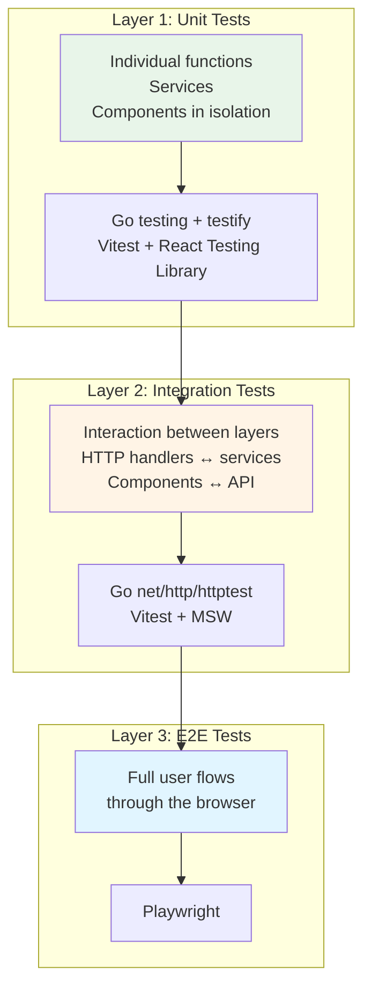

# Testing Guidelines

TrAIveler follows a **Test-Driven Development** workflow: write a failing test (Red), make it pass with minimal code (Green), then refactor. All tests must pass before a pull request can be merged.

---

## Testing Strategy

The project uses a three-layer testing strategy:



| Layer | Scope | Tools |
|---|---|---|
| Unit | Individual functions, services, and components in isolation | Go `testing` + `testify` / Vitest + React Testing Library |
| Integration | Interaction between layers (HTTP handlers ↔ services, components ↔ API) | Go `net/http/httptest` / Vitest + MSW |
| E2E | Full user flows through the browser | Playwright |

---

## Layer 1: Unit Tests

### Backend (Go)

- Test files live next to the source file they test: `itinerary_service_test.go` alongside `itinerary_service.go`.
- Use the standard `testing` package for all tests. Use `github.com/stretchr/testify/assert` and `testify/require` for assertions.
- Use interfaces and dependency injection to keep units testable without real databases or external services.
- Test function naming: `TestUnitName_Condition_ExpectedResult`.

```go
// Good
func TestGenerateItinerary_ValidInput_ReturnsItinerary(t *testing.T) { ... }
func TestGenerateItinerary_EmptyDestination_ReturnsError(t *testing.T) { ... }
```

### Frontend (React / TypeScript)

- Test files live next to the source file they test: `TripCard.test.tsx` alongside `TripCard.tsx`.
- Use **Vitest** as the test runner and **React Testing Library** for component tests.
- Unit test naming follows: `describe` block names the unit, `it`/`test` block describes the behavior.

```ts
describe('TripCard', () => {
  it('renders the trip destination name', () => { ... });
  it('shows a placeholder when no image is provided', () => { ... });
});
```

- Test what the user sees and does, not implementation details. Query by accessible role, label, or text — not by CSS class or internal state.

---

## Layer 2: Integration Tests

### Backend (Go)

- Integration tests live in an `integration/` subdirectory within the relevant package, or in a top-level `tests/integration/` folder.
- Use `net/http/httptest` to spin up a real HTTP server and test handler-to-service interactions.
- Use a test database or an in-memory substitute (e.g., SQLite) — never run integration tests against a production or shared database.
- File naming: `<feature>_integration_test.go`.

```go
func TestCreateTrip_ValidPayload_Returns201(t *testing.T) { ... }
```

### Frontend (React / TypeScript)

- Integration tests verify that a feature's components, hooks, and API calls work together correctly.
- Use **Mock Service Worker (MSW)** to intercept HTTP requests instead of mocking modules directly.
- These tests live under `src/features/<feature>/__tests__/` or alongside the feature entry component.

---

## Layer 3: E2E Tests

- E2E tests are written with **Playwright** and live in the top-level `e2e/` directory.
- Each file covers one user flow: `generate-itinerary.spec.ts`, `share-trip.spec.ts`.
- E2E tests run against a fully deployed (or locally running) instance of the application.
- Do not use hard-coded timeouts. Use Playwright's built-in auto-wait and `expect` assertions.

```ts
test('user can generate a trip itinerary', async ({ page }) => {
  await page.goto('/');
  await page.getByLabel('Destination').fill('Tokyo, Japan');
  await page.getByRole('button', { name: 'Generate Itinerary' }).click();
  await expect(page.getByRole('heading', { name: 'Day 1' })).toBeVisible();
});
```

---

## Folder Structure Summary

```
backend/
  internal/
    itinerary/
      itinerary_service.go
      itinerary_service_test.go       # unit
    handler/
      trip_handler.go
      trip_handler_test.go            # unit
  tests/
    integration/
      trip_integration_test.go        # integration

frontend/
  src/
    components/
      TripCard/
        TripCard.tsx
        TripCard.test.tsx             # unit
    features/
      itinerary/
        ItineraryView.tsx
        __tests__/
          ItineraryView.test.tsx      # integration

e2e/
  generate-itinerary.spec.ts          # E2E
  share-trip.spec.ts                  # E2E
```

---

## Coverage Targets

| Layer | Minimum Coverage |
|---|---|
| Unit (backend) | 80% of business logic |
| Unit (frontend) | 80% of shared components and hooks |
| Integration | All public API endpoints |
| E2E | All primary user flows defined in functional requirements |

Coverage is a floor, not a goal. Prioritize meaningful tests over achieving a percentage.

---

## Rules

- Tests must be deterministic. Avoid relying on real clocks, random values, or external services in unit and integration tests.
- A failing test must never be committed unless it is intentionally in the Red phase of TDD and tracked in the current branch.
- Test names must be written in English and must describe the expected behavior, not the implementation.
