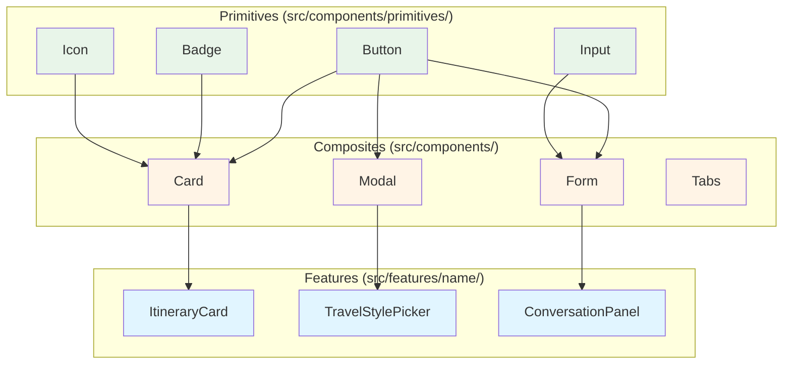

# UI Guidelines

These guidelines cover the design system, component conventions, spacing, color, and accessibility rules for TrAIveler's React 19 frontend.

---

## Design Principles

- **Clarity over decoration**: every visual element must serve the user's goal of planning a trip.
- **Progressive disclosure**: show only what the user needs at each step; reveal detail on demand.
- **Consistency**: reuse the same tokens (color, spacing, typography) everywhere. Never introduce a one-off value directly in a component.

---

## Design Tokens

All design tokens are defined as CSS custom properties in a single file: `src/styles/tokens.css`. Components must reference tokens — never hard-coded values.

### Color

```css
:root {
  /* Brand */
  --color-primary:        #2563EB;  /* main interactive elements */
  --color-primary-hover:  #1D4ED8;
  --color-primary-subtle: #EFF6FF;  /* backgrounds, badges */

  /* Neutral */
  --color-neutral-900: #111827;  /* body text */
  --color-neutral-600: #4B5563;  /* secondary text */
  --color-neutral-300: #D1D5DB;  /* borders, dividers */
  --color-neutral-100: #F3F4F6;  /* page backgrounds */
  --color-white:       #FFFFFF;

  /* Semantic */
  --color-success: #16A34A;
  --color-warning: #D97706;
  --color-error:   #DC2626;
}
```

> These are initial defaults. The design system palette can be updated as the visual identity evolves, but token names must stay stable.

### Spacing Scale

The spacing scale is based on a **4 px base unit**.

```css
:root {
  --space-1:  4px;
  --space-2:  8px;
  --space-3:  12px;
  --space-4:  16px;
  --space-6:  24px;
  --space-8:  32px;
  --space-12: 48px;
  --space-16: 64px;
}
```

- Use spacing tokens for `margin`, `padding`, `gap`, and `border-radius`. Never use arbitrary pixel values.
- The default content max-width is **1280px**, centered with `auto` horizontal margins.

### Typography

```css
:root {
  --font-family-base: 'Inter', system-ui, sans-serif;
  --font-size-sm:   0.875rem;  /* 14px */
  --font-size-base: 1rem;      /* 16px */
  --font-size-lg:   1.125rem;  /* 18px */
  --font-size-xl:   1.25rem;   /* 20px */
  --font-size-2xl:  1.5rem;    /* 24px */
  --font-size-3xl:  1.875rem;  /* 30px */
  --font-weight-regular: 400;
  --font-weight-medium:  500;
  --font-weight-bold:    700;
  --line-height-body:    1.6;
  --line-height-heading: 1.25;
}
```

---

## Component Library

### Atomic Design Layers

Components are organized in three layers:



| Layer | Location | Description |
|---|---|---|
| Primitives | `src/components/primitives/` | Lowest-level: Button, Input, Badge, Icon |
| Composites | `src/components/` | Built from primitives: Card, Modal, Form, Tabs |
| Features | `src/features/<name>/` | Business-specific: ItineraryCard, TravelStylePicker |

### Component Rules

- One component per file. File name and component name must match in PascalCase: `ItineraryCard.tsx`.
- Props interfaces are named `<ComponentName>Props` and defined in the same file.
- Use CSS Modules (`Component.module.css`) for component-scoped styles. Global styles belong in `src/styles/`.
- Do not use inline `style` attributes except for genuinely dynamic values (e.g., computed widths).

### Example Component Shape

```tsx
interface TripCardProps {
  destination: string;
  durationDays: number;
  coverImageUrl?: string;
  onOpen: () => void;
}

export function TripCard({ destination, durationDays, coverImageUrl, onOpen }: TripCardProps) {
  return (
    <article className={styles.card} onClick={onOpen}>
      {coverImageUrl && }
      <div className={styles.body}>
        <h2 className={styles.title}>{destination}</h2>
        <p className={styles.meta}>{durationDays} days</p>
      </div>
    </article>
  );
}
```

---

## Responsive Design

- Design mobile-first. Base styles target small screens; larger breakpoints extend them.
- Breakpoints (defined as tokens):

```css
:root {
  --bp-sm: 640px;
  --bp-md: 768px;
  --bp-lg: 1024px;
  --bp-xl: 1280px;
}
```

- The main layout uses CSS Grid or Flexbox; no third-party layout framework is required.
- Touch targets (buttons, links) must be at least **44 × 44 px** on mobile.

---

## Accessibility (WCAG 2.1 AA)

The following rules are non-negotiable for every component:

| Rule | Requirement |
|---|---|
| Color contrast | Text on background must meet a **4.5:1** contrast ratio minimum |
| Interactive elements | Must be reachable and operable via keyboard (`Tab`, `Enter`, `Space`, `Escape`) |
| Focus indicators | Never remove the browser's focus ring without providing a custom, visible alternative |
| Images | Every `` must have a meaningful `alt` attribute or `alt=""` for decorative images |
| Form fields | Every `<input>` and `<select>` must have an associated `<label>` (or `aria-label`) |
| ARIA | Use ARIA attributes only when a native HTML element cannot express the semantics |
| Page title | Each route must update `<title>` to reflect the current page context |
| Heading hierarchy | Use a single `<h1>` per page; do not skip heading levels |

Run `axe` or the browser's accessibility inspector during development to catch issues early.

---

## Icons

- Use a single icon library project-wide (e.g., **Lucide React**). Do not mix multiple icon packages.
- Icons used without adjacent text must have an `aria-label` or a visually hidden label.

---

## Loading and Error States

Every data-dependent component must handle three states explicitly:

1. **Loading**: display a skeleton or spinner.
2. **Error**: display a clear, actionable error message. Do not show raw error strings to users.
3. **Empty**: display a meaningful empty state (e.g., "No trips yet — create your first one").
