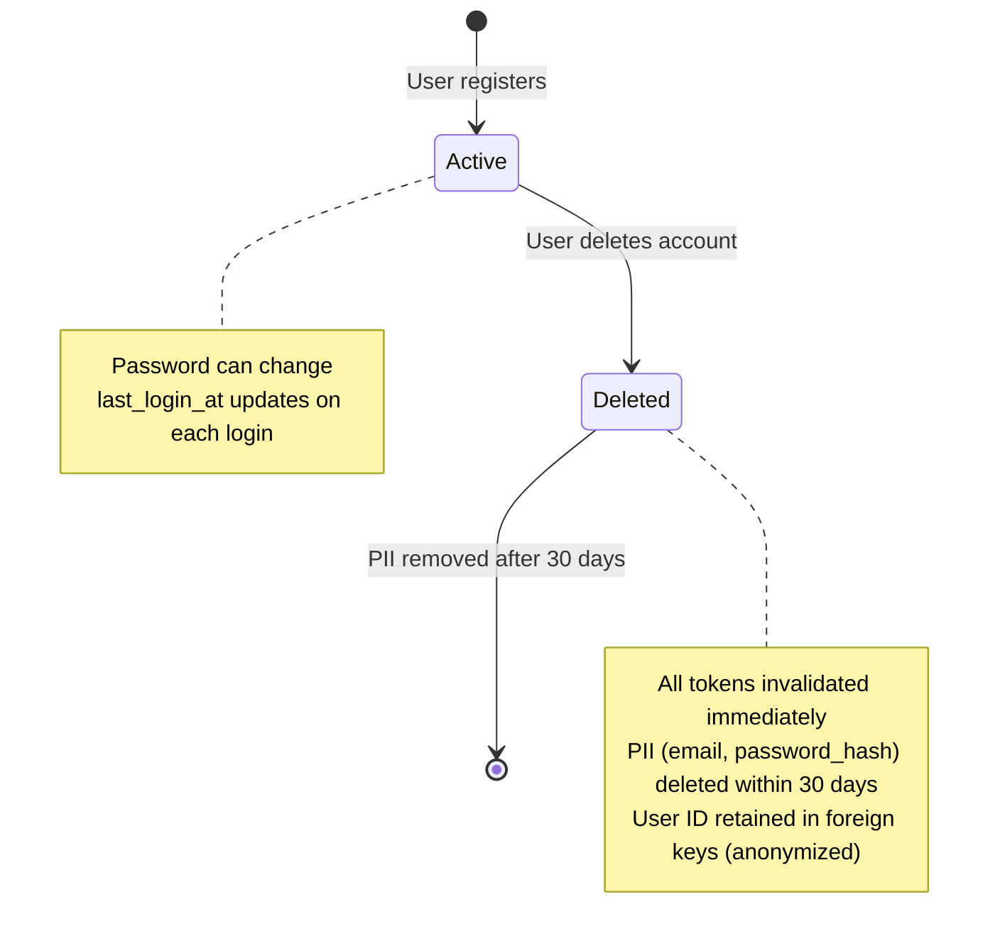
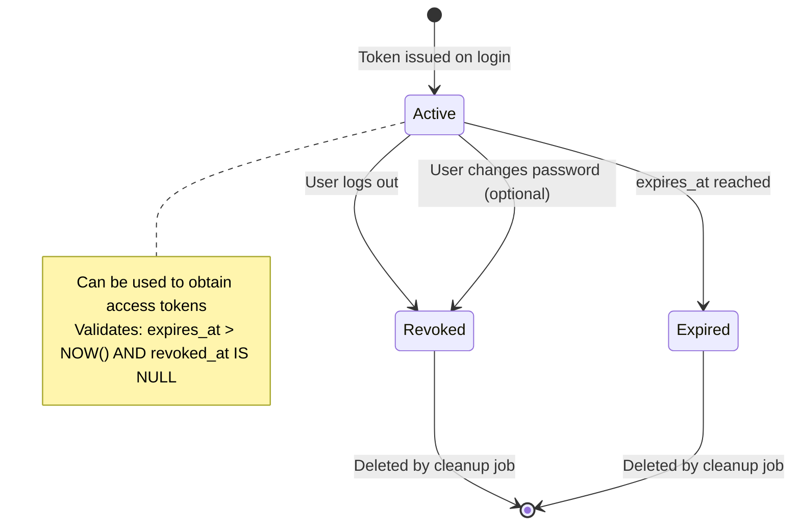
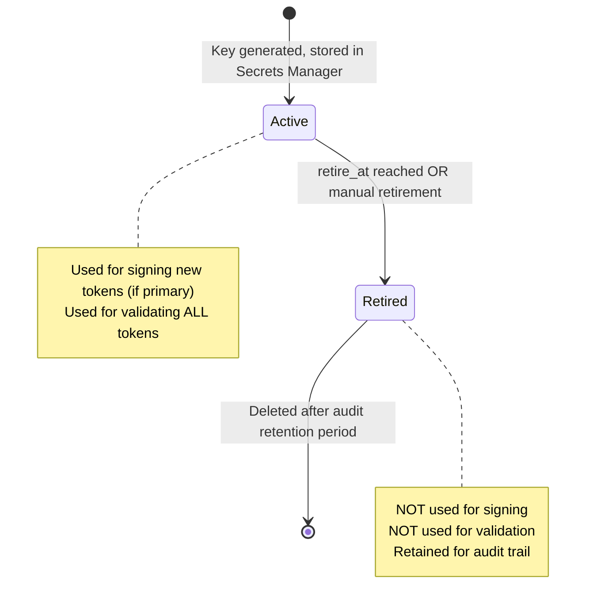
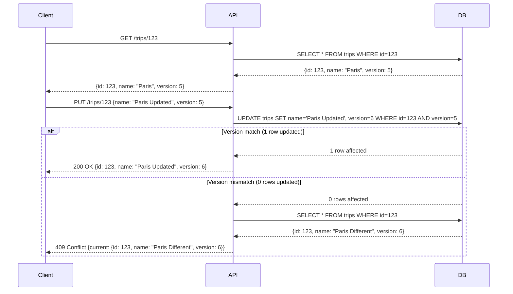
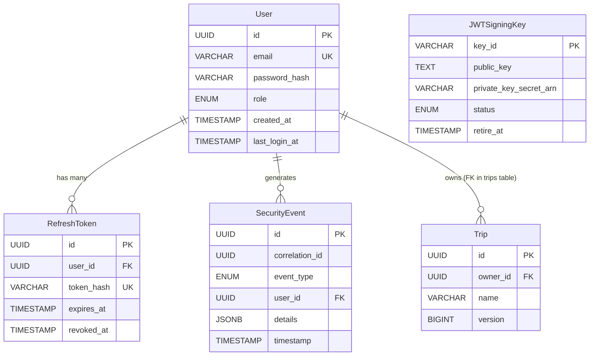

# Data Model: Security & Authentication/Authorization Model

**Feature**: 004-security-auth-model | **Date**: 2026-07-03

**Purpose**: Define entity schemas, relationships, validation rules, and state transitions for the security foundation.

---

## Entity 1: User

**Description**: Represents an authenticated user account with credentials, role, and audit timestamps.

### Attributes

| Attribute | Type | Constraints | Description |
|-----------|------|-------------|-------------|
| `id` | UUID | PRIMARY KEY, NOT NULL | Unique identifier for the user |
| `email` | VARCHAR(255) | UNIQUE, NOT NULL | User's email address (used for login) |
| `password_hash` | VARCHAR(255) | NOT NULL | Bcrypt hash of user's password (cost factor 12+) |
| `role` | ENUM('admin', 'partner') | NOT NULL, DEFAULT 'admin' | User's role determining permissions |
| `created_at` | TIMESTAMP | NOT NULL, DEFAULT NOW() | Account creation timestamp |
| `updated_at` | TIMESTAMP | NOT NULL, DEFAULT NOW() | Last account modification timestamp |
| `last_login_at` | TIMESTAMP | NULLABLE | Last successful login timestamp |

### Validation Rules

- **Email**: Must match RFC 5322 email format; case-insensitive uniqueness check
- **Password**: Minimum 8 characters, maximum 72 characters (bcrypt limit); must contain at least one uppercase, one lowercase, one digit
- **Role**: Only 'admin' or 'partner' allowed; cannot be changed after account creation (new requirement for role stability)

### Indexes

- `idx_users_email` (UNIQUE) on `email` for fast login lookups
- `idx_users_role` on `role` for role-based queries (if analytics needed)

### State Transitions



---

## Entity 2: RefreshToken

**Description**: Represents a long-lived refresh token issued to a user for obtaining new access tokens without re-authentication.

### Attributes

| Attribute | Type | Constraints | Description |
|-----------|------|-------------|-------------|
| `id` | UUID | PRIMARY KEY, NOT NULL | Unique identifier for the refresh token |
| `user_id` | UUID | NOT NULL, FOREIGN KEY → users.id ON DELETE CASCADE | User who owns this refresh token |
| `token_hash` | VARCHAR(255) | UNIQUE, NOT NULL | SHA-256 hash of the refresh token (never store plaintext) |
| `expires_at` | TIMESTAMP | NOT NULL | Token expiration time (30 days from issuance) |
| `created_at` | TIMESTAMP | NOT NULL, DEFAULT NOW() | Token creation timestamp |
| `revoked_at` | TIMESTAMP | NULLABLE | Token revocation timestamp (if user logs out or password changes) |

### Validation Rules

- **Token**: Must be cryptographically random (32 bytes minimum); hashed with SHA-256 before storage
- **Expires At**: Must be >NOW() and ≤30 days from creation
- **Revoked Tokens**: Cannot be used even if not expired; validation checks `revoked_at IS NULL`

### Indexes

- `idx_refresh_tokens_token_hash` (UNIQUE) on `token_hash` for fast lookup during refresh
- `idx_refresh_tokens_user_id` on `user_id` for user-level token queries (e.g., invalidate all on password change)
- `idx_refresh_tokens_expires_at` on `expires_at` for cleanup of expired tokens

### Relationships

- **User** (1:N) — One user can have multiple active refresh tokens (different devices/browsers)

### State Transitions



---

## Entity 3: JWTSigningKey

**Description**: Represents an RSA key pair used for signing and validating JWT tokens. Multiple keys can be active simultaneously to support zero-downtime rotation.

### Attributes

| Attribute | Type | Constraints | Description |
|-----------|------|-------------|-------------|
| `key_id` | VARCHAR(64) | PRIMARY KEY, NOT NULL | Unique identifier for the key (e.g., "key-2026-07-01") |
| `public_key` | TEXT | NOT NULL | PEM-encoded RSA public key (2048-bit minimum) |
| `private_key_secret_arn` | VARCHAR(255) | NOT NULL | AWS Secrets Manager ARN for private key (never in DB) |
| `status` | ENUM('active', 'retired') | NOT NULL, DEFAULT 'active' | Key status determining validation eligibility |
| `created_at` | TIMESTAMP | NOT NULL, DEFAULT NOW() | Key creation timestamp |
| `retire_at` | TIMESTAMP | NULLABLE | Scheduled retirement timestamp (grace period end) |

### Validation Rules

- **Key ID**: Must be globally unique across all keys (historical and active)
- **Public Key**: Must be valid PEM-encoded RSA public key; 2048-bit minimum (RS256 requirement)
- **Status**: Only 'active' keys are used for validation; 'retired' keys retained for audit only
- **Retire At**: Must be >created_at; typically 30 days after a new key becomes primary

### Storage Notes

- **Private keys are NEVER stored in the database**. Only AWS Secrets Manager ARN is stored.
- Backend retrieves private key from Secrets Manager at runtime for token signing.

### State Transitions



---

## Entity 4: SecurityEvent

**Description**: Structured log entry for security-relevant events (authentication, authorization, input validation failures).

### Attributes

| Attribute | Type | Constraints | Description |
|-----------|------|-------------|-------------|
| `id` | UUID | PRIMARY KEY, NOT NULL | Unique identifier for the event |
| `correlation_id` | UUID | NOT NULL | Correlation ID for request tracing across services |
| `event_type` | ENUM | NOT NULL | Type of security event (see enum values below) |
| `user_id` | UUID | NULLABLE, FOREIGN KEY → users.id ON DELETE SET NULL | User associated with event (if applicable) |
| `severity` | ENUM('info', 'warning', 'error') | NOT NULL | Event severity level |
| `ip_address` | VARCHAR(45) | NULLABLE | Source IP address (IPv4 or IPv6) |
| `user_agent` | VARCHAR(255) | NULLABLE | HTTP User-Agent header |
| `details` | JSONB | NOT NULL, DEFAULT '{}' | Event-specific structured details |
| `timestamp` | TIMESTAMP | NOT NULL, DEFAULT NOW() | Event occurrence timestamp |

### Event Types

| Event Type | Severity | Details Fields | Description |
|------------|----------|----------------|-------------|
| `auth_login_success` | info | `{user_email, device_fingerprint}` | Successful login |
| `auth_login_failure` | warning | `{user_email, failure_reason}` | Failed login attempt |
| `auth_token_refresh` | info | `{user_email}` | Access token refreshed |
| `auth_logout` | info | `{user_email}` | User logged out |
| `auth_password_change` | info | `{user_email, invalidate_all_sessions}` | Password changed |
| `authz_denied` | warning | `{user_email, role, operation, resource_id}` | Authorization denial (403) |
| `validation_prompt_injection` | error | `{user_email, attack_pattern, prompt_preview}` | Prompt injection detected |
| `validation_sql_injection` | error | `{user_email, endpoint, payload_preview}` | SQL injection attempt detected |
| `validation_xss_injection` | error | `{user_email, endpoint, payload_preview}` | XSS attempt detected |
| `concurrency_conflict` | warning | `{user_email, resource_type, resource_id, version}` | Optimistic locking conflict (409) |

### Validation Rules

- **Correlation ID**: Must be unique per request; propagated from HTTP headers or generated on ingress
- **Details**: Must be valid JSON; no sensitive data (passwords, tokens, full payloads) allowed
- **IP Address**: Must be valid IPv4 or IPv6 format if present
- **Timestamp**: Must be ≤NOW() (cannot log future events)

### Indexes

- `idx_security_events_correlation_id` on `correlation_id` for request trace queries
- `idx_security_events_user_id` on `user_id` for user activity audit
- `idx_security_events_event_type` on `event_type` for event type filtering
- `idx_security_events_timestamp` on `timestamp` for time-range queries

### Retention

- CloudWatch Logs retention: **30 days** (FR-051a)
- Database retention: Events written to both CloudWatch (for real-time monitoring) and PostgreSQL (for structured queries). Database retention follows same 30-day policy with nightly cleanup job.

---

## Entity 5: TripVersion (Optimistic Locking)

**Description**: Version metadata for trip entities to support optimistic locking and conflict detection.

**Note**: This is a column added to existing `trips` and `itinerary_items` tables, not a separate table.

### Attributes (added to existing entities)

| Attribute | Type | Constraints | Description |
|-----------|------|-------------|-------------|
| `version` | BIGINT | NOT NULL, DEFAULT 1 | Monotonically incrementing version number |

### Validation Rules

- **Version**: Increments by 1 on every UPDATE; clients must provide current version in update request
- **Conflict Detection**: `UPDATE trips SET ..., version = version + 1 WHERE id = $1 AND version = $2`
  - If 0 rows affected → version mismatch → return 409 Conflict with current resource state

### Concurrency Flow



---

## Relationships Summary



---

## Validation Rules Cross-Reference

| Functional Requirement | Entity | Validation Rule |
|------------------------|--------|-----------------|
| FR-003 (24h access token) | N/A (JWT claim) | `exp` claim ≤ `iat` + 24h |
| FR-004 (30d refresh token) | RefreshToken | `expires_at` ≤ `created_at` + 30d |
| FR-046 (bcrypt cost 12+) | User | `password_hash` generated with bcrypt cost ≥12 |
| FR-009a (multi-key rotation) | JWTSigningKey | Multiple 'active' keys allowed; validation iterates all |
| FR-011a (optimistic locking) | Trip, ItineraryItem | `version` increments on UPDATE; mismatch → 409 |
| FR-008a (password change choice) | RefreshToken | Optional `revoked_at` update based on user choice |
| FR-050 (no sensitive data in logs) | SecurityEvent | `details` JSONB excludes passwords, tokens, full payloads |

---

## Migration Strategy

### Phase 1: Core Authentication Tables

```sql
-- Create users table
CREATE TABLE users (
    id UUID PRIMARY KEY DEFAULT gen_random_uuid(),
    email VARCHAR(255) UNIQUE NOT NULL,
    password_hash VARCHAR(255) NOT NULL,
    role VARCHAR(20) NOT NULL DEFAULT 'admin' CHECK (role IN ('admin', 'partner')),
    created_at TIMESTAMP NOT NULL DEFAULT NOW(),
    updated_at TIMESTAMP NOT NULL DEFAULT NOW(),
    last_login_at TIMESTAMP
);

CREATE INDEX idx_users_email ON users(email);

-- Create refresh_tokens table
CREATE TABLE refresh_tokens (
    id UUID PRIMARY KEY DEFAULT gen_random_uuid(),
    user_id UUID NOT NULL REFERENCES users(id) ON DELETE CASCADE,
    token_hash VARCHAR(255) UNIQUE NOT NULL,
    expires_at TIMESTAMP NOT NULL,
    created_at TIMESTAMP NOT NULL DEFAULT NOW(),
    revoked_at TIMESTAMP
);

CREATE INDEX idx_refresh_tokens_token_hash ON refresh_tokens(token_hash);
CREATE INDEX idx_refresh_tokens_user_id ON refresh_tokens(user_id);
CREATE INDEX idx_refresh_tokens_expires_at ON refresh_tokens(expires_at);
```

### Phase 2: JWT Key Management

```sql
-- Create jwt_signing_keys table
CREATE TABLE jwt_signing_keys (
    key_id VARCHAR(64) PRIMARY KEY,
    public_key TEXT NOT NULL,
    private_key_secret_arn VARCHAR(255) NOT NULL,
    status VARCHAR(20) NOT NULL DEFAULT 'active' CHECK (status IN ('active', 'retired')),
    created_at TIMESTAMP NOT NULL DEFAULT NOW(),
    retire_at TIMESTAMP
);
```

### Phase 3: Security Logging

```sql
-- Create security_events table
CREATE TABLE security_events (
    id UUID PRIMARY KEY DEFAULT gen_random_uuid(),
    correlation_id UUID NOT NULL,
    event_type VARCHAR(50) NOT NULL,
    user_id UUID REFERENCES users(id) ON DELETE SET NULL,
    severity VARCHAR(20) NOT NULL CHECK (severity IN ('info', 'warning', 'error')),
    ip_address VARCHAR(45),
    user_agent VARCHAR(255),
    details JSONB NOT NULL DEFAULT '{}',
    timestamp TIMESTAMP NOT NULL DEFAULT NOW()
);

CREATE INDEX idx_security_events_correlation_id ON security_events(correlation_id);
CREATE INDEX idx_security_events_user_id ON security_events(user_id);
CREATE INDEX idx_security_events_event_type ON security_events(event_type);
CREATE INDEX idx_security_events_timestamp ON security_events(timestamp);
```

### Phase 4: Optimistic Locking (augment existing tables)

```sql
-- Add version column to trips table (created in previous feature)
ALTER TABLE trips ADD COLUMN version BIGINT NOT NULL DEFAULT 1;

-- Add version column to itinerary_items table (created in previous feature)
ALTER TABLE itinerary_items ADD COLUMN version BIGINT NOT NULL DEFAULT 1;
```

---

## Data Protection Notes

| Entity | Sensitive Fields | Protection |
|--------|------------------|------------|
| User | `password_hash` | Bcrypt hashed, never returned in API responses |
| User | `email` | PII; returned only to authenticated owner; deleted on account deletion |
| RefreshToken | `token_hash` | SHA-256 hashed; plaintext token never stored |
| JWTSigningKey | `private_key_secret_arn` | Private key stored in AWS Secrets Manager only |
| SecurityEvent | `details` | No passwords, tokens, or full payloads; sanitized before storage |

**All PII deleted within 30 days of account deletion (FR-044).**
